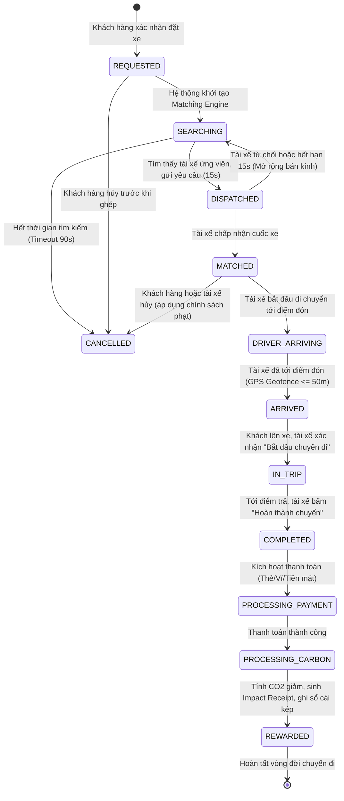
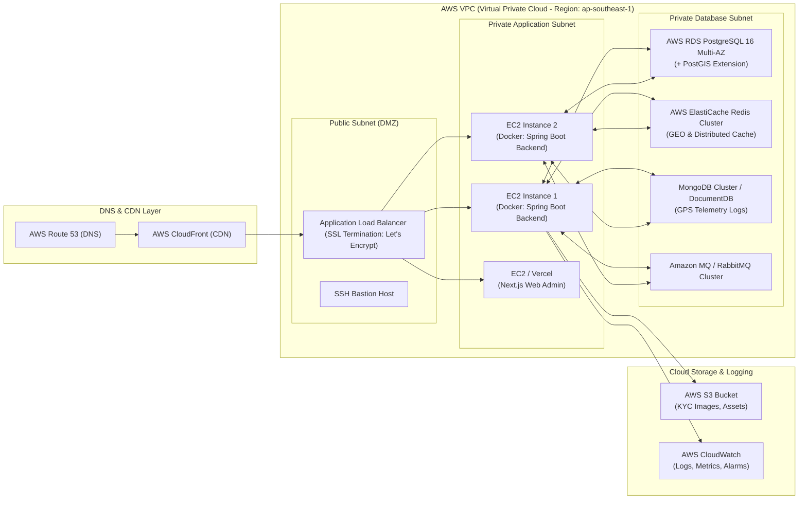

# Green Mobility Platform - Master Architecture Specification

> **Tài liệu**: Kiến trúc Tổng thể Hệ thống (Master Architecture)  
> **Dự án**: Nền tảng gọi xe điện tích hợp hệ thống đo lường, báo cáo và khuyến khích giảm phát thải carbon  
> **Sinh viên thực hiện**: Phạm Hà Anh Thư (23521544), Nguyễn Minh Thiện (23521484)  
> **Cán bộ hướng dẫn**: ThS. Trần Thị Hồng Yến — Trường ĐH Công nghệ Thông tin (ĐHQG TP.HCM)  
> **Phiên bản**: 1.0.0 (Production Blueprint)

---

## 1. Tổng quan Dự án & Tầm nhìn Kiến trúc (System Vision)

Nền tảng **Green Mobility** là giải pháp công nghệ chuyển đổi số giao thông đô thị bền vững, tiên phong giải quyết bài toán:
1. **Nền tảng gọi xe điện hoàn chỉnh**: Vận hành end-to-end với tốc độ ghép cuốc dưới 30 giây, theo dõi định vị GPS thời gian thực (độ trễ dưới 5 giây) và tích hợp cổng thanh toán trực tuyến.
2. **Engine định lượng phát thải Carbon thời gian thực**: Tính toán lượng khí nhà kính ($CO_2$) giảm được trên từng chuyến đi dựa trên cơ sở dữ liệu hệ số phát thải IPCC và hướng dẫn kiểm kê của Bộ Tài nguyên và Môi trường Việt Nam (tính đến hệ số phát thải lưới điện quốc gia).
3. **Cơ chế Khuyến khích & Sổ cái kép (Incentive & Double-Entry Ledger)**: Quản lý ví tín chỉ carbon cá nhân (Personal Carbon Credit - PCC) và điểm thưởng trung thành (Loyalty Points) bằng mô hình sổ cái kép kế toán, đảm bảo tính toàn vẹn và bất biến của tài sản số.
4. **Trực quan hóa tác động (Impact Receipt & Green Reporting)**: Xuất hóa đơn tác động môi trường số sau mỗi chuyến đi và Dashboard phân tích phát thải toàn diện cho Khách hàng, Tài xế và Quản trị viên (hướng đến chuẩn ESG Scope 3).
5. **AI & Trí tuệ nhân tạo bảo vệ hệ thống**: 
   - **Machine Learning (Isolation Forest)**: Phát hiện gian lận cuốc xe và GPS spoofing.
   - **Computer Vision (Face Verification)**: Xác minh khuôn mặt tài xế bằng Face Embedding trước mỗi ca làm việc nhằm chống cho thuê/mượn tài khoản.
   - **AI Copilot**: Trợ lý Chatbot quản trị viên hỗ trợ truy vấn báo cáo ngôn ngữ tự nhiên.

---

## 2. Sơ đồ Kiến trúc Tổng thể (High-Level System Architecture)

Hệ thống được thiết kế theo mô hình **Modular Monolith** trên nền tảng Spring Boot (Java), phân tách nghiêm ngặt ranh giới nghiệp vụ (Bounded Contexts) để vừa đảm bảo tính gọn nhẹ, nhất quán dữ liệu trong giai đoạn phát triển, vừa sẵn sàng bóc tách thành các Microservices độc lập khi quy mô mở rộng.

```mermaid
flowchart TB
    subgraph Clients["Client Applications Layer"]
        CA["Customer Mobile App\n(Flutter / Dart)"]
        DA["Driver Mobile App\n(Flutter / Dart)"]
        WA["Admin Web Portal\n(Next.js / TypeScript / Tailwind)"]
    end

    subgraph Ingress["Ingress & Edge Layer"]
        ALB["AWS Application Load Balancer / NGINX"]
        WSS_EP["WebSocket / STOMP Gateway (WSS)"]
        REST_EP["RESTful API Gateway / Reverse Proxy"]
    end

    subgraph CoreBackend["Core Backend (Spring Boot Modular Monolith)"]
        subgraph ModAuth["module-identity"]
            JWT_SEC["Auth & RBAC Service\n(Spring Security, JWT)"]
        end
        subgraph ModTrip["module-trip"]
            TRIP_SM["Trip Lifecycle State Machine"]
            DISPATCH["Dispatch Orchestrator"]
        end
        subgraph ModMatching["module-matching"]
            GEO_MATCHER["Geospatial Matching Engine\n(Redis GEO + Scoring)"]
        end
        subgraph ModCarbon["module-carbon"]
            CO2_ENG["Carbon Calculation Engine\n(IPCC / MoNRE Emission Model)"]
            IMPACT_GEN["Impact Receipt Generator"]
        end
        subgraph ModIncentive["module-incentive"]
            LEDGER_ENG["Double-Entry Ledger Engine\n(Carbon Wallet & Points)"]
            REWARD_MGR["Reward & Gamification Engine"]
        end
        subgraph ModDriverVehicle["module-driver-vehicle"]
            KYC_MGR["Driver & Vehicle Registry\n(EV Specs, Battery, Inspection)"]
            FACE_AUTH["Face Verification Service\n(DeepFace / FaceNet Proxy)"]
        end
        subgraph ModPayment["module-payment"]
            PAY_SVC["Payment Service\n(VNPay / MoMo Sandbox)"]
        end
        subgraph ModFraud["module-fraud"]
            FRAUD_ENG["Fraud & GPS Anomaly Detection\n(Isolation Forest + Rule Engine)"]
        end
        subgraph ModChatbot["module-ai-copilot"]
            AI_COPILOT["Admin Query Copilot\n(LLM RAG / Vector Query)"]
        end
    end

    subgraph EventBus["Asynchronous Event Mesh"]
        RABBITMQ["RabbitMQ / Kafka Message Broker\n(Events: trip.requested, trip.completed, carbon.calculated)"]
    end

    subgraph DataPersistence["Data & State Persistence Layer"]
        REDIS["Redis In-Memory Data Store\n- Geospatial Index (GEOADD/GEOSEARCH)\n- Driver Heartbeat & Session\n- Distributed Locks (Redisson)"]
        POSTGRES[("PostgreSQL 16 + PostGIS\n- Relational Core (Users, Trips, Ledgers)\n- Spatial GIS Index (GIST geometry)\n- ACID Transactions")]
        MONGO[("MongoDB 7.0\n- High-Density GPS Telemetry Logs\n- Full Route Breadcrumbs\n- System Audit Trails")]
        S3["AWS S3 / MinIO Object Storage\n- Driver KYC Documents\n- Face Verification Selfies\n- Vehicle Registration Docs"]
    end

    subgraph ThirdParty["External Services & APIs"]
        MAPS["Google Maps Platform / OSRM\n(Routing, Geocoding, Distance Matrix)"]
        FCM["Firebase Cloud Messaging (FCM)\n(Push Notifications)"]
        VNPAY["VNPay / MoMo Payment Gateway"]
    end

    CA -->|HTTPS / REST| REST_EP
    DA -->|HTTPS / REST| REST_EP
    WA -->|HTTPS / REST| REST_EP
    CA <-->|WSS (STOMP)| WSS_EP
    DA <-->|WSS (STOMP)| WSS_EP

    REST_EP --> ALB
    WSS_EP --> ALB
    ALB --> CoreBackend

    DISPATCH -->|Events| RABBITMQ
    RABBITMQ --> CO2_ENG
    RABBITMQ --> LEDGER_ENG
    RABBITMQ --> FRAUD_ENG

    GEO_MATCHER <--> REDIS
    CoreBackend <--> POSTGRES
    CoreBackend <--> MONGO
    CoreBackend --> S3

    DISPATCH --> MAPS
    CO2_ENG --> MAPS
    FACE_AUTH --> S3
    PAY_SVC --> VNPAY
    CoreBackend --> FCM
```

---

## 3. Quyết định Thiết kế Kiến trúc (Architectural Decision Records - ADR)

### ADR-01: Lựa chọn Kiến trúc Modular Monolith cho Core Backend
* **Bối cảnh**: Hệ thống cần triển khai đầy đủ các tính năng gọi xe thời gian thực, đo lường carbon, sổ cái kép kế toán và phát hiện gian lận trong thời gian đồ án từ 07/09/2026 đến 11/01/2027.
* **Quyết định**: Áp dụng kiến trúc **Modular Monolith** trên nền tảng Spring Boot. Phân tách ranh giới rõ ràng bằng package domain: `com.greenmobility.identity`, `com.greenmobility.trip`, `com.greenmobility.matching`, `com.greenmobility.carbon`, `com.greenmobility.incentive`, `com.greenmobility.drivervehicle`, `com.greenmobility.fraud`. Các module giao tiếp qua Domain Events hoặc Service Interfaces nghiêm ngặt.
* **Hệ quả**: Giảm thiểu chi phí overhead về DevOps, network latency giữa các service, đảm bảo tính toàn vẹn giao dịch ACID cho nghiệp vụ sổ cái kép và cuốc xe mà vẫn dễ dàng tách thành Microservices độc lập trong tương lai.

### ADR-02: Phân tách Lưu trữ Dữ liệu Đa hình (Polyglot Persistence)
* **PostgreSQL + PostGIS**: Nắm giữ dữ liệu nghiệp vụ quan hệ có tính toàn vẹn giao dịch cao (User, Driver, Vehicle, Trip, Double-Entry Ledger, Reward Catalog). PostGIS hỗ trợ lập chỉ mục không gian địa lý `GIST(geom)` để truy vấn tọa độ ranh giới quận huyện, trạm sạc và điểm đón/trả.
* **Redis**: Lưu trữ trạng thái nóng có độ trễ cực thấp: vị trí tức thời của tài xế đang trực tuyến (`GEOADD` / `GEOSEARCH`), session người dùng, mã OTP, và khóa phân tán (Distributed Lock) qua Redisson để chống tranh chấp nhận cuốc.
* **MongoDB**: Lưu trữ dữ liệu chuỗi thời gian (time-series) mật độ cao từ telemetry GPS của tài xế (mỗi 3–5 giây gửi 1 tọa độ). Điều này giảm tải hoàn toàn I/O nặng nề cho PostgreSQL.
* **AWS S3**: Lưu trữ tập tin tĩnh (ảnh đại diện, ảnh CCCD, giấy đăng ký xe, ảnh selfie xác minh khuôn mặt).

### ADR-03: Giao thức Thời gian thực (Real-time Communication)
* Sử dụng **WebSocket qua giao thức STOMP (Simple Text Oriented Messaging Protocol)** bảo mật qua WSS.
* Topic Pub/Sub định hướng:
  - `/topic/driver-location/{driverId}`: Stream vị trí tài xế cho hành khách đang theo dõi cuốc xe.
  - `/topic/trip/{tripId}`: Đồng bộ trạng thái chuyến đi (`DRIVER_ARRIVING`, `IN_TRIP`, `COMPLETED`).
  - `/user/queue/ride-dispatch`: Gửi yêu cầu ghép cuốc có thời hạn (15s countdown) trực tiếp đến tài xế được chọn.
* Hỗ trợ cơ chế **Heartbeat Ping/Pong (10s)** để phát hiện tài xế mất kết nối mạng đột ngột và chuyển trạng thái sang `OFFLINE`.

### ADR-04: Hệ thống Sổ cái kép (Double-Entry Ledger Architecture) cho Tín chỉ Carbon & Điểm thưởng
* **Bối cảnh**: Điểm thưởng và Carbon Credit nếu chỉ lưu dưới dạng cột `balance` số thực trong bảng User sẽ dễ bị lỗi race condition, không thể đối soát kiểm toán và tiềm ẩn nguy cơ sai lệch số dư.
* **Quyết định**: Áp dụng mô hình chuẩn kế toán kép (Double-Entry Bookkeeping). Mỗi giao dịch (`LedgerTransaction`) phải bao gồm ít nhất 2 bản ghi bút toán (`LedgerEntry`) với quy tắc bất biến:
  $$\sum \text{Debit} = \sum \text{Credit}$$
* Các tài khoản hệ thống gồm:
  - `SYSTEM_CARBON_RESERVE`: Quỹ phát thải chuẩn của hệ thống (tạo ra tín chỉ khi chuyến xe xanh thành công).
  - `USER_CARBON_WALLET`: Ví tín chỉ carbon của khách hàng/tài xế.
  - `PARTNER_REDEMPTION_POOL`: Quỹ thanh toán của đối tác đổi quà.
  - `SYSTEM_BURN_ACCOUNT`: Tài khoản tiêu hủy tín chỉ khi đã quy đổi thành công.

---

## 4. Vòng đời Chuyến đi & Máy trạng thái (Trip Lifecycle State Machine)

Một chuyến đi trên nền tảng Green Mobility trải qua quy trình nghiêm ngặt được điều phối bởi State Machine:



### Chi tiết các bước chuyển trạng thái (State Transitions):
1. **`REQUESTED` $\rightarrow$ `SEARCHING`**:
   - Khách hàng chọn điểm đón/trả $\rightarrow$ Tính toán định tuyến OSRM $\rightarrow$ Trả về giá cước ước tính và lượng $CO_2$ dự kiến giảm $\rightarrow$ Khách bấm Đặt xe $\rightarrow$ Lưu bản ghi `Trip` trạng thái `REQUESTED`.
2. **`SEARCHING` $\rightarrow$ `DISPATCHED`**:
   - Matching Engine truy vấn Redis GEO tìm tài xế xe điện thích hợp trong bán kính $R_1 = 1.5\text{km}$.
   - Chọn tài xế có điểm Score cao nhất $\rightarrow$ Áp dụng Distributed Lock trên Redis cho `driverId` $\rightarrow$ Đẩy WebSocket event đến tài xế kèm đồng hồ đếm ngược 15 giây.
3. **`DISPATCHED` $\rightarrow$ `MATCHED`**:
   - Tài xế bấm "Chấp nhận" $\rightarrow$ Hệ thống cập nhật trạng thái tài xế thành `BUSY`, hủy tìm kiếm, thông báo cho khách hàng thông tin tài xế, biển số xe điện và thời gian đón dự kiến (ETA).
4. **`IN_TRIP` $\rightarrow$ `COMPLETED`**:
   - Xe di chuyển tới điểm đến $\rightarrow$ Cập nhật tọa độ liên tục vào MongoDB telemetry.
   - Tài xế xác nhận kết thúc $\rightarrow$ Chốt quãng đường thực tế di chuyển $S_{\text{actual}}$ qua phép đo GPS và Map-matching.
5. **`COMPLETED` $\rightarrow$ `PROCESSING_CARBON` $\rightarrow$ `REWARDED`**:
   - Bắn sự kiện bất đồng bộ `trip.completed` sang RabbitMQ.
   - Consumer kích hoạt **Carbon Calculation Engine** tính toán $gCO_2$ giảm được.
   - Kích hoạt **Incentive Ledger** sinh giao dịch kép cộng Điểm thưởng & Tín chỉ Carbon vào ví khách hàng và tài xế.
   - Sinh bản ghi **Impact Receipt** (Hóa đơn xanh) và gửi thông báo đẩy qua FCM.

---

## 5. Mô hình Toán học Tính toán Giảm phát thải Carbon (Carbon Emission Engine)

### 5.1. Cơ sở Phương pháp luận
Phương pháp tính toán dựa trên hướng dẫn của **IPCC (Intergovernmental Panel on Climate Change)** và **Thông tư hướng dẫn kiểm kê khí nhà kính của Bộ Tài nguyên và Môi trường Việt Nam**. Lượng khí thải giảm thiểu bằng chênh lệch giữa phát thải của phương tiện động cơ đốt trong (xăng) tương đương và phát thải vòng đời hoạt động của phương tiện điện (quy đổi theo hệ số phát thải lưới điện quốc gia).

### 5.2. Công thức Chuẩn hóa
$$\Delta E_{\text{CO}_2} = d \times \left( EF_{\text{baseline}} - EF_{\text{EV\_adjusted}} \right)$$

Trong đó:
- $\Delta E_{\text{CO}_2}$: Khối lượng phát thải $CO_2$ giảm được trên chuyến đi ($g\text{CO}_2$).
- $d$: Quãng đường thực tế của chuyến đi ($km$), được tính từ vệt tọa độ GPS đã lọc nhiễu qua thuật toán Ramer–Douglas–Peucker kết hợp bản đồ OSRM.
- $EF_{\text{baseline}}$: Hệ số phát thải của phương tiện xăng tương đương cùng phân khúc ($g\text{CO}_2/km$).
- $EF_{\text{EV\_adjusted}}$: Hệ số phát thải gián tiếp của xe điện dựa trên mức tiêu thụ điện năng trung bình và hệ số phát thải lưới điện quốc gia ($g\text{CO}_2/km$):
  $$EF_{\text{EV\_adjusted}} = SEC \times EF_{\text{grid}}$$
  - $SEC$: Suất tiêu thụ năng lượng điện trung bình của phương tiện ($kWh/km$).
  - $EF_{\text{grid}}$: Hệ số phát thải lưới điện quốc gia Việt Nam ($g\text{CO}_2/kWh$), được công bố định kỳ bởi Cục Biến đổi khí hậu (Bộ TN&MT).

### 5.3. Bảng Tham số Tiêu chuẩn áp dụng (Cấu hình trên Web Admin)

| Loại Phương tiện | Phân khúc tương đương | $EF_{\text{baseline}}$ (Xe xăng) | Suất tiêu thụ điện ($SEC$) | $EF_{\text{grid}}$ (VN MoNRE) | $EF_{\text{EV\_adjusted}}$ | **CO2 Giảm TB / km** |
| :--- | :--- | :--- | :--- | :--- | :--- | :--- |
| **Xe máy điện (E-Bike)** | Xe máy xăng 110-150cc | $68.5\,g\text{CO}_2/km$ | $0.032\,kWh/km$ | $722.1\,g\text{CO}_2/kWh$ | $23.1\,g\text{CO}_2/km$ | **$45.4\,g\text{CO}_2/km$** |
| **Ô tô điện 4 chỗ (Compact)** | Sedan xăng hạng B/C | $152.0\,g\text{CO}_2/km$ | $0.135\,kWh/km$ | $722.1\,g\text{CO}_2/kWh$ | $97.5\,g\text{CO}_2/km$ | **$54.5\,g\text{CO}_2/km$** |
| **Ô tô điện 7 chỗ (SUV)** | SUV xăng cỡ trung | $210.0\,g\text{CO}_2/km$ | $0.180\,kWh/km$ | $722.1\,g\text{CO}_2/kWh$ | $130.0\,g\text{CO}_2/km$ | **$80.0\,g\text{CO}_2/km$** |

### 5.4. Quy đổi Chỉ số Trực quan hóa (Equivalency Metric Engine)
Để biến những con số $gCO_2$ trừu tượng thành trải nghiệm trực quan trên **Impact Receipt**:
- **Tương đương Cây xanh hấp thụ (Tree-Days Equivalent)**:
  $$\text{Tree-Days} = \frac{\Delta E_{\text{CO}_2} \text{ (kg)}}{0.06\,kg/\text{ngày}}$$
  *(Một cây đô thị trưởng thành hấp thụ trung bình khoảng $21.9\,kg\text{CO}_2/\text{năm} \approx 0.06\,kg/\text{ngày}$)*.
- **Tương đương Số giờ thắp bóng đèn LED 10W (Bulb-Hours Equivalent)**:
  $$\text{Bulb-Hours} = \frac{\Delta E_{\text{CO}_2} \text{ (g)}}{7.221\,g/\text{giờ}}$$

---

## 6. Kiến trúc Bảo mật & Phát hiện Gian lận (Security & ML Pipeline)

### 6.1. Xác minh Khuôn mặt Tài xế bằng Computer Vision (Face Verification)
* **Mục tiêu**: Chống hành vi mượn hoặc cho thuê tài khoản tài xế xe điện.
* **Quy trình**:
  1. Khi tài xế bấm nút "Bật nhận cuốc" (Online), ứng dụng yêu cầu chụp ảnh chân dung trực diện (Liveness Detection kiểm tra nhấp nháy mắt/quay nhẹ đầu).
  2. Ảnh được nén và gửi lên Backend `module-driver-vehicle` qua HTTPS.
  3. Backend trích xuất Face Embedding (vectơ 512 chiều qua mô hình ArcFace / DeepFace) và so khớp khoảng cách Cosine với Embedding đã được Admin duyệt trong hồ sơ KYC:
     $$\text{Cosine Similarity} = \frac{\mathbf{u} \cdot \mathbf{v}}{\|\mathbf{u}\|_2 \|\mathbf{v}\|_2} \ge 0.75$$
  4. Nếu hợp lệ, hệ thống cấp quyền kích hoạt trạng thái `ONLINE`. Nếu không khớp, ghi log cảnh báo và khóa tạm thời.

### 6.2. Phát hiện Gian lận GPS Spoofing & Cày Tín chỉ Carbon (Isolation Forest)
* **Rủi ro**: Tài xế/khách hàng thông đồng sử dụng ứng dụng Fake GPS để tạo các cuốc xe ảo nhằm trục lợi điểm thưởng và tín chỉ carbon.
* **Giải pháp**: Phối hợp Rule-Based Engine và Mô hình Machine Learning **Isolation Forest**:
  - **Quy tắc Kiểm tra Tính hợp lý Vật lý (Heuristic Rules)**:
    - *Vận tốc tức thời*: Nếu vận tốc giữa 2 điểm GPS liên tiếp $v = \frac{\Delta s}{\Delta t} > 120\,km/h$ trong đô thị $\rightarrow$ Đánh dấu cờ vi phạm tốc độ.
    - *Dịch chuyển tức thời (Teleportation)*: Khoảng cách nhảy vọt $\Delta s > 500m$ trong vòng 2 giây.
    - *Tọa độ đóng băng (Dead Pinning)*: Tọa độ đứng yên tuyệt đối sai số dưới $0.000001^{\circ}$ trong khi cuốc xe đang tính là di chuyển.
  - **Mô hình Isolation Forest**:
    - Vector đặc trưng đầu vào: `[avg_speed, max_accel, bearing_variance, mock_provider_flag, distance_ratio_to_osrm, trip_duration_ratio]`.
    - Trả về điểm bất thường (Anomaly Score $\in [-1, 1]$). Nếu score $< -0.5$, cuốc xe tự động bị giữ lại (Status: `FLAGGED_FOR_AUDIT`), không cộng tín chỉ carbon vào ví cho đến khi Admin phê duyệt.

---

## 7. Kiến trúc Triển khai & Hạ tầng Cloud (AWS / Docker)



---

## 8. Nguyên tắc Mã nguồn & Tiêu chuẩn Tuân thủ dành cho AI Agent
1. **Ranh giới Module**: Không được gọi trực tiếp Repository của Module khác. Ví dụ: `TripService` không được inject `UserRepository`, mà phải thông qua `IdentityModuleApi` hoặc bắn Domain Event.
2. **Xử lý Tọa độ Không gian**: Mọi tọa độ kinh/vĩ độ phải lưu theo chuẩn WGS84 (`SRID 4326`). Khi tính khoảng cách chính xác trên Trái đất, luôn chuyển đổi sang Geography hoặc sử dụng công thức Haversine/ST_Distance.
3. **Tính Bất biến của Sổ cái (Ledger Immutability)**: Tuyệt đối không viết câu lệnh `UPDATE` hay `DELETE` trên bảng `ledger_entries`. Mọi điều chỉnh số dư đều phải thực hiện bằng một bút toán đảo (Reversal Transaction) đối ứng.
4. **An toàn Thread & Race Condition**: Các hành động cập nhật trạng thái cuốc xe và trừ ví điểm thưởng phải luôn được bọc trong Distributed Lock (Redis Redisson) hoặc Database Pessimistic Lock (`SELECT FOR UPDATE`).
