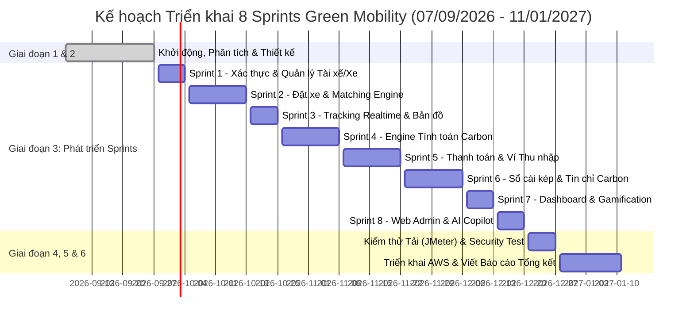

# Green Mobility Platform - AI Coding Agent Playbook

> **Tài liệu**: Cẩm nang & Quy trình Thực thi dành cho AI Coding Agent (Agent Playbook)  
> **Dự án**: Nền tảng gọi xe điện tích hợp hệ thống đo lường, báo cáo và khuyến khích giảm phát thải carbon  
> **Sinh viên thực hiện**: Phạm Hà Anh Thư (23521544), Nguyễn Minh Thiện (23521484)  
> **Cán bộ hướng dẫn**: ThS. Trần Thị Hồng Yến — Trường ĐH Công nghệ Thông tin (ĐHQG TP.HCM)  
> **Mục tiêu**: Hướng dẫn tự động hóa lập trình cho AI Agent (hoặc Developer) phát triển từng sprint, module, API, giao diện và test script đạt độ chính xác 100% so với đề cương.

---

## 1. Nguyên tắc Bất biến khi Viết Code (Agent Invariant Rules)

Khi AI Agent thực thi sinh mã hoặc chỉnh sửa mã nguồn, **bắt buộc tuân thủ 6 nguyên tắc sau**:

1. **Ranh giới Module (Strict Module Boundary)**:
   - Kiến trúc Backend là **Spring Boot Modular Monolith**.
   - Module `trip` không được inject trực tiếp Repository của module `incentive` hay `carbon`. Giao tiếp liên module phải thông qua **Service Interface công khai** (ví dụ: `IncentiveModuleApi`) hoặc bắn **Spring Domain Events / RabbitMQ Events**.
2. **Quy tắc Sổ cái kép Bất biến (Double-Entry Ledger Invariant)**:
   - Tuyệt đối **không** được viết lệnh `UPDATE` hay `DELETE` trên bảng `ledger_entries`.
   - Mọi thay đổi số dư Tín chỉ Carbon hay Điểm thưởng đều phải thông qua giao dịch kế toán gồm ít nhất 2 bút toán cân bằng:
     $$\sum \text{Debit} = \sum \text{Credit}$$
   - Số dư của tài khoản (`balance`) là kết quả tổng hợp của các bút toán.
3. **Chuẩn Tọa độ Địa lý (Geospatial Standards)**:
   - Tất cả tọa độ lưu trữ trên PostgreSQL/PostGIS phải dùng hệ tọa độ **WGS84 (`SRID 4326`)** theo thứ tự `Point(longitude, latitude)`. Lưu ý: Kinh độ (lng) trước, Vĩ độ (lat) sau theo chuẩn GIS quốc tế.
   - Khi tính khoảng cách chính xác, luôn ép kiểu sang `geography` hoặc gọi `ST_Distance(geom1::geography, geom2::geography)`.
4. **Phòng chống Race Condition khi Ghép Cuốc**:
   - Khi gửi yêu cầu cuốc xe cho tài xế, phải bắt buộc lấy khóa phân tán **Redis Distributed Lock (Redisson)** trên `driverId` trong 15 giây. Không để 2 cuốc xe cùng được gửi đến 1 tài xế tại cùng thời điểm.
5. **Tiêu chuẩn Trả lời API (Uniform API Response)**:
   - Tất cả REST API phải bọc kết quả trả về trong khuôn mẫu chuẩn `ApiResponse<T>`:
     ```json
     {
       "success": true,
       "message": "Thao tác thành công",
       "data": { ... },
       "timestamp": "2026-09-07T14:30:00Z"
     }
     ```
6. **Không Mock trong Logic Tính Toán Carbon**:
   - Công thức tính $CO_2$ giảm phải lấy trực tiếp từ bảng `emission_factors` đang active trong cơ sở dữ liệu, không được hardcode số trong Java service.

---

## 2. Cấu trúc Cây Thư mục Dự án Monorepo

```text
green-mobility/
├── docs/                              # Toàn bộ tài liệu đặc tả kiến trúc & đề cương
│   ├── 01_MASTER_ARCHITECTURE.md
│   ├── 02_BACKEND_SPEC.md
│   ├── 03_MOBILE_SPEC.md
│   ├── 04_ADMIN_SPEC.md
│   ├── 05_AGENT_PLAYBOOK.md
│   └── DE_CUONG_KLTN_...md
│
├── backend/                           # Spring Boot 3.3+ (Java 21) Modular Monolith
│   ├── pom.xml (hoặc build.gradle)
│   ├── Dockerfile
│   └── src/main/java/com/greenmobility/
│       ├── common/
│       ├── config/
│       └── modules/
│           ├── identity/
│           ├── drivervehicle/
│           ├── matching/
│           ├── trip/
│           ├── carbon/
│           ├── incentive/
│           ├── payment/
│           └── fraud/
│
├── frontend-admin/                    # Web Admin Next.js 14+ (TypeScript + Tailwind)
│   ├── package.json
│   ├── Dockerfile
│   └── src/
│       ├── app/
│       ├── components/
│       ├── lib/
│       └── types/
│
├── mobile/                            # Flutter 3.22+ Monorepo / Multi-Package
│   ├── packages/
│   │   ├── core_network/
│   │   ├── core_ui/
│   │   ├── core_map/
│   │   └── core_model/
│   └── apps/
│       ├── customer_app/
│       └── driver_app/
│
├── docker-compose.yml                 # Khởi chạy cụm Local: Postgres/PostGIS, Redis, Mongo, RabbitMQ
└── README.md
```

---

## 3. Lộ trình 8 Sprints Thực thi Chi tiết (Implementation Roadmap)

Bám sát 100% thời gian biểu trong Đề cương KLTN từ ngày **07/09/2026 đến 11/01/2027**:



---

### Sprint 1: Xác thực, Quản lý Tài xế, Xe điện & Xác thực Khuôn mặt (28/09 – 04/10/2026)
* **Mục tiêu**: Đăng ký, đăng nhập JWT cho 3 vai trò (Customer, Driver, Admin); nộp hồ sơ KYC xe điện; xác thực khuôn mặt tài xế (Face Verification) khi vào ca.
* **Backend Tasks**:
  - `module-identity`: Entity `User`, `Role`, `SecurityConfig`, JWT Token Provider, API `/auth/register`, `/auth/login`.
  - `module-driver-vehicle`: Entity `DriverProfile`, `Vehicle`, `FaceVerificationLog`.
  - API nộp hồ sơ KYC kèm upload ảnh S3/MinIO.
  - Tích hợp Face Verification service: Nhận ảnh selfie, trích xuất embedding 512d, tính Cosine Similarity $\ge 0.75$.
* **Frontend/Mobile Tasks**:
  - Mobile: Màn hình Đăng ký/Đăng nhập số điện thoại + OTP.
  - Mobile Driver: Màn hình chụp ảnh CCCD, GPLX, khai báo xe VinFast Feliz S / VF e34. Màn hình Camera Face Verification khi bật ca.
  - Admin Web: Trang xét duyệt hồ sơ KYC đối chiếu tài xế (`/drivers`).

---

### Sprint 2: Đặt xe & Thuật toán Ghép Cặp (Matching Engine) (05/10 – 18/10/2026)
* **Mục tiêu**: Khách hàng tạo yêu cầu đặt xe, hệ thống tự động tìm và điều phối tài xế xe điện gần nhất với thời gian ghép $< 30$ giây.
* **Backend Tasks**:
  - `module-trip`: Entity `Trip`, State Machine (`REQUESTED`, `SEARCHING`, `MATCHED`, `CANCELLED`).
  - `module-matching`:
    - `DriverGeoRedisRepository`: Lưu vị trí tài xế `GEOADD drivers:geo:available:{type} lng lat driverId`.
    - `MatchingEngineService`: Tìm kiếm đa bán kính (Tier 1: 1.5km $\rightarrow$ Tier 2: 3.0km $\rightarrow$ Tier 3: 5.0km).
    - Tính điểm Score ứng viên (ưu tiên khoảng cách, dung lượng pin xe điện $>20\%$, rating tài xế).
    - Distributed Lock bằng Redisson khóa `driverId` trong 15s đếm ngược.
* **Frontend/Mobile Tasks**:
  - Customer App: Màn hình bản đồ chọn điểm đón/trả, ước tính giá cước, nút Đặt xe, hiệu ứng radar tìm kiếm.
  - Driver App: Pop-up nhận cuốc xe với vòng tròn đếm ngược 15 giây kèm khoảng cách và nút Chấp nhận/Từ chối.

---

### Sprint 3: Theo dõi Thời gian thực & Điều hướng (19/10 – 25/10/2026)
* **Mục tiêu**: Stream vị trí GPS thời gian thực giữa Tài xế và Khách hàng với độ trễ $< 5$ giây; lưu log vệt tọa độ vào MongoDB.
* **Backend Tasks**:
  - `WebSocketConfig`: Cấu hình STOMP endpoint `/ws-connect`.
  - Kênh `/topic/driver-location/{driverId}` và `/topic/trip/{tripId}`.
  - MongoDB `driver_gps_traces`: Lưu chuỗi tọa độ phục vụ vẽ lại hành trình.
* **Frontend/Mobile Tasks**:
  - Driver App: Bật Background Geolocation, gửi tọa độ mỗi 3 giây khi xe chạy. Bản đồ điều hướng OSRM Turn-by-Turn.
  - Customer App: Đón nhận vị trí xe qua WebSocket, làm mượt marker di chuyển (Interpolation / Lerp), hiển thị thời gian đón dự kiến (ETA).

---

### Sprint 4: Engine Tính toán Phát thải Carbon & Cấu hình Hệ số (26/10 – 08/11/2026)
* **Mục tiêu**: Tính toán chính xác lượng $CO_2$ giảm được sau chuyến đi dựa trên công thức IPCC/Bộ TN&MT; sinh hóa đơn tác động xanh (Impact Receipt).
* **Backend Tasks**:
  - `module-carbon`: Entity `EmissionFactor`, `CarbonRecord`, `TripImpactReceipt`.
  - `CarbonCalculationService`: Thực thi công thức:
    $$\Delta E_{\text{CO}_2} = d_{\text{actual}} \times \left( EF_{\text{baseline}} - SEC \times EF_{\text{grid}} \right)$$
  - Chuyển đổi chỉ số tương đương: Số ngày cây xanh hấp thụ ($0.06\,kg/\text{ngày}$), Số giờ thắp đèn LED 10W ($7.221\,g/\text{giờ}$).
  - API cấu hình ma trận phát thải cho Admin (`/emissions`).
* **Frontend/Mobile Tasks**:
  - Customer App: Màn hình **Impact Receipt** xuất hiện sau chuyến đi (Thẻ chúc mừng xanh, nút chia sẻ lên mạng xã hội).
  - Admin Web: Giao diện quản lý và cập nhật hệ số phát thải có audit log và phiên bản hiệu lực.

---

### Sprint 5: Thanh toán & Ví Thu nhập Tài xế (09/11 – 22/11/2026)
* **Mục tiêu**: Tích hợp cổng thanh toán trực tuyến (VNPay / MoMo sandbox) và quản lý ví cước chuyến đi.
* **Backend Tasks**:
  - `module-payment`: Xử lý tạo URL thanh toán VNPay/MoMo, IPN Webhook callback xác nhận giao dịch an toàn với chữ ký HMAC-SHA512.
  - Cập nhật trạng thái cuốc xe thành `PAID` và kích hoạt luồng trả thu nhập cho tài xế.
* **Frontend/Mobile Tasks**:
  - Customer App: Màn hình chọn phương thức thanh toán, tích hợp WebView mở cổng VNPay/MoMo.
  - Driver App: Màn hình Ví thu nhập, lịch sử nhận tiền từng cuốc xe.

---

### Sprint 6: Hệ thống Khuyến khích (Sổ cái kép, Ví Carbon & Điểm thưởng) (23/11 – 06/12/2026)
* **Mục tiêu**: Vận hành sổ cái kép kế toán (Double-Entry Ledger) quản lý Tín chỉ Carbon cá nhân và Điểm thưởng; đảm bảo không sai lệch số dư.
* **Backend Tasks**:
  - `module-incentive`: Entity `LedgerAccount`, `LedgerTransaction`, `LedgerEntry`, `Reward`, `RewardRedemption`.
  - `LedgerEngineService`: Tự động tạo bút toán kép khi nhận event `carbon.event.calculated`.
  - Database constraint & Application check: $\sum \text{Debit} = \sum \text{Credit}$.
  - API quy đổi điểm thưởng sang voucher hoặc đóng góp trồng cây xanh.
* **Frontend/Mobile Tasks**:
  - Customer App: Màn hình Ví Carbon (thẻ ảo hiển thị kg $CO_2$ đã giảm, số dư PCC, điểm thưởng). Cửa hàng quà tặng xanh Eco-Store.
  - Admin Web: Màn hình kiểm toán đối soát sổ cái kép (`/incentives/ledger-audit`).

---

### Sprint 7: Báo cáo Tổng hợp & Gamification (07/12 – 13/12/2026)
* **Mục tiêu**: Bảng xếp hạng sống xanh, hệ thống huy hiệu và báo cáo định kỳ tuần/tháng.
* **Backend Tasks**:
  - Query Aggregation thống kê lượng $CO_2$ theo tuần/tháng của từng người dùng và từng quận huyện.
  - Bảng xếp hạng Leaderboard: Redis Sorted Sets `ZADD leaderboard:carbon:weekly {co2} {userId}`.
* **Frontend/Mobile Tasks**:
  - Customer App: Màn hình Bảng xếp hạng Top người sống xanh, bộ huy hiệu thành tựu (Eco Pioneer, Carbon Crusher). Báo cáo ESG cá nhân.

---

### Sprint 8: Hoàn thiện Web Admin & AI Copilot Chatbot (14/12 – 20/12/2026)
* **Mục tiêu**: Dashboard điều hành toàn diện cho Quản trị viên và Chatbot AI truy vấn báo cáo ngôn ngữ tự nhiên.
* **Backend Tasks**:
  - Phân hệ phát hiện gian lận (`module-fraud`): Tích hợp mô hình Anomaly Detection (Isolation Forest) phát hiện GPS spoofing và cày cuốc xe ảo.
  - `module-ai-copilot`: Tích hợp Spring AI / LLM Client hỗ trợ Admin hỏi đáp số liệu vận hành và số liệu phát thải.
* **Frontend Tasks**:
  - Admin Web: Bản đồ điều hành trực tiếp toàn thành phố, công cụ Replay hành trình chuyến đi từ MongoDB GPS logs. Hộp thoại Chatbot Copilot.

---

## 4. Bộ Dữ liệu Mẫu Chuẩn (Seed & Mock Specifications)

AI Agent khi tạo file seed data (`seed-data.sql` hoặc test fixtures) phải sử dụng đúng các bộ dữ liệu sau:

### 4.1. Tọa độ Địa lý Thực tế tại TP. Hồ Chí Minh
| Địa điểm | Kinh độ (Longitude) | Vĩ độ (Latitude) | Ghi chú |
| :--- | :--- | :--- | :--- |
| **Nhà hát Thành phố (Quận 1)** | `106.702981` | `10.776530` | Trung tâm Quận 1 |
| **Chợ Bến Thành (Quận 1)** | `106.698306` | `10.772545` | Điểm đón du lịch |
| **Hồ Con Rùa (Quận 3)** | `106.695780` | `10.782620` | Quận 3 |
| **Landmark 81 (Bình Thạnh)** | `106.721900` | `10.795100` | Khu đô thị Vinhomes |
| **ĐH Công nghệ Thông tin (UIT - ĐHQG)** | `106.803054` | `10.870020` | Khu Đô thị ĐHQG TP.HCM |
| **Khu Công nghệ cao (SHTP - TP. Thủ Đức)** | `106.792500` | `10.854000` | Điểm công nghệ cao |
| **Phú Mỹ Hưng - Crescent Mall (Quận 7)** | `106.719600` | `10.729500` | Trung tâm Nam Sài Gòn |

### 4.2. Danh mục Dòng Xe Điện Mẫu (EV Fleet Models)
1. **Xe máy điện VinFast Feliz S**:
   - `vehicleType`: `ELECTRIC_MOTORBIKE`
   - `batteryCapacityKwh`: `3.5` kWh
   - `rangePerChargeKm`: `198` km
   - `energyConsumption`: `0.032` kWh/km
2. **Xe máy điện Dat Bike Weaver++**:
   - `vehicleType`: `ELECTRIC_MOTORBIKE`
   - `batteryCapacityKwh`: `5.0` kWh
   - `rangePerChargeKm`: `200` km
   - `energyConsumption`: `0.035` kWh/km
3. **Ô tô điện VinFast VF e34**:
   - `vehicleType`: `ELECTRIC_CAR_4SEAT`
   - `batteryCapacityKwh`: `42.0` kWh
   - `rangePerChargeKm`: `318` km
   - `energyConsumption`: `0.135` kWh/km
4. **Ô tô điện VinFast VF 8**:
   - `vehicleType`: `ELECTRIC_CAR_7SEAT`
   - `batteryCapacityKwh`: `87.7` kWh
   - `rangePerChargeKm`: `471` km
   - `energyConsumption`: `0.180` kWh/km

### 4.3. Bảng Hệ số Phát thải Môi trường Mặc định (Bộ TN&MT & IPCC)
* **Hệ số phát thải lưới điện quốc gia ($EF_{\text{grid}}$)**: `722.1` $g\text{CO}_2/kWh$.
* **Hệ số phát thải xe xăng cơ sở ($EF_{\text{baseline}}$)**:
  - Xe máy xăng: `68.5` $g\text{CO}_2/km$.
  - Ô tô 4 chỗ xăng: `152.0` $g\text{CO}_2/km$.
  - Ô tô 7 chỗ xăng: `210.0` $g\text{CO}_2/km$.

---

## 5. Mẫu Câu Prompt Chuẩn Giao Việc cho AI Coding Agent (Prompt Templates)

Khi người dùng hoặc hệ thống muốn giao việc cho một AI sub-agent code từng phần, hãy sử dụng các khuôn mẫu prompt sau:

### Prompt Template 1: Lập trình Backend Module
```text
Bạn là chuyên gia Backend Spring Boot 3.3 (Java 21). 
Hãy đọc tài liệu docs/01_MASTER_ARCHITECTURE.md và docs/02_BACKEND_SPEC.md, sau đó tiến hành hiện thực module [TÊN_MODULE, ví dụ: module-carbon].
Yêu cầu bắt buộc:
1. Tạo đầy đủ Entity JPA, Repository, Service, Controller theo đúng schema CSDL và REST API specs đã đặc tả.
2. Tuân thủ nguyên tắc Modular Monolith: Không phụ thuộc trực tiếp vào Repository của module khác.
3. Sử dụng ApiResponse<T> cho toàn bộ các endpoints.
4. Viết Unit Test bằng JUnit 5 và Mockito phủ tối thiểu 85% logic nghiệp vụ.
```

### Prompt Template 2: Lập trình Matching Engine với Redis GEO
```text
Bạn là chuyên gia tối ưu hóa hiệu năng thời gian thực trên Redis và Spring Boot.
Hãy hiện thực MatchingEngineService trong module-matching theo đặc tả mục 4 của docs/02_BACKEND_SPEC.md:
1. Sử dụng Redis GEO (GEOSEARCH) với chiến lược mở rộng bán kính 3 tầng: 1.5km -> 3.0km -> 5.0km.
2. Tính điểm Score ứng viên theo công thức trọng số (Khoảng cách, % Pin, Rating, Tần suất hủy cuốc).
3. Áp dụng Distributed Lock bằng Redisson cho driverId trong 15 giây đếm ngược.
4. Bắn STOMP WebSocket event tới /user/queue/ride-dispatch.
```

### Prompt Template 3: Lập trình Sổ Cái Kép (Double-Entry Ledger)
```text
Hãy hiện thực LedgerEngineService trong module-incentive tuân thủ quy tắc bất biến trong docs/01_MASTER_ARCHITECTURE.md và docs/02_BACKEND_SPEC.md:
1. Mọi giao dịch phải tạo ra ít nhất 2 LedgerEntry cân bằng (Tổng Debit = Tổng Credit).
2. Tuyệt đối không viết lệnh UPDATE hoặc DELETE trên bảng ledger_entries.
3. Bọc toàn bộ nghiệp vụ trong giao dịch @Transactional(isolation = Isolation.SERIALIZABLE) hoặc áp dụng khóa bi quan.
4. Viết Testcontainers test đảm bảo rollback khi ném LedgerImbalanceException.
```

---

## 6. Kế hoạch Kiểm thử Chịu tải & An ninh (Testing & Hardening Runbook)

Bám sát giai đoạn 4 của đề cương (21/12 – 27/12/2026):

### 6.1. Stress Test với Apache JMeter
* **Kịch bản**:
  - Mô phỏng **1.000 tài xế xe điện** trực tuyến đồng thời tại khu vực Quận 1 và gửi tọa độ GPS mỗi 3 giây qua WebSocket.
  - Mô phỏng **500 khách hàng** cùng tạo yêu cầu đặt xe (`POST /trips/request`) trong khung giờ cao điểm (Peak Hour: 17h30 - 18h30).
* **Tiêu chí Nghiệm thu (Success Criteria)**:
  - Tỷ lệ lỗi HTTP/WebSocket: $< 0.1\%$.
  - Thời gian ghép tài xế thành công trung bình: $< 25$ giây (yêu cầu đề cương: $< 30$ giây).
  - Độ trễ gửi nhận vị trí GPS giữa tài xế và khách hàng: $< 2.5$ giây (yêu cầu đề cương: $< 5$ giây).

### 6.2. Kiểm thử An ninh & Chống Gian lận (Security & Fraud Testing)
* **Kịch bản 1: Giả mạo Tọa độ GPS (GPS Spoofing / Teleportation)**:
  - Dùng script gửi 2 tọa độ cách nhau 5km chỉ sau 1 giây.
  - *Kết quả mong đợi*: Hệ thống phát hiện bất thường vận tốc, kích hoạt `FraudAlert`, tạm giữ cuốc xe không cộng tín chỉ carbon vào ví.
* **Kịch bản 2: Bút toán Bất cân bằng (Ledger Imbalance Tampering)**:
  - Thử nghiệm cố tình chèn 1 bản ghi Debit mà không có Credit đối ứng.
  - *Kết quả mong đợi*: Database trigger hoặc Hibernate ném ngoại lệ, giao dịch rollback 100%, số dư ví không đổi.
