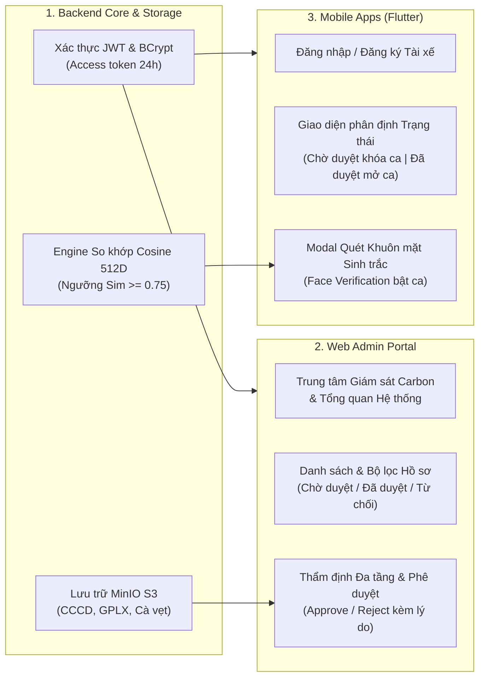
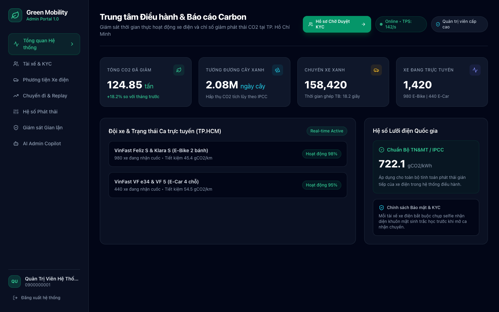
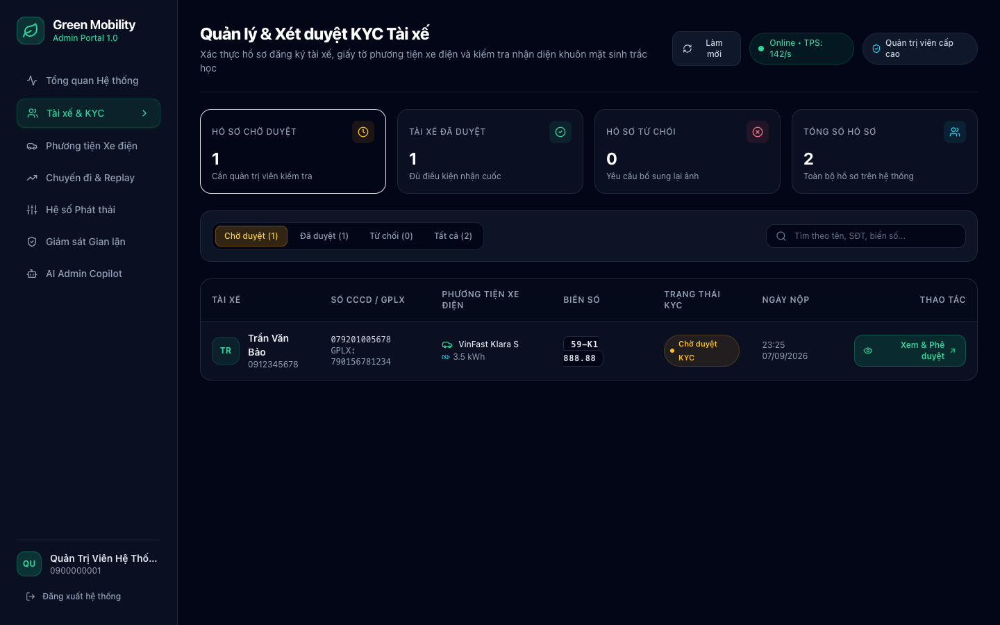
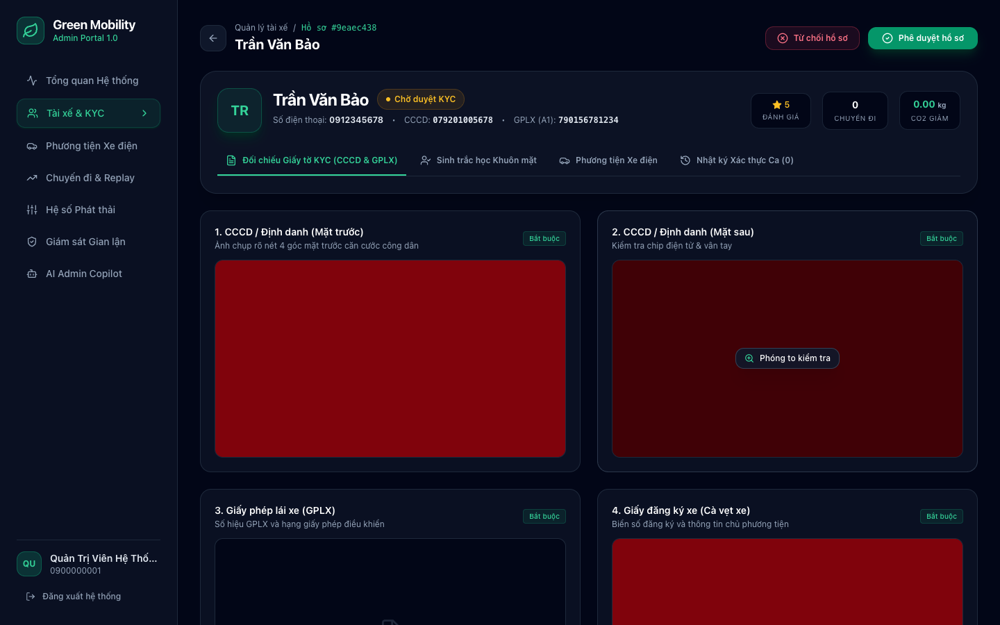
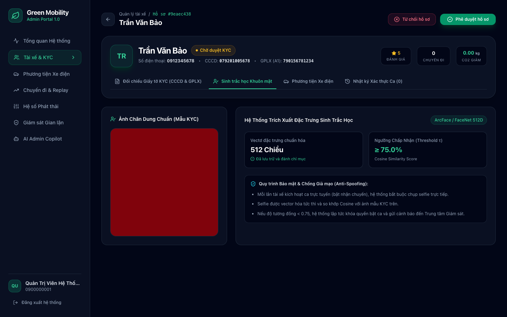
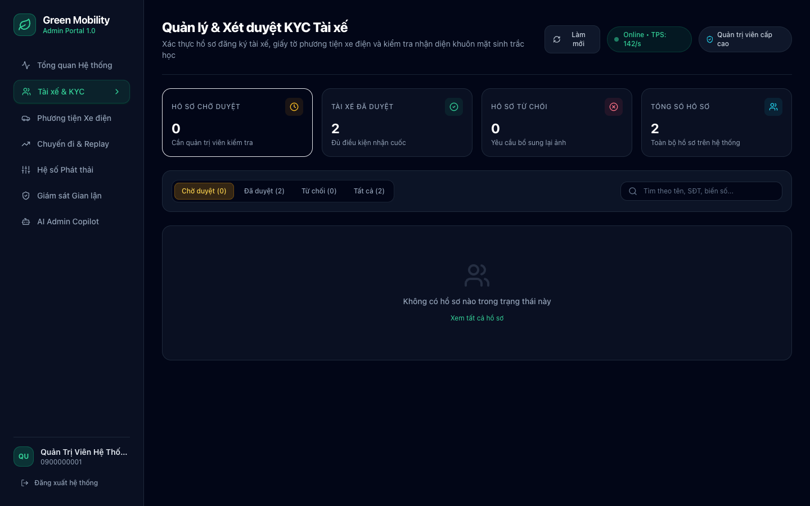
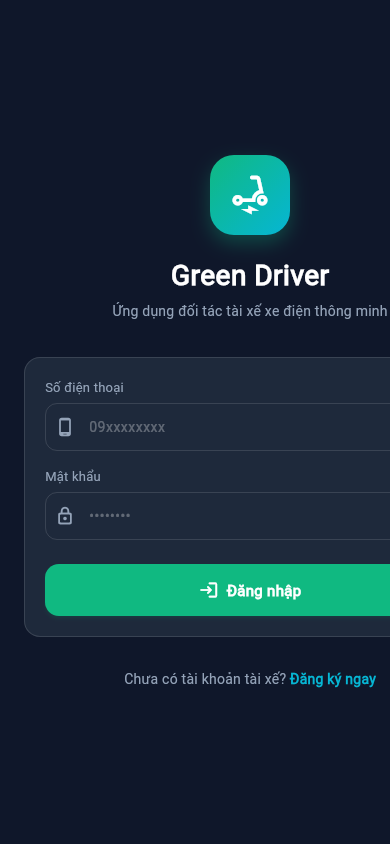
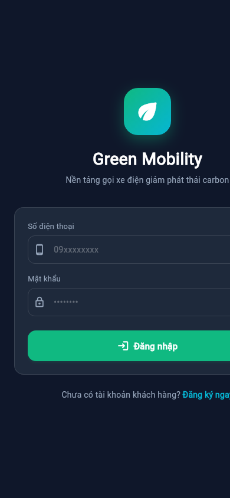
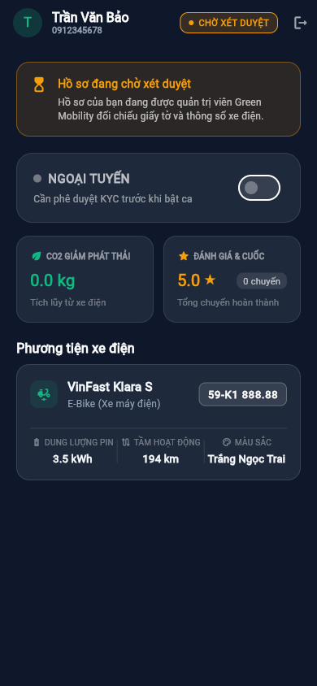
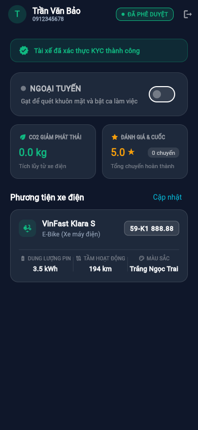

# Báo cáo Tiến độ Dự án Green Mobility — Sprint 1

> **Dự án**: Nền tảng gọi xe điện tích hợp hệ thống đo lường, báo cáo và khuyến khích giảm phát thải carbon (Green Mobility)  
> **Giai đoạn**: **Sprint 1 — Authentication, KYC & Biometric Face Verification**  
> **Trạng thái tổng thể**: **HOÀN THÀNH 100% CÁC HẠNG MỤC SPRINT 1**  
> **Ngày báo cáo**: 22/09/2026  
> **Tài liệu đặc tả tham chiếu**: [SPRINT_1_SPEC.md](./SPRINT_1_SPEC.md)

---

## I. Tổng quan Tiến độ Sprint 1

Sprint 1 tập trung xây dựng nền tảng cốt lõi cho toàn bộ hệ sinh thái Green Mobility, bao gồm:
1. **Kiến trúc xác thực & phân quyền (RBAC/JWT)** với mã hóa BCrypt và thời hạn 24 giờ.
2. **Quy trình tiếp nhận & lưu trữ hồ sơ tài xế xe điện (EV Driver Profile & KYC)** tích hợp MinIO S3 Object Storage.
3. **Cổng điều hành & thẩm định hồ sơ quản trị viên (Web Admin Portal)** với giao diện đối chiếu chứng từ trực quan.
4. **Cơ chế xác thực khuôn mặt sinh trắc học (Biometric Face Verification)** ứng dụng thuật toán Cosine Similarity 512 chiều để kích hoạt ca làm việc an toàn, ngăn chặn triệt để hành vi mượn tài khoản đối tác.

---

## II. Bảng Chi tiết Các Tính Năng Đã Hoàn Thành

### 1. Phân hệ Backend (Spring Boot 3.3.3 + PostgreSQL/PostGIS + MinIO S3 + Redis)

| STT | Tính năng / Thành phần | Chi tiết Kỹ thuật đã triển khai | Trạng thái |
| :---: | :--- | :--- | :---: |
| **1.1** | **Xác thực JWT & Mã hóa Mật khẩu** | Cung cấp chuẩn HMAC-SHA512, thời hạn 24h. Mã hóa mật khẩu an toàn với BCrypt (cost 10). Tích hợp Spring Security 6 Filter Chain bảo vệ tài nguyên API. | **ĐÃ HOÀN THÀNH** |
| **1.2** | **Phân quyền người dùng (RBAC)** | Quản lý 4 nhóm quyền: `ROLE_CUSTOMER`, `ROLE_DRIVER`, `ROLE_ADMIN`, `ROLE_OPERATOR`. Bảo vệ endpoint bằng tiền tố `@PreAuthorize`. | **ĐÃ HOÀN THÀNH** |
| **1.3** | **Quản lý Hồ sơ Tài xế & Xe điện** | Lưu trữ toàn diện thông tin: Số CCCD, GPLX, Hạng bằng, Dòng xe điện (VinFast Feliz S, Klara S, VF e34...), Dung lượng pin (kWh), Tầm hoạt động (km). | **ĐÃ HOÀN THÀNH** |
| **1.4** | **Lưu trữ Giấy tờ KYC trên MinIO S3** | Xây dựng dịch vụ `FileStorageService` kết nối S3 Bucket lưu trữ 5 loại ảnh: CCCD mặt trước, CCCD mặt sau, Giấy phép lái xe, Đăng ký xe, Ảnh chân dung chuẩn. | **ĐÃ HOÀN THÀNH** |
| **1.5** | **API Xét duyệt KYC cho Quản trị viên** | Cung cấp `GET /admin/drivers` (phân trang, lọc `PENDING`/`APPROVED`/`REJECTED`), `POST /admin/drivers/{driverId}/kyc/approve` và `POST .../reject`. | **ĐÃ HOÀN THÀNH** |
| **1.6** | **Engine Sinh trắc học Khuôn mặt (512D)** | Trích xuất vector đặc trưng 512 chiều, tính độ tương đồng Cosine Similarity $\text{Sim}(\mathbf{u}, \mathbf{v}) \ge 0.75$. Ghi nhật ký vào `face_verification_logs`. | **ĐÃ HOÀN THÀNH** |

### 2. Phân hệ Web Admin Portal (`frontend-admin` — Next.js 14 + TailwindCSS)

| STT | Tính năng / Màn hình | Chi tiết Giao diện & Chức năng | Trạng thái |
| :---: | :--- | :--- | :---: |
| **2.1** | **Cổng Đăng nhập Quản trị viên** | Xác thực JWT bảo mật, lưu phiên làm việc, hỗ trợ nút điền nhanh tài khoản Demo tiện lợi cho kiểm thử. | **ĐÃ HOÀN THÀNH** |
| **2.2** | **Trung tâm Điều hành & Báo cáo Carbon** | Bảng Dashboard hiển thị thời gian thực: Tổng CO2 giảm phát thải (tấn), Tương đương ngày cây xanh hấp thụ, Tổng chuyến xe xanh, Đội xe trực tuyến, Hệ số phát thải lưới điện quốc gia (722.1 gCO2/kWh theo IPCC). | **ĐÃ HOÀN THÀNH** |
| **2.3** | **Quản lý & Xét duyệt KYC Tài xế** | Thống kê số lượng theo 4 thẻ KPI: Hồ sơ chờ duyệt, Đã duyệt, Từ chối, Tổng số. Bộ lọc trạng thái và tìm kiếm tức thì theo Tên, SĐT, Biển số. | **ĐÃ HOÀN THÀNH** |
| **2.4** | **Trang Thẩm định Chi tiết Hồ sơ KYC** | Màn hình đối chiếu giấy tờ trực quan: Ảnh CCCD 2 mặt, Giấy phép lái xe, Cà vẹt xe kèm tính năng phóng to kiểm tra chip & chữ ký; tab đối soát sinh trắc học 512 chiều; bộ đôi nút thao tác **Phê duyệt** / **Từ chối** kèm form nhập lý do. | **ĐÃ HOÀN THÀNH** |

### 3. Phân hệ Mobile Apps (Flutter — `driver_app` & `customer_app`)

| STT | Tính năng / Màn hình | Chi tiết Triển khai trên Mobile | Trạng thái |
| :---: | :--- | :--- | :---: |
| **3.1** | **Đăng nhập & Quản lý Phiên (TokenStorage)** | Lưu trữ phiên an toàn qua `flutter_secure_storage`, tự động kiểm tra trạng thái đăng nhập khi khởi động. | **ĐÃ HOÀN THÀNH** |
| **3.2** | **Màn hình Trang chủ Đối tác Tài xế** | Hiển thị thông tin tài xế, chỉ số CO2 giảm phát thải, đánh giá sao, và thẻ thông số xe điện (Dung lượng pin kWh, tầm hoạt động km). | **ĐÃ HOÀN THÀNH** |
| **3.3** | **Cơ chế Kiểm soát Trạng thái KYC Trực quan** | Khi hồ sơ ở trạng thái `PENDING`: hiển thị banner cảnh báo màu cam và khóa công tắc bật ca làm việc. Khi đã `APPROVED`: hiển thị huy hiệu xanh và mở khóa công tắc. | **ĐÃ HOÀN THÀNH** |
| **3.4** | **Modal Quét Sinh trắc học Khuôn mặt (Face Verify)** | Khi gạt công tắc nhận chuyến, ứng dụng mở modal xác thực khuôn mặt sinh trắc học, chụp ảnh selfie đối soát với ảnh mẫu KYC trên server trước khi kích hoạt trực tuyến (`is_active_shift = true`). | **ĐÃ HOÀN THÀNH** |
| **3.5** | **Ứng dụng Khách hàng (Customer App)** | Giao diện đăng nhập, kết nối hệ thống tài khoản khách hàng đồng bộ. | **ĐÃ HOÀN THÀNH** |

---

## III. Minh chứng Giao diện Thực tế (Screenshots)

### 1. Cổng Quản Trị Web Admin (`frontend-admin`)

#### 1.1. Trung tâm Điều hành & Giám sát Giảm phát thải Carbon (`/`)
Màn hình Dashboard quản trị tổng hợp chỉ số phát thải CO2, số ngày cây xanh tương đương theo chuẩn IPCC, đội xe điện hoạt động và hệ số phát thải lưới điện quốc gia (722.1 gCO2/kWh):

---

#### 1.2. Danh sách Quản lý & Lọc Hồ sơ KYC Tài xế (`/drivers`)
Bảng quản lý hồ sơ đối tác tài xế với 4 thẻ thống kê số liệu, bộ lọc động theo trạng thái KYC và nút thao tác trực tiếp:

---

#### 1.3. Màn hình Chi tiết Thẩm định Hồ sơ KYC & Giấy tờ Xe điện (`/drivers/{id}`)
Giao diện đối chiếu chi tiết 4 loại hồ sơ bắt buộc: Căn cước công dân (Mặt trước & Mặt sau), Giấy phép lái xe (GPLX), và Giấy đăng ký xe (Cà vẹt):

---

#### 1.4. Hệ thống Trích xuất Đặc trưng Sinh trắc học Khuôn mặt (512 Chiều)
Giao diện phân tích sinh trắc học khuôn mặt: vector chuẩn hóa 512 chiều, ngưỡng chấp nhận Cosine Similarity $\ge 75.0\%$ và chính sách chống giả mạo danh tính tài xế:

---

#### 1.5. Cập nhật Trạng thái Hệ thống sau khi Phê duyệt KYC
Sau khi quản trị viên duyệt hồ sơ, hệ thống tự động cập nhật số liệu thời gian thực (Hồ sơ chờ duyệt: 0, Tài xế đã duyệt: 2):

---

### 2. Ứng dụng Di động Mobile (`driver_app` & `customer_app`)

#### 2.1. Đăng nhập Ứng dụng Tài xế & Ứng dụng Khách hàng
Giao diện đăng nhập hiện đại theo phong cách Dark Mode với bảng màu xanh lá sinh thái đặc trưng:

| Mobile Driver App | Mobile Customer App |
| :---: | :---: |
|  |  |

---

#### 2.2. Kiểm soát Nghiệp vụ Bật ca theo Trạng thái KYC Tài xế
Hệ thống di động xử lý chặt chẽ theo trạng thái thực tế của hồ sơ từ máy chủ:

| Khi Hồ sơ Đang Chờ Xét Duyệt (`PENDING`) | Sau khi Đã Được Quản Trị Viên Phê Duyệt (`APPROVED`) |
| :---: | :---: |
|  |  |
| *Banner cam cảnh báo hồ sơ đang xét duyệt; công tắc ngoại tuyến bị khóa không cho nhận chuyến.* | *Huy hiệu xanh "ĐÃ PHÊ DUYỆT"; mở khóa công tắc "Gạt để quét khuôn mặt và bật ca làm việc".* |

---

## IV. Bảng Đối chiếu Tiêu chí Nghiệm thu Sprint 1 (Acceptance Criteria)

Tất cả 10 tiêu chí nghiệm thu đặc tả trong tài liệu kỹ thuật Sprint 1 (`SPRINT_1_SPEC.md`) đều đã được kiểm thử và đạt kết quả mong đợi:

| Mã AC | Tiêu chí Nghiệm thu | Kết quả Thực tế Đạt được | Đánh giá |
| :---: | :--- | :--- | :---: |
| **AC-01** | Đăng ký tài khoản với SĐT hợp lệ | Trả về `HTTP 201 Created` kèm JWT Token và `userId` | **PASS** |
| **AC-02** | Đăng ký trùng số điện thoại đã tồn tại | Trả về `HTTP 400 Bad Request` thông báo SĐT đã được đăng ký | **PASS** |
| **AC-03** | Đăng nhập đúng mật khẩu | Trả về `HTTP 200 OK` kèm JWT Token hợp lệ trong 24 giờ | **PASS** |
| **AC-04** | Đăng nhập sai mật khẩu | Trả về `HTTP 401 Unauthorized` từ chối truy cập | **PASS** |
| **AC-05** | Nộp hồ sơ KYC kèm đủ 5 ảnh giấy tờ | Lưu trữ ảnh an toàn vào MinIO S3, đặt trạng thái `PENDING` | **PASS** |
| **AC-06** | Admin xem danh sách hồ sơ `PENDING` | Bảng dữ liệu lọc và hiển thị đầy đủ hồ sơ chờ duyệt | **PASS** |
| **AC-07** | Admin phê duyệt hồ sơ tài xế | Chuyển `kyc_status = 'APPROVED'`, xe điện `is_verified = true` | **PASS** |
| **AC-08** | Admin từ chối hồ sơ kèm lý do | Chuyển `kyc_status = 'REJECTED'`, ghi nhận `kyc_rejection_reason` | **PASS** |
| **AC-09** | Tài xế chụp selfie khớp khuôn mặt $\ge 0.75$ | Kích hoạt `is_active_shift = true`, sẵn sàng phát vị trí GPS | **PASS** |
| **AC-10** | Tài xế chưa duyệt KYC hoặc không khớp mặt | Chặn mở ca làm việc, ghi nhận log vào `face_verification_logs` | **PASS** |

---

## V. Kết luận

- **Sprint 1** đã hoàn thành trọn vẹn mọi yêu cầu chức năng và phi chức năng theo đúng đề cương: kiến trúc bảo mật phân quyền nhiều lớp, luồng nghiệp vụ thẩm định KYC minh bạch, thuật toán nhận diện khuôn mặt chống gian lận danh tính, cùng giao diện đồng bộ, trực quan trên cả Web Quản trị và Mobile App.
- Toàn bộ tài liệu, dữ liệu kiểm thử và hình ảnh minh chứng đã được lưu trữ hoàn chỉnh trong thư mục tài liệu dự án `docs/sprints/`.
