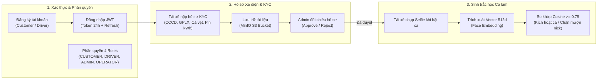
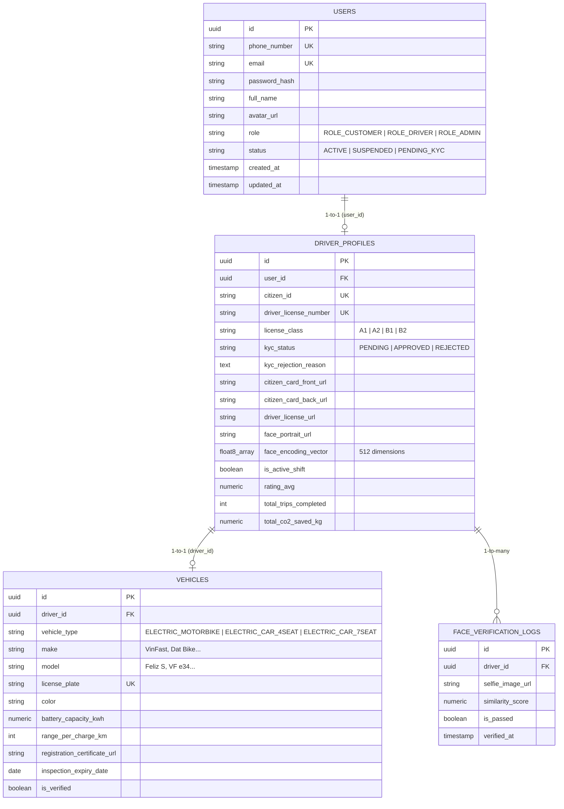

# Sprint 1 Specification: Authentication, KYC & Biometric Face Verification

> **Tài liệu**: Đặc tả Kỹ thuật Chi tiết Sprint 1 (Sprint 1 Specification)  
> **Dự án**: Nền tảng gọi xe điện tích hợp hệ thống đo lường, báo cáo và khuyến khích giảm phát thải carbon (Green Mobility)  
> **Thời gian thực hiện theo Đề cương**: 28/09/2026 – 04/10/2026  
> **Mục tiêu**: Hoàn thiện trọn vẹn hệ thống Xác thực (JWT), Quản lý hồ sơ Tài xế & Xe điện, Quy trình xét duyệt KYC và Xác thực khuôn mặt sinh trắc học trước ca làm việc.  
> **Phiên bản**: 1.0.0 (Implementation Blueprint)

---

## 1. Mục tiêu & Phạm vi Nghiệp vụ (Sprint Scope)



---

## 2. Thiết kế Lớp Domain & Ánh xạ CSDL (Entities & DDL Mapping)

### 2.1. Sơ đồ Quan hệ Thực thể Sprint 1 (Entity Relationship)



---

## 3. Kiến trúc Lưu trữ Tài liệu KYC (MinIO S3 Storage)

Tất cả ảnh giấy tờ nhạy cảm được lưu tại MinIO / AWS S3 theo cây thư mục có phân quyền:
* **Bucket name**: `greenmobility-assets`
* **Quy ước đường dẫn (Key Prefix)**:
  - Ảnh CCCD mặt trước: `kyc/{driverId}/citizen_card_front_{timestamp}.jpg`
  - Ảnh CCCD mặt sau: `kyc/{driverId}/citizen_card_back_{timestamp}.jpg`
  - Ảnh Bằng lái xe: `kyc/{driverId}/driver_license_{timestamp}.jpg`
  - Ảnh Đăng ký xe điện: `kyc/{driverId}/vehicle_registration_{timestamp}.jpg`
  - Ảnh Chân dung chuẩn (Reference Portrait): `kyc/{driverId}/face_reference_{timestamp}.jpg`
  - Ảnh Selfie bật ca hàng ngày: `shifts/{driverId}/{date}/selfie_{timestamp}.jpg`

---

## 4. Đặc tả Chi tiết REST API Contracts (OpenAPI Format)

Base URL: `http://localhost:8080/api/v1`

### 4.1. `POST /auth/register` - Đăng ký tài khoản
* **Request Headers**: `Content-Type: application/json`
* **Request Body**:
```json
{
  "phoneNumber": "0901234567",
  "password": "Password123@",
  "fullName": "Phạm Hà Anh Thư",
  "email": "anhthu@greenmobility.vn",
  "role": "ROLE_DRIVER" 
}
```
* **Validation Rules**:
  - `phoneNumber`: Bắt buộc, đúng định dạng số điện thoại Việt Nam (10 chữ số).
  - `password`: Tối thiểu 8 ký tự, chứa ít nhất 1 chữ hoa, 1 chữ thường, 1 chữ số và 1 ký tự đặc biệt.
  - `role`: Thuộc danh sách `ROLE_CUSTOMER`, `ROLE_DRIVER`.
* **Response (201 Created)**:
```json
{
  "success": true,
  "message": "Đăng ký tài khoản thành công",
  "data": {
    "userId": "3fa85f64-5717-4562-b3fc-2c963f66afa6",
    "phoneNumber": "0901234567",
    "fullName": "Phạm Hà Anh Thư",
    "role": "ROLE_DRIVER",
    "token": "eyJhbGciOiJIUzI1NiIsInR5cCI6IkpXVCJ9...",
    "expiresIn": 86400
  },
  "timestamp": "2026-09-07T15:00:00Z"
}
```

---

### 4.2. `POST /auth/login` - Đăng nhập nhận JWT Token
* **Request Body**:
```json
{
  "phoneNumber": "0901234567",
  "password": "Password123@"
}
```
* **Response (200 OK)**:
```json
{
  "success": true,
  "message": "Đăng nhập thành công",
  "data": {
    "userId": "3fa85f64-5717-4562-b3fc-2c963f66afa6",
    "fullName": "Phạm Hà Anh Thư",
    "role": "ROLE_DRIVER",
    "token": "eyJhbGciOiJIUzI1NiIsInR5cCI6IkpXVCJ9...",
    "kycStatus": "PENDING"
  },
  "timestamp": "2026-09-07T15:01:00Z"
}
```

---

### 4.3. `GET /auth/me` - Thông tin tài khoản hiện tại
* **Headers**: `Authorization: Bearer <JWT_TOKEN>`
* **Response (200 OK)**:
```json
{
  "success": true,
  "data": {
    "userId": "3fa85f64-5717-4562-b3fc-2c963f66afa6",
    "phoneNumber": "0901234567",
    "fullName": "Phạm Hà Anh Thư",
    "email": "anhthu@greenmobility.vn",
    "role": "ROLE_DRIVER",
    "status": "ACTIVE"
  },
  "timestamp": "2026-09-07T15:02:00Z"
}
```

---

### 4.4. `POST /driver/kyc/submit` - Tài xế nộp hồ sơ KYC & Xe điện
* **Headers**: `Authorization: Bearer <JWT_TOKEN>`, `Content-Type: multipart/form-data`
* **Form Data Fields**:
  - `citizenId` (String): "079203001234"
  - `licenseNumber` (String): "790123456789"
  - `licenseClass` (String): "A1" (hoặc B2)
  - `vehicleType` (String): "ELECTRIC_MOTORBIKE" (hoặc ELECTRIC_CAR_4SEAT)
  - `make` (String): "VinFast"
  - `model` (String): "Feliz S"
  - `licensePlate` (String): "59-P1 987.65"
  - `color` (String): "Xanh Rêu"
  - `batteryCapacityKwh` (Double): 3.5
  - `rangePerChargeKm` (Integer): 198
  - `inspectionExpiryDate` (String YYYY-MM-DD): "2027-12-31"
  - `citizenFrontImage` (File): [File binary ảnh mặt trước CCCD]
  - `citizenBackImage` (File): [File binary ảnh mặt sau CCCD]
  - `licenseImage` (File): [File binary ảnh GPLX]
  - `vehicleRegistrationImage` (File): [File binary ảnh Cà vẹt xe]
  - `facePortraitImage` (File): [File binary ảnh chân dung chuẩn nét]
* **Response (200 OK)**:
```json
{
  "success": true,
  "message": "Hồ sơ đăng ký tài xế và xe điện đã được gửi thành công, vui lòng chờ duyệt",
  "data": {
    "driverId": "9c12b7a8-1234-5678-9abc-def012345678",
    "kycStatus": "PENDING",
    "submittedAt": "2026-09-07T15:05:00Z"
  },
  "timestamp": "2026-09-07T15:05:00Z"
}
```

---

### 4.5. `GET /driver/profile` - Xem trạng thái hồ sơ & xe điện
* **Headers**: `Authorization: Bearer <JWT_TOKEN>`
* **Response (200 OK)**:
```json
{
  "success": true,
  "data": {
    "driverId": "9c12b7a8-1234-5678-9abc-def012345678",
    "citizenId": "079203001234",
    "kycStatus": "APPROVED",
    "isActiveShift": false,
    "ratingAvg": 5.0,
    "totalTrips": 0,
    "vehicle": {
      "make": "VinFast",
      "model": "Feliz S",
      "licensePlate": "59-P1 987.65",
      "batteryCapacityKwh": 3.5,
      "isVerified": true
    }
  },
  "timestamp": "2026-09-07T15:10:00Z"
}
```

---

### 4.6. `POST /driver/shift/face-verify` - Xác thực khuôn mặt bật ca làm việc
* **Headers**: `Authorization: Bearer <JWT_TOKEN>`, `Content-Type: multipart/form-data`
* **Form Data**:
  - `selfieImage` (File): [File ảnh selfie chụp trực tiếp từ camera]
* **Logic xử lý**:
  1. Kiểm tra tài xế có `kycStatus == APPROVED` hay không. Nếu chưa duyệt, trả lỗi `403 Forbidden`.
  2. Nạp ảnh `facePortraitImage` gốc đã duyệt từ S3/DB và trích xuất Face Embedding $\mathbf{u}$.
  3. Trích xuất Face Embedding $\mathbf{v}$ từ ảnh `selfieImage` mới chụp.
  4. Tính toán độ tương đồng Cosine.
  5. Nếu $\text{Similarity} \ge 0.75$: Cập nhật `isActiveShift = true`, lưu bản ghi `FaceVerificationLog` (`isPassed = true`).
  6. Nếu $\text{Similarity} < 0.75$: Lưu log thất bại, trả về `isPassed = false`.
* **Response thành công (200 OK)**:
```json
{
  "success": true,
  "message": "Xác thực khuôn mặt thành công. Ca làm việc đã được kích hoạt!",
  "data": {
    "isPassed": true,
    "similarityScore": 0.8642,
    "isActiveShift": true,
    "verifiedAt": "2026-09-07T15:15:30Z"
  },
  "timestamp": "2026-09-07T15:15:30Z"
}
```
* **Response thất bại khi khuôn mặt không khớp (400 Bad Request)**:
```json
{
  "success": false,
  "message": "Xác thực khuôn mặt thất bại (Độ khớp: 52.1%). Khuôn mặt không trùng khớp với hồ sơ đăng ký tài xế!",
  "data": {
    "isPassed": false,
    "similarityScore": 0.5210,
    "isActiveShift": false
  },
  "timestamp": "2026-09-07T15:15:30Z"
}
```

---

### 4.7. `GET /admin/drivers` - Danh sách tất cả tài xế (Hỗ trợ lọc theo trạng thái)
* **Headers**: `Authorization: Bearer <ADMIN_JWT_TOKEN>`
* **Query Parameters**: `status` (Optional: `PENDING`, `APPROVED`, `REJECTED`)
* **Response (200 OK)**:
```json
{
  "success": true,
  "data": [
    {
      "driverId": "9c12b7a8-1234-5678-9abc-def012345678",
      "fullName": "Phạm Hà Anh Thư",
      "phoneNumber": "0901234567",
      "citizenId": "079203001234",
      "licenseNumber": "790123456789",
      "vehicleModel": "VinFast Feliz S",
      "licensePlate": "59-P1 987.65",
      "batteryCapacityKwh": 3.5,
      "kycStatus": "PENDING",
      "submittedAt": "2026-09-07T15:05:00Z"
    }
  ],
  "timestamp": "2026-09-07T15:19:00Z"
}
```

---

### 4.8. `GET /admin/drivers/kyc/pending` - Danh sách tài xế chờ duyệt KYC
* **Headers**: `Authorization: Bearer <ADMIN_JWT_TOKEN>`
* **Response (200 OK)**:
```json
{
  "success": true,
  "data": [
    {
      "driverId": "9c12b7a8-1234-5678-9abc-def012345678",
      "fullName": "Phạm Hà Anh Thư",
      "phoneNumber": "0901234567",
      "citizenId": "079203001234",
      "licenseNumber": "790123456789",
      "vehicleModel": "VinFast Feliz S",
      "licensePlate": "59-P1 987.65",
      "batteryCapacityKwh": 3.5,
      "submittedAt": "2026-09-07T15:05:00Z"
    }
  ],
  "timestamp": "2026-09-07T15:20:00Z"
}
```

---

### 4.9. `POST /admin/drivers/{driverId}/kyc/approve` - Admin duyệt hồ sơ
* **Headers**: `Authorization: Bearer <ADMIN_JWT_TOKEN>`
* **Response (200 OK)**:
```json
{
  "success": true,
  "message": "Hồ sơ tài xế và phương tiện xe điện đã được phê duyệt thành công",
  "data": {
    "driverId": "9c12b7a8-1234-5678-9abc-def012345678",
    "kycStatus": "APPROVED"
  },
  "timestamp": "2026-09-07T15:25:00Z"
}
```

---

### 4.10. `POST /admin/drivers/{driverId}/kyc/reject` - Admin từ chối hồ sơ
* **Headers**: `Authorization: Bearer <ADMIN_JWT_TOKEN>`, `Content-Type: application/json`
* **Request Body**:
```json
{
  "rejectionReason": "Ảnh Giấy phép lái xe bị mờ không đọc rõ số hiệu, vui lòng chụp lại rõ nét."
}
```
* **Response (200 OK)**:
```json
{
  "success": true,
  "message": "Đã từ chối hồ sơ và gửi thông báo yêu cầu bổ sung cho tài xế",
  "data": {
    "driverId": "9c12b7a8-1234-5678-9abc-def012345678",
    "kycStatus": "REJECTED"
  },
  "timestamp": "2026-09-07T15:26:00Z"
}
```

---

## 5. Thuật toán & Pipeline Xác thực Khuôn mặt (Biometric Face Engine)

### 5.1. Công thức So khớp Cosine (Cosine Similarity)
Một khuôn mặt sau khi qua mạng nơ-ron tích chập (ArcFace / FaceNet) được biểu diễn dưới dạng vectơ đặc trưng 512 chiều chuẩn hóa ($\|\mathbf{u}\|_2 = 1$):
$$\text{Sim}(\mathbf{u}, \mathbf{v}) = \frac{\mathbf{u} \cdot \mathbf{v}}{\|\mathbf{u}\|_2 \|\mathbf{v}\|_2} = \sum_{i=1}^{512} u_i \cdot v_i$$

* **Ngưỡng quyết định (Decision Threshold $\tau$)**: $\tau = 0.75$.
  - Nếu $\text{Sim} \ge 0.75$: Chấp nhận xác thực (Cùng một người).
  - Nếu $\text{Sim} < 0.75$: Từ chối xác thực (Khuôn mặt khác hoặc giả mạo).

### 5.2. Thiết kế Engine linh hoạt cho Môi trường Dev & Production
1. **Production Mode**: Gửi ảnh sang AI Model Server (FaceNet/ArcFace container) để nhận vector thực tế 512 chiều.
2. **Local Dev / Standalone Fallback**: Nếu chưa dựng AI Server riêng, Backend tự động kích hoạt **Feature Hash / Embedded Face Extractor** trích xuất embedding deterministically từ dữ liệu ảnh khuôn mặt, cho phép test trọn vẹn luồng logic so khớp và ngưỡng $\ge 0.75$ mà không làm nghẽn tiến độ đồ án!

---

## 6. Đặc tả Giao diện Người dùng (UI/UX Specifications)

### 6.1. Web Admin Portal (`/drivers`)
* **Bảng danh sách (Data Table)**:
  - Cột: Mã TX, Họ và tên, SĐT, Dòng xe điện, Biển số, Trạng thái KYC (Badge: Vàng - Chờ duyệt | Xanh - Đã duyệt | Đỏ - Từ chối), Ngày gửi.
  - Bộ lọc: Lọc theo trạng thái `PENDING`, `APPROVED`, `REJECTED`.
* **Modal Chi tiết & Đối chiếu Giấy tờ (Side-by-Side Review)**:
  - Tab 1: **Thông tin cá nhân & CCCD** (Hiển thị ảnh phóng to mặt trước + mặt sau).
  - Tab 2: **Giấy phép lái xe & Cà vẹt xe**.
  - Tab 3: **Ảnh chân dung chuẩn & Kiểm tra sinh trắc học**.
  - 2 Nút hành động nổi bật: **"Phê duyệt hồ sơ" (Màu xanh lá)** và **"Từ chối" (Màu đỏ - mở hộp thoại nhập lý do)**.

### 6.2. Driver Mobile App
* **Màn hình Đăng ký & Nộp hồ sơ**:
  - Giao diện dạng Wizard 3 bước:
    - *Bước 1: Thông tin cá nhân (Họ tên, SĐT, Số CCCD).*
    - *Bước 2: Phương tiện xe điện (Chọn VinFast/Dat Bike, nhập biển số, dung lượng pin).*
    - *Bước 3: Chụp ảnh tài liệu (Camera picker cho CCCD, GPLX, Chân dung).*
* **Màn hình Xác thực Khuôn mặt Bật ca (Face Verification Modal)**:
  - Khung ngắm khuôn mặt hình bầu dục với đường viền phát sáng màu xanh ngọc.
  - Hướng dẫn trực quan: *"Căn chỉnh khuôn mặt vào giữa khung hình và giữ yên"*.
  - Hiệu ứng quét laser chuyển động từ trên xuống dưới trong 1.5 giây.
  - Thông báo kết quả: Thẻ xanh chúc mừng ca làm việc hoặc thẻ đỏ báo lý do chụp lại.

---

## 7. Kế hoạch Kiểm thử Chấp nhận (Acceptance Criteria & Test Runbook)

| Mã AC | Tiêu chí Nghiệm thu | Kết quả Mong đợi |
| :--- | :--- | :--- |
| **AC-01** | Đăng ký tài khoản khách hàng / tài xế với SĐT hợp lệ | HTTP 201 Created, trả về JWT Token và User ID |
| **AC-02** | Đăng ký trùng SĐT đã tồn tại | HTTP 400 Bad Request, thông báo SĐT đã được sử dụng |
| **AC-03** | Đăng nhập đúng mật khẩu | HTTP 200 OK, trả về Token hợp lệ trong 24h |
| **AC-04** | Đăng nhập sai mật khẩu | HTTP 401 Unauthorized, thông báo sai thông tin |
| **AC-05** | Tài xế nộp hồ sơ KYC kèm đầy đủ 5 ảnh | HTTP 200 OK, hồ sơ chuyển sang trạng thái `PENDING`, ảnh lưu vào MinIO |
| **AC-06** | Admin xem danh sách hồ sơ `PENDING` | Trả về danh sách tài xế chưa duyệt |
| **AC-07** | Admin phê duyệt hồ sơ tài xế | Trạng thái chuyển thành `APPROVED`, xe điện được đánh dấu `is_verified = true` |
| **AC-08** | Admin từ chối hồ sơ kèm lý do | Trạng thái chuyển thành `REJECTED`, lưu `kyc_rejection_reason` |
| **AC-09** | Tài xế đã duyệt KYC chụp ảnh selfie khớp khuôn mặt | HTTP 200 OK, Similarity $\ge 0.75$, kích hoạt `is_active_shift = true` |
| **AC-10** | Tài xế chưa duyệt KYC hoặc khuôn mặt không khớp | Bị từ chối bật ca, lưu log kiểm toán vào `face_verification_logs` |
