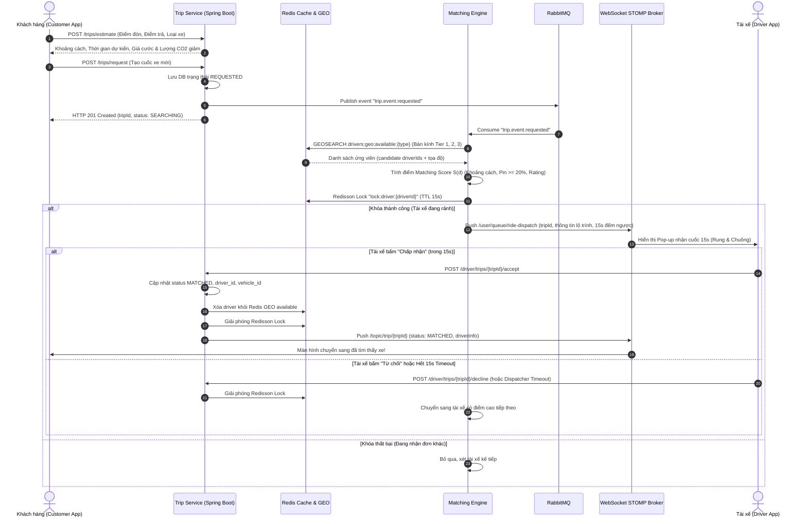
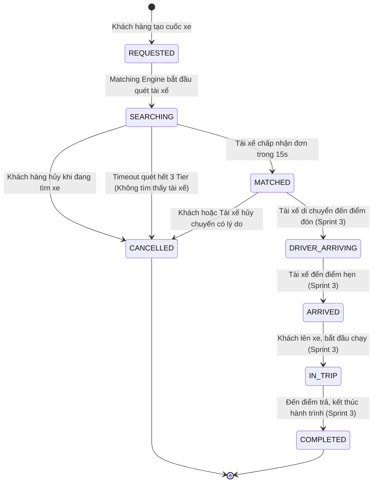
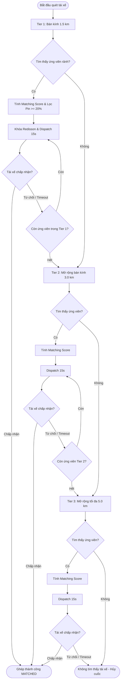
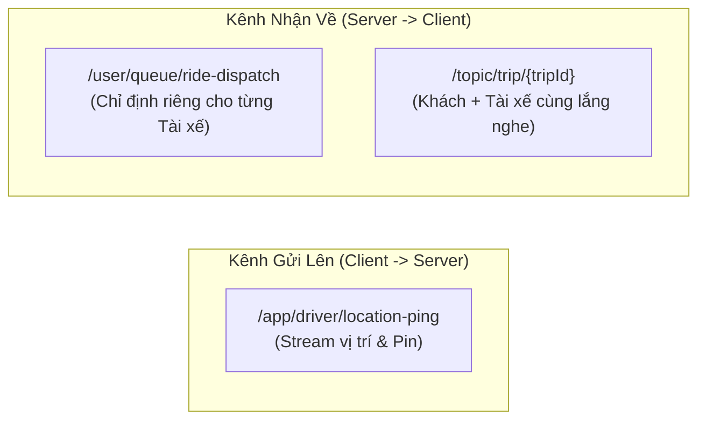

# Sprint 2 Specification: Ride Booking & Real-time Driver Matching Engine

> **Tài liệu**: Đặc tả Kỹ thuật Chi tiết Sprint 2 (Sprint 2 Specification)  
> **Dự án**: Nền tảng gọi xe điện tích hợp hệ thống đo lường, báo cáo và khuyến khích giảm phát thải carbon (Green Mobility)  
> **Thời gian thực hiện theo Đề cương KLTN**: 05/10/2026 – 18/10/2026  
> **Mục tiêu**: Hoàn thiện toàn diện quy trình Đặt xe điện (Ride Booking), Thuật toán Ghép cặp Tài xế thông minh đa bán kính (Matching Engine) sử dụng Redis GEO & PostGIS, Cơ chế phân phối đơn (Dispatching) chống nghẽn và race condition với Redisson Distributed Lock, Tích hợp WebSocket STOMP thông báo cuốc xe trong 15 giây, và Ước tính tức thì lượng $CO_2$ giảm được.  
> **Phiên bản**: 1.0.0 (Production Blueprint)

---

## 1. Mục tiêu & Phạm vi Nghiệp vụ (Sprint Scope & System Overview)

Sprint 2 kế thừa toàn bộ nền tảng Định danh, Hồ sơ tài xế xe điện và Xác thực khuôn mặt vào ca của Sprint 1, kích hoạt luồng nghiệp vụ cốt lõi nhất của nền tảng: **Kết nối Khách hàng có nhu cầu di chuyển xanh với Tài xế xe điện gần nhất**.



---

## 2. Vòng đời Chuyến xe & Thiết kế Máy Trạng thái (Trip State Machine)

### 2.1. Sơ đồ Chuyển đổi Trạng thái (State Diagram)

Trong phạm vi Sprint 2, trọng tâm là chu kỳ từ lúc tạo yêu cầu đến khi ghép cặp thành công (`REQUESTED` $\rightarrow$ `SEARCHING` $\rightarrow$ `MATCHED`) và các trường hợp hủy (`CANCELLED`). Các trạng thái tiếp theo (`DRIVER_ARRIVING`, `ARRIVED`, `IN_TRIP`, `COMPLETED`) được định nghĩa sẵn trong schema để đón đầu Sprint 3 (GPS Tracking).



### 2.2. Bảng Chuyển trạng thái & Quy tắc Ràng buộc (Transition Matrix)

| Trạng thái Hiện tại | Hành động Kích hoạt | Trạng thái Mới | Tác nhân (Actor) | Ràng buộc Nghiệp vụ |
| :--- | :--- | :--- | :--- | :--- |
| `[None]` | Tạo cuốc xe | `REQUESTED` | Khách hàng | Tọa độ điểm đón/trả hợp lệ, cước phí $>0$. |
| `REQUESTED` | Engine nhận diện | `SEARCHING` | Hệ thống (RabbitMQ) | Đẩy sự kiện vào Queue điều phối. |
| `SEARCHING` | Chấp nhận nhận cuốc | `MATCHED` | Tài xế | Phải giữ được Redisson Distributed Lock và phản hồi trong 15s. |
| `SEARCHING` | Khách bấm Hủy cuốc | `CANCELLED` | Khách hàng | Giải phóng mọi lock tài xế đang mời (nếu có). |
| `SEARCHING` | Quét hết 3 Tier không ai nhận | `CANCELLED` | Hệ thống | `cancel_reason = 'NO_DRIVER_AVAILABLE'`. |
| `MATCHED` | Hủy sau khi đã ghép | `CANCELLED` | Khách / Tài xế | Cần cung cấp lý do hủy, ghi nhận vi phạm nếu tài xế tự ý hủy. |

---

## 3. Thiết kế CSDL, Bộ nhớ đệm Redis & Message Queue

### 3.1. CSDL Quan hệ PostgreSQL (Bảng `trips`)

Bảng `trips` đã được thiết lập từ `V1__init_schema.sql` với kiểu dữ liệu không gian PostGIS `geometry(Point, 4326)`:

```sql
-- Trích xuất lược đồ thực tế của bảng trips
CREATE TABLE trips (
    id UUID PRIMARY KEY DEFAULT uuid_generate_v4(),
    trip_code VARCHAR(32) UNIQUE NOT NULL,             -- Mã cuốc công khai (VD: GM-20261005-A1B2)
    customer_id UUID NOT NULL REFERENCES users(id),
    driver_id UUID REFERENCES driver_profiles(id),      -- NULL khi SEARCHING, điền khi MATCHED
    vehicle_id UUID REFERENCES vehicles(id),            -- NULL khi SEARCHING, điền khi MATCHED
    vehicle_type VARCHAR(30) NOT NULL,                 -- ELECTRIC_MOTORBIKE, ELECTRIC_CAR_4SEAT, ELECTRIC_CAR_7SEAT
    
    -- Tọa độ PostGIS SRID 4326 (WGS 84)
    pickup_geom geometry(Point, 4326) NOT NULL,
    pickup_address TEXT NOT NULL,
    dropoff_geom geometry(Point, 4326) NOT NULL,
    dropoff_address TEXT NOT NULL,
    
    -- Trạng thái & Lý do
    status VARCHAR(30) NOT NULL DEFAULT 'REQUESTED',
    cancel_reason TEXT,
    cancelled_by VARCHAR(20),                          -- CUSTOMER, DRIVER, SYSTEM
    
    -- Ước tính & Thực tế
    estimated_distance_m INT NOT NULL,                 -- Quãng đường ước tính (mét)
    estimated_duration_s INT NOT NULL,                 -- Thời gian ước tính (giây)
    actual_distance_m INT,
    actual_duration_s INT,
    
    -- Giá cước & Thanh toán
    fare_amount NUMERIC(12, 2) NOT NULL,               -- Cước gốc VND
    discount_amount NUMERIC(12, 2) DEFAULT 0.00,
    final_amount NUMERIC(12, 2) NOT NULL,              -- Cước thực trả
    payment_method VARCHAR(20) NOT NULL,               -- CASH, VNPAY, MOMO, GREEN_WALLET
    payment_status VARCHAR(20) NOT NULL DEFAULT 'PENDING',
    
    -- Tác động Xanh
    co2_saved_grams NUMERIC(10, 2) DEFAULT 0.00,       -- Lượng CO2 giảm dự kiến
    carbon_credits_earned NUMERIC(10, 4) DEFAULT 0.0000,
    loyalty_points_earned INT DEFAULT 0,
    
    -- Mốc thời gian
    requested_at TIMESTAMP WITH TIME ZONE DEFAULT CURRENT_TIMESTAMP,
    matched_at TIMESTAMP WITH TIME ZONE,
    arrived_pickup_at TIMESTAMP WITH TIME ZONE,
    started_trip_at TIMESTAMP WITH TIME ZONE,
    completed_at TIMESTAMP WITH TIME ZONE
);

-- Chỉ mục không gian và hiệu năng
CREATE INDEX idx_trips_pickup_geom ON trips USING GIST(pickup_geom);
CREATE INDEX idx_trips_customer ON trips(customer_id, requested_at DESC);
CREATE INDEX idx_trips_driver ON trips(driver_id, requested_at DESC);
CREATE INDEX idx_trips_status ON trips(status);
```

### 3.2. Cấu trúc Dữ liệu Bộ nhớ đệm Redis

Redis đóng vai trò là "Bộ não định vị và phân phối tức thời" với thời gian phản hồi sub-millisecond:

| Key Format | Redis Type | TTL | Mô tả & Chức năng |
| :--- | :--- | :--- | :--- |
| `drivers:geo:available:{vehicleType}` | **GEO** | Vĩnh viễn (xóa khi tắt ca / bận) | Lưu trữ tọa độ `lng, lat, driverId` của các tài xế đang trực tuyến và rảnh việc (`is_active_shift = true`). |
| `driver:meta:{driverId}` | **Hash** | 24 giờ | Lưu metadata tài xế: `batteryPercent`, `ratingAvg`, `vehicleModel`, `licensePlate`, `lastPingTime`. |
| `lock:driver:{driverId}` | **String (Redisson RLock)** | **15 giây** | Khóa phân tán ngăn chặn việc 1 tài xế bị điều phối cho 2 cuốc xe cùng lúc (Race condition). |
| `trip:dispatch:{tripId}` | **Hash** | 5 phút | Trạng thái điều phối cuốc xe: `currentTier`, `dispatchedDriverId`, `declinedDriversSet`, `dispatchedAt`. |
| `driver:cooldown:{driverId}:{tripId}`| **String** | 60 giây | Đánh dấu tài xế đã từ chối cuốc xe này để không mời lại trong cùng phiên tìm kiếm. |

#### Các lệnh Redis thao tác vị trí:
```redis
# 1. Tài xế ping vị trí định kỳ 5s khi đang rảnh:
GEOADD drivers:geo:available:ELECTRIC_MOTORBIKE 106.70154 10.77712 "9c12b7a8-1234-5678-9abc-def012345678"

# 2. Cập nhật metadata pin và trạng thái:
HSET driver:meta:9c12b7a8-1234-5678-9abc-def012345678 battery 85 rating 4.92 updated 1788791400

# 3. Matching Engine quét tài xế gần điểm đón trong bán kính 1.5 km:
GEOSEARCH drivers:geo:available:ELECTRIC_MOTORBIKE FROMLONLAT 106.70098 10.77653 BYRADIUS 1.5 km WITHCOORD WITHDIST WITHHASH ASC COUNT 10

# 4. Khi tài xế nhận cuốc (MATCHED) hoặc tắt ca:
ZREM drivers:geo:available:ELECTRIC_MOTORBIKE "9c12b7a8-1234-5678-9abc-def012345678"
```

### 3.3. Kiến trúc Message Broker RabbitMQ

* **Exchange Name**: `greenmobility.topic.exchange` (Type: `topic`, Durable: `true`)
* **Hàng đợi & Định tuyến**:

| Routing Key | Queue Name | Chức năng | Payload DTO |
| :--- | :--- | :--- | :--- |
| `trip.event.requested` | `q.trip.matching.requests` | Kích hoạt Matching Engine tìm tài xế | `TripRequestedEvent` |
| `trip.event.dispatched` | `q.trip.notification.dispatch` | Gửi WebSocket / Push Notification cho tài xế | `TripDispatchedEvent` |
| `trip.event.matched` | `q.trip.status.matched` | Thông báo cho khách hàng đã ghép xe | `TripMatchedEvent` |
| `trip.event.cancelled` | `q.trip.status.cancelled` | Dọn dẹp Redisson Lock, báo hủy cho đối tác | `TripCancelledEvent` |

---

## 4. Thuật toán Ghép Cặp Tài xế Xe điện (EV Matching Engine Algorithm)

### 4.1. Chiến lược Mở rộng Đa Bán kính (Multi-tier Radius Expansion)

Để cân bằng giữa **Thời gian chờ của khách** và **Khoảng cách di chuyển của tài xế**, hệ thống áp dụng cơ chế mở rộng bậc thang 3 tầng (3-Tier Radius Progression):



### 4.2. Công thức Tính Điểm Ưu tiên (Matching Scoring Function)

Đối với mỗi ứng viên tài xế $d$ tìm thấy trong bán kính $r_{\max}$, hệ thống tính toán điểm số tổng hợp $S(d) \in [0, 1]$:

$$S(d) = w_{\text{dist}} \cdot S_{\text{dist}}(d) + w_{\text{bat}} \cdot S_{\text{bat}}(d) + w_{\text{rate}} \cdot S_{\text{rate}}(d)$$

Trong đó:
1. **Điểm Khoảng cách ($S_{\text{dist}}$)**: Càng gần điểm đón thì điểm càng cao:
   $$S_{\text{dist}}(d) = 1 - \frac{D(d)}{r_{\max}}$$
   *(với $D(d)$ là khoảng cách đường chim bay từ Redis GEO tính bằng mét)*.
2. **Điểm Dung lượng Pin Xe điện ($S_{\text{bat}}$)**: Ưu tiên tài xế xe điện có pin dồi dào:
   $$S_{\text{bat}}(d) = \frac{B(d)}{100}$$
   *(với $B(d)$ là % pin hiện tại của xe, $0 \le B(d) \le 100$)*.
3. **Điểm Đánh giá Sao ($S_{\text{rate}}$)**: Ưu tiên tài xế uy tín chất lượng:
   $$S_{\text{rate}}(d) = \frac{R(d) - 1.0}{4.0}$$
   *(với $R(d) \in [1.0, 5.0]$)*.

* **Trọng số Chuẩn hóa**:
  $$w_{\text{dist}} = 0.50, \quad w_{\text{bat}} = 0.30, \quad w_{\text{rate}} = 0.20 \quad (\sum w = 1.0)$$

> [!IMPORTANT]
> **Điều kiện Tiên quyết (Hard Constraint - Battery Safeguard)**:
> Nếu pin xe điện $B(d) < 20\%$, tài xế **bị loại ngay lập tức** khỏi danh sách ứng viên (loại trừ trường hợp chết pin giữa chặng đón).
> Nếu quãng đường dự kiến chuyến đi $L_{\text{trip}} > 15\,\text{km}$, yêu cầu pin xe $B(d) \ge 35\%$.

---

## 5. Công thức Định giá Cước & Dự toán Giảm phát thải Carbon

### 5.1. Bảng Giá Cước Tiêu chuẩn (Fare Structure)

Áp dụng biểu phí cạnh tranh minh bạch cho từng phân khúc phương tiện xanh:

| Loại Phương tiện | Mã Định danh (`vehicleType`) | Giá Mở cửa (2 km đầu) | Giá mỗi km tiếp theo ($> 2\,\text{km}$) | Phụ phí Đêm (22h - 06h) |
| :--- | :--- | :--- | :--- | :--- |
| **E-Bike (Xe máy điện)** | `ELECTRIC_MOTORBIKE` | **12.000 VNĐ** | **4.500 VNĐ / km** | + 5.000 VNĐ |
| **E-Car 4 chỗ (Xe con điện)**| `ELECTRIC_CAR_4SEAT` | **20.000 VNĐ** | **12.000 VNĐ / km** | + 15.000 VNĐ |
| **E-Car 7 chỗ (SUV điện)** | `ELECTRIC_CAR_7SEAT` | **25.000 VNĐ** | **14.500 VNĐ / km** | + 20.000 VNĐ |

* **Công thức Tổng quát**:
  $$\text{Fare} = \begin{cases} 
  \text{BaseFare} & \text{nếu } d \le 2.0\,\text{km} \\ 
  \text{BaseFare} + (d - 2.0) \times \text{RatePerKm} & \text{nếu } d > 2.0\,\text{km} 
  \end{cases}$$
  *(Làm tròn lên đơn vị nghìn đồng gần nhất, ví dụ: 34.200đ $\rightarrow$ 35.000đ)*.

### 5.2. Công thức Dự toán Lượng $CO_2$ Giảm được

Dựa trên hướng dẫn kiểm kê khí nhà kính của IPCC và Định mức Tiêu thụ Năng lượng:

$$\Delta E_{\text{CO}_2} = d_{\text{km}} \times \left( EF_{\text{gasoline}} - SEC \times EF_{\text{grid}} \right)$$

* **Các tham số tiêu chuẩn**:
  - Đối với Xe máy điện (`ELECTRIC_MOTORBIKE`):
    - $EF_{\text{gasoline}} = 68.5\,\text{gCO}_2/\text{km}$ (xe xăng 110cc-125cc).
    - $SEC = 0.025\,\text{kWh}/\text{km}$ (xe máy điện VinFast / Dat Bike).
    - $EF_{\text{grid}} = 0.7221\,\text{kgCO}_2/\text{kWh} = 722.1\,\text{gCO}_2/\text{kWh}$ (Hệ số phát thải lưới điện Việt Nam).
    - $\Rightarrow \text{Phát thải EV} = 0.025 \times 722.1 = 18.05\,\text{gCO}_2/\text{km}$.
    - $\Rightarrow \text{Lượng giảm thuần } \Delta E_{\text{CO}_2} = 68.5 - 18.05 = \mathbf{50.45\,\text{gCO}_2/\text{km}}$.
  - Đối với Ô tô điện 4 chỗ (`ELECTRIC_CAR_4SEAT`):
    - $EF_{\text{gasoline}} = 165.0\,\text{gCO}_2/\text{km}$ (xe xăng 1.5L).
    - $SEC = 0.145\,\text{kWh}/\text{km}$ (VinFast VF e34 / VF 5).
    - $\Rightarrow \text{Phát thải EV} = 0.145 \times 722.1 = 104.7\,\text{gCO}_2/\text{km}$.
    - $\Rightarrow \text{Lượng giảm thuần } \Delta E_{\text{CO}_2} = 165.0 - 104.7 = \mathbf{60.30\,\text{gCO}_2/\text{km}}$.
* **Quy đổi Trực quan**:
  - **Số ngày cây xanh thành phố hấp thụ**: $\text{Days} = \frac{\Delta E_{\text{CO}_2}}{60.0\,\text{g/ngày}}$.
  - **Số giờ thắp sáng bóng đèn LED 10W**: $\text{Hours} = \frac{\Delta E_{\text{CO}_2}}{7.221\,\text{g/giờ}}$.

---

## 6. Đặc tả Chi tiết REST API Contracts

Base URL: `http://localhost:8080/api/v1`

### 6.1. `POST /trips/estimate` - Ước tính Cước phí & CO2 Trước khi Đặt
* **Quyền hạn**: `ROLE_CUSTOMER`, `ROLE_DRIVER`, `ROLE_ADMIN`
* **Request Body**:
```json
{
  "pickupLat": 10.776530,
  "pickupLng": 106.700981,
  "pickupAddress": "Nhà hát Thành phố, Quận 1, TP.HCM",
  "dropoffLat": 10.870020,
  "dropoffLng": 106.803054,
  "dropoffAddress": "Trường ĐH Công nghệ Thông tin, TP. Thủ Đức, TP.HCM",
  "vehicleType": "ELECTRIC_MOTORBIKE"
}
```
* **Validation**:
  - `pickupLat`, `dropoffLat`: Tọa độ vĩ độ hợp lệ $[-90, 90]$.
  - `pickupLng`, `dropoffLng`: Tọa độ kinh độ hợp lệ $[-180, 180]$.
  - `vehicleType`: Bắt buộc thuộc `[ELECTRIC_MOTORBIKE, ELECTRIC_CAR_4SEAT, ELECTRIC_CAR_7SEAT]`.
* **Response (200 OK)**:
```json
{
  "success": true,
  "message": "Dự toán lộ trình thành công",
  "data": {
    "vehicleType": "ELECTRIC_MOTORBIKE",
    "distanceMeters": 16200,
    "distanceKm": 16.2,
    "durationSeconds": 1920,
    "durationMinutes": 32,
    "fareAmountVnd": 76000,
    "carbonEstimate": {
      "co2SavedGrams": 817.29,
      "treeAbsorptionDays": 13.62,
      "ledBulbHours": 113.18,
      "baselineGasolineGrams": 1109.70,
      "evEmittedGrams": 292.41
    },
    "routePolyline": "g_t_gA_r|qSs@q..."
  },
  "timestamp": "2026-10-05T08:30:00Z"
}
```

---

### 6.2. `POST /trips/request` - Khách hàng Tạo Yêu cầu Đặt xe
* **Headers**: `Authorization: Bearer <CUSTOMER_JWT>`
* **Request Body**:
```json
{
  "pickupLat": 10.776530,
  "pickupLng": 106.700981,
  "pickupAddress": "Nhà hát Thành phố, Quận 1, TP.HCM",
  "dropoffLat": 10.870020,
  "dropoffLng": 106.803054,
  "dropoffAddress": "Trường ĐH Công nghệ Thông tin, TP. Thủ Đức, TP.HCM",
  "vehicleType": "ELECTRIC_MOTORBIKE",
  "paymentMethod": "CASH"
}
```
* **Logic Xử lý**:
  1. Kiểm tra khách hàng không có chuyến đi nào khác đang dở dang (`REQUESTED`, `SEARCHING`, `MATCHED`, `IN_TRIP`). Nếu có, trả về lỗi `409 Conflict`.
  2. Tính toán lại khoảng cách và cước phí theo server-side để chống can thiệp client.
  3. Tạo bản ghi `trips` với mã `tripCode` duy nhất định dạng `GM-YYYYMMDD-XXXX`.
  4. Đẩy thông điệp `TripRequestedEvent` lên RabbitMQ `greenmobility.topic.exchange`.
  5. Kích hoạt Worker tìm kiếm tài xế bất đồng bộ.
* **Response (201 Created)**:
```json
{
  "success": true,
  "message": "Yêu cầu đặt xe đã được tạo, hệ thống đang kết nối tài xế gần nhất",
  "data": {
    "tripId": "7bb192a0-4318-4a92-b68e-5b1287c80521",
    "tripCode": "GM-20261005-9981",
    "status": "SEARCHING",
    "fareAmountVnd": 76000,
    "paymentMethod": "CASH",
    "requestedAt": "2026-10-05T08:31:00Z"
  },
  "timestamp": "2026-10-05T08:31:00Z"
}
```

---

### 6.3. `GET /trips/{tripId}` - Xem Chi tiết Chuyến xe
* **Headers**: `Authorization: Bearer <JWT_TOKEN>`
* **Response (200 OK)**:
```json
{
  "success": true,
  "data": {
    "tripId": "7bb192a0-4318-4a92-b68e-5b1287c80521",
    "tripCode": "GM-20261005-9981",
    "status": "MATCHED",
    "pickupAddress": "Nhà hát Thành phố, Quận 1, TP.HCM",
    "dropoffAddress": "Trường ĐH Công nghệ Thông tin, TP. Thủ Đức, TP.HCM",
    "fareAmountVnd": 76000,
    "paymentMethod": "CASH",
    "paymentStatus": "PENDING",
    "estimatedDistanceKm": 16.2,
    "co2SavedGrams": 817.29,
    "driver": {
      "driverId": "9c12b7a8-1234-5678-9abc-def012345678",
      "fullName": "Nguyễn Minh Thiện",
      "phoneNumber": "0987654321",
      "avatarUrl": "https://minio.greenmobility.vn/avatars/driver1.jpg",
      "ratingAvg": 4.95,
      "vehicleModel": "VinFast Feliz S",
      "licensePlate": "59-P1 987.65",
      "currentLat": 10.777120,
      "currentLng": 106.701540
    },
    "matchedAt": "2026-10-05T08:31:18Z"
  },
  "timestamp": "2026-10-05T08:31:20Z"
}
```

---

### 6.4. `POST /trips/{tripId}/cancel` - Khách hàng hoặc Hệ thống Hủy cuốc
* **Headers**: `Authorization: Bearer <CUSTOMER_JWT>`
* **Request Body**:
```json
{
  "cancelReason": "Thay đổi kế hoạch di chuyển cá nhân"
}
```
* **Logic Xử lý**:
  1. Chỉ được hủy khi cuốc xe ở trạng thái `REQUESTED`, `SEARCHING`, hoặc `MATCHED` (chưa bắt đầu hành trình).
  2. Cập nhật `status = CANCELLED`, `cancelled_by = CUSTOMER`, `cancel_reason = ...`.
  3. Nếu cuốc xe đang có Redisson Lock giữ tài xế, giải phóng ngay lập tức.
  4. Bắn thông báo qua WebSocket STOMP `/topic/trip/{tripId}` để Driver và Customer đồng bộ giao diện.
* **Response (200 OK)**:
```json
{
  "success": true,
  "message": "Đã hủy cuốc xe thành công",
  "data": {
    "tripId": "7bb192a0-4318-4a92-b68e-5b1287c80521",
    "status": "CANCELLED",
    "cancelledBy": "CUSTOMER"
  },
  "timestamp": "2026-10-05T08:32:00Z"
}
```

---

### 6.5. `POST /driver/location/ping` - Tài xế Báo cáo Vị trí & Trạng thái Định kỳ
* **Headers**: `Authorization: Bearer <DRIVER_JWT>`
* **Request Body**:
```json
{
  "lat": 10.777120,
  "lng": 106.701540,
  "speedKmh": 24.5,
  "bearing": 182.0,
  "batteryPercent": 82
}
```
* **Logic Xử lý**:
  1. Kiểm tra tài xế đã bật ca (`is_active_shift == true`). Nếu chưa bật ca, không nạp vào GEO.
  2. Kiểm tra tài xế có đang bận thực hiện cuốc xe không. Nếu rảnh, ghi đè vào Redis GEO `drivers:geo:available:{vehicleType}`.
  3. Cập nhật Redis Hash `driver:meta:{driverId}` với % pin và thời điểm ping.
* **Response (200 OK)**:
```json
{
  "success": true,
  "message": "Vị trí và dung lượng pin xe điện đã được đồng bộ",
  "timestamp": "2026-10-05T08:31:05Z"
}
```

---

### 6.6. `POST /driver/trips/{tripId}/accept` - Tài xế Chấp nhận Nhận cuốc
* **Headers**: `Authorization: Bearer <DRIVER_JWT>`
* **Logic Xử lý**:
  1. Kiểm tra `trip.status == SEARCHING`.
  2. Kiểm tra tài xế đang giữ `lock:driver:{driverId}` hợp lệ.
  3. Đổi trạng thái trip sang `MATCHED`, gán `driver_id` và `vehicle_id`.
  4. Rút tài xế khỏi Redis GEO `drivers:geo:available:{vehicleType}` để không nhận thêm cuốc khác.
  5. Giải phóng Redisson lock.
  6. Phát sự kiện WebSocket STOMP tới `/topic/trip/{tripId}`.
* **Response (200 OK)**:
```json
{
  "success": true,
  "message": "Nhận cuốc xe thành công! Vui lòng di chuyển tới điểm đón khách",
  "data": {
    "tripId": "7bb192a0-4318-4a92-b68e-5b1287c80521",
    "tripCode": "GM-20261005-9981",
    "status": "MATCHED",
    "customerName": "Phạm Hà Anh Thư",
    "customerPhone": "0901234567",
    "pickupAddress": "Nhà hát Thành phố, Quận 1, TP.HCM",
    "dropoffAddress": "Trường ĐH Công nghệ Thông tin, TP. Thủ Đức, TP.HCM",
    "estimatedDistanceKm": 16.2,
    "netIncomeVnd": 60800
  },
  "timestamp": "2026-10-05T08:31:18Z"
}
```

---

### 6.7. `POST /driver/trips/{tripId}/decline` - Tài xế Bỏ qua / Từ chối Cuốc
* **Headers**: `Authorization: Bearer <DRIVER_JWT>`
* **Request Body**:
```json
{
  "reason": "Pin xe không đủ chạy tuyến xa"
}
```
* **Logic Xử lý**:
  1. Giải phóng ngay `lock:driver:{driverId}`.
  2. Lưu tài xế vào Redis Cooldown key `driver:cooldown:{driverId}:{tripId}` (TTL 60s).
  3. Kích hoạt Matching Engine tìm ứng viên kế tiếp ngay lập tức mà không phải chờ hết 15s.
* **Response (200 OK)**:
```json
{
  "success": true,
  "message": "Đã từ chối cuốc xe, hệ thống đang chuyển sang tài xế kế tiếp",
  "timestamp": "2026-10-05T08:31:10Z"
}
```

---

## 7. Giao thức Thời gian thực WebSocket & STOMP (Real-time Channels)

* **WebSocket Handshake URL**: `ws://localhost:8080/ws-connect` (hoặc `wss://api.greenmobility.vn/ws-connect`)
* **Headers Xác thực**: `Authorization: Bearer <JWT_TOKEN>`



### 7.1. Kênh Phân phối Đơn cho Tài xế: `/user/queue/ride-dispatch`
Khi Matching Engine chọn được tài xế tiềm năng, tin nhắn STOMP được gửi trực tiếp tới Queue cá nhân của tài xế đó:
```json
{
  "tripId": "7bb192a0-4318-4a92-b68e-5b1287c80521",
  "tripCode": "GM-20261005-9981",
  "pickupAddress": "Nhà hát Thành phố, Quận 1",
  "pickupLat": 10.776530,
  "pickupLng": 106.700981,
  "distanceToPickupKm": 0.8,
  "dropoffAddress": "ĐH Công nghệ Thông tin, TP. Thủ Đức",
  "tripDistanceKm": 16.2,
  "estimatedDurationMinutes": 32,
  "estimatedEarningsVnd": 60800,
  "co2SavedGrams": 817.29,
  "countdownSeconds": 15
}
```

### 7.2. Kênh Lắng nghe Biến động Chuyến xe: `/topic/trip/{tripId}`
Cả Khách hàng và Tài xế đều subscribe kênh này để đồng bộ trạng thái tức thì:
* **Khi đã tìm thấy tài xế (`MATCHED`)**:
```json
{
  "tripId": "7bb192a0-4318-4a92-b68e-5b1287c80521",
  "status": "MATCHED",
  "message": "Đã tìm thấy tài xế xe điện! Tài xế đang trên đường đến đón bạn.",
  "driver": {
    "fullName": "Nguyễn Minh Thiện",
    "phoneNumber": "0987654321",
    "avatarUrl": "https://minio.greenmobility.vn/avatars/driver1.jpg",
    "ratingAvg": 4.95,
    "vehicleModel": "VinFast Feliz S",
    "licensePlate": "59-P1 987.65",
    "currentLat": 10.777120,
    "currentLng": 106.701540
  },
  "timestamp": "2026-10-05T08:31:18Z"
}
```
* **Khi cuốc xe bị hủy (`CANCELLED`)**:
```json
{
  "tripId": "7bb192a0-4318-4a92-b68e-5b1287c80521",
  "status": "CANCELLED",
  "message": "Cuốc xe đã bị hủy do: Thay đổi kế hoạch di chuyển cá nhân",
  "cancelledBy": "CUSTOMER",
  "timestamp": "2026-10-05T08:32:00Z"
}
```

---

## 8. Đặc tả Chi tiết Giao diện Người dùng (UI/UX Specifications)

### 8.1. Customer Mobile App (`mobile/apps/customer_app`)

#### 1. Màn hình Chọn lộ trình & Xem trước Cước phí (Ride Booking Screen)
* **Bản đồ Tương tác**:
  - Tích hợp Flutter Mapbox / Google Maps SDK.
  - Tự động lấy vị trí hiện tại của khách làm điểm đón mặc định (Ghim xanh phát sáng).
  - Thanh tìm kiếm điểm đến (Google Places / Nominatim autocomplete).
  - Khi đã chọn cả 2 điểm: Tự động vẽ Polyline màu xanh Cyan (`#06B6D4`) nối liền lộ trình, tính toán khoảng cách và thời gian.
* **Thẻ Lựa chọn Phương tiện Xanh (Vehicle Selection Cards)**:
  - 3 tùy chọn cuộn ngang hoặc danh sách:
    1. **E-Bike (Xe máy điện)**: Icon xe hai bánh màu xanh ngọc, Giá: 76.000đ, Thời gian đón dự kiến: 3 phút, **Huy hiệu: Giảm 817g CO2** 🌿.
    2. **E-Car 4 chỗ (VF e34/VF 5)**: Icon ô tô 4 chỗ, Giá: 190.000đ, Thời gian đón: 6 phút, **Huy hiệu: Giảm 977g CO2** 🌿.
    3. **E-Car 7 chỗ (VF 8)**: Icon SUV sang trọng, Giá: 231.000đ, Thời gian đón: 8 phút, **Huy hiệu: Giảm 1.250g CO2** 🌿.
* **Nút bấm Hành động**:
  - Nút "Đặt xe Green Mobility" màu xanh Emerald (`#10B981`) tràn viền, chạm nổi bật.

#### 2. Màn hình Tìm kiếm Radar (Searching Radar Modal)
* Khi bấm "Đặt xe", xuất hiện toàn màn hình hoặc Bottom Sheet mở rộng:
  - Hiệu ứng sóng Radar đồng tâm màu ngọc lục bảo phát xung liên tục quanh ghim đón.
  - Vòng tròn đếm ngược tối đa 30 giây kèm câu chữ chuyển động: *"Đang kết nối với tài xế xe điện gần nhất..."*
  - Nút **"Hủy tìm kiếm"** màu đỏ nhạt bên dưới cho phép khách dừng tìm kiếm bất cứ lúc nào.

#### 3. Bottom Sheet Ghép xe Thành công (Matched Bottom Sheet)
* Xuất hiện ngay khi nhận tin nhắn STOMP `MATCHED`:
  - Âm thanh "Ting" nhẹ nhàng kèm haptic feedback rung nhẹ.
  - Hiển thị ảnh đại diện tài xế, Tên tài xế, Số sao đánh giá (4.95 ⭐).
  - Tên xe & Biển số xe điện (VD: *VinFast Feliz S - 59-P1 987.65*).
  - 2 nút liên lạc tiện ích: **"Gọi điện"** và **"Nhắn tin"**.
  - Thanh tiến trình: *"Tài xế đang đến đón (Ước tính: 3 phút)"*.

---

### 8.2. Driver Mobile App (`mobile/apps/driver_app`)

#### 1. Cơ chế Đẩy Tọa độ khi Bật ca (Online Ping Service)
* Sau khi tài xế vượt qua Face Verification (Sprint 1) và gạt nút **"BẬT CA TRỰC TUYẾN"**:
  - Dịch vụ Foreground Service tự động kích hoạt, gửi tọa độ GPS và % pin xe điện lên Backend mỗi 5 giây (`POST /driver/location/ping`).
  - Nền ứng dụng hiển thị trạng thái: *"Sẵn sàng đón khách - Đang phát tín hiệu xanh"*.

#### 2. Pop-up Nhận Cuốc Toàn Màn hình (Ride Dispatch Pop-up)
Khi nhận thông điệp STOMP `/user/queue/ride-dispatch`:
* Điện thoại rung dồn dập và phát chuông chuông cảnh báo cuốc mới.
* Tự động sáng màn hình:
  - **Vòng tròn đếm ngược 15 giây** chuyển màu từ Xanh lá $\rightarrow$ Vàng cam $\rightarrow$ Đỏ.
  - Khoảng cách đến điểm đón: `Cách bạn 800m (3 phút)`.
  - Lộ trình tóm tắt: Điểm đón $\rightarrow$ Điểm trả.
  - Thu nhập chuyến đi: `+60.800 VNĐ` (Màu vàng kim nổi bật).
  - Đóng góp giảm phát thải: `+817 g CO2`.
* **2 Nút bấm Thao tác**:
  - **Nút "Chấp nhận" (Màu xanh Emerald #10B981, chiếm 70% chiều ngang)**: Nhận cuốc ngay.
  - **Nút "Từ chối" (Màu xám Slate #64748B, chiếm 30% chiều ngang)**: Nhường cho tài xế khác.

---

### 8.3. Web Admin Portal (`frontend-admin`)

#### Trang Giám sát Điều phối Thời gian thực (`/trips/live-dispatch`)
* **Bản đồ Điều phối Trực tiếp (Live Dispatch Map)**:
  - Bản đồ vệ tinh hiển thị các cuốc xe đang tìm kiếm (Chấm radar màu vàng nhấp nháy).
  - Hiển thị các xe điện trực tuyến xung quanh (Icon xe xanh lá).
* **Bảng Thống kê Hiệu suất Ghép cặp (Matching KPI Cards)**:
  - Tổng số cuốc yêu cầu trong ngày.
  - Tỷ lệ ghép thành công (Matching Success Rate: mục tiêu $\ge 92\%$).
  - Thời gian ghép trung bình (Average Matching Latency: mục tiêu $< 18$ giây).
  - Lượng $CO_2$ tích lũy toàn hệ thống đã giảm được trong ngày (kg).

---

## 9. Kế hoạch Kiểm thử Chấp nhận (Acceptance Criteria & Test Matrix)

| Mã AC | Nghiệp vụ Kiểm thử | Đầu vào & Thao tác | Kết quả Kỳ vọng (Expected Result) | Trạng thái |
| :--- | :--- | :--- | :--- | :--- |
| **AC-01** | Ước tính cước & CO2 | `POST /trips/estimate` với tọa độ 2 điểm cách nhau 16.2km | Trả về HTTP 200 OK, `distanceKm = 16.2`, `fareAmountVnd = 76000`, `co2SavedGrams = 817.29`. | Chờ kiểm thử |
| **AC-02** | Khách tạo cuốc xe mới | `POST /trips/request` với đầy đủ thông tin hợp lệ | Trả về HTTP 201 Created, `tripCode` sinh tự động, trạng thái `SEARCHING`, đẩy event lên RabbitMQ. | Chờ kiểm thử |
| **AC-03** | Khách tạo cuốc khi đang có cuốc dở dang | `POST /trips/request` khi tài khoản đã có cuốc `SEARCHING` | Trả về HTTP 409 Conflict, thông báo khách hàng đang có cuốc xe chưa hoàn thành. | Chờ kiểm thử |
| **AC-04** | Tài xế trực tuyến đẩy vị trí vào Redis GEO | `POST /driver/location/ping` khi `is_active_shift = true` | Tọa độ xuất hiện trong Redis GEO `drivers:geo:available:{type}`, truy vấn `GEOSEARCH` tìm thấy được. | Chờ kiểm thử |
| **AC-05** | Tài xế tắt ca không được ghép đơn | Gạt tắt ca (`is_active_shift = false`) | Key của tài xế bị xóa khỏi Redis GEO, Matching Engine không quét trúng. | Chờ kiểm thử |
| **AC-06** | Lọc xe điện pin yếu (Battery Safeguard) | Tài xế có pin xe điện $< 20\%$ | Bị Matching Engine loại bỏ khỏi danh sách ứng viên dù ở rất gần điểm đón. | Chờ kiểm thử |
| **AC-07** | Mở rộng đa bán kính (Tier Expansion) | Điểm đón không có tài xế trong 1.5km nhưng có tài xế cách 2.5km | Matching Engine tự động mở rộng sang Tier 2 (3.0km) và tìm thấy tài xế. | Chờ kiểm thử |
| **AC-08** | Khóa phân tán Redisson chống Race Condition | 2 cuốc xe cùng tìm kiếm 1 tài xế rảnh duy nhất | Chỉ 1 cuốc xe lấy được `lock:driver:{driverId}`, cuốc còn lại tự động chuyển sang tài xế khác. | Chờ kiểm thử |
| **AC-09** | Dispatch qua WebSocket STOMP | Khớp được tài xế ứng viên | Tin nhắn đẩy về `/user/queue/ride-dispatch`, Driver App rung và hiện Pop-up 15s. | Chờ kiểm thử |
| **AC-10** | Tài xế bấm Chấp nhận nhận cuốc | `POST /driver/trips/{tripId}/accept` trong vòng 15s | Cuốc xe chuyển sang `MATCHED`, WebSocket gửi thông báo cho cả Khách và Tài xế, xóa tài xế khỏi Redis GEO. | Chờ kiểm thử |
| **AC-11** | Tài xế Từ chối hoặc Timeout 15s | Tài xế bấm "Từ chối" hoặc để hết 15s | Giải phóng Redisson lock, tài xế rơi vào cooldown 60s, Engine chuyển ngay sang ứng viên kế tiếp. | Chờ kiểm thử |
| **AC-12** | Khách hàng bấm Hủy khi đang tìm xe | `POST /trips/{tripId}/cancel` | Cuốc xe chuyển thành `CANCELLED`, giải phóng mọi lock đang chờ, radar trên mobile dừng quét. | Chờ kiểm thử |
| **AC-13** | Quét hết 3 Tier không tìm thấy tài xế | Không có tài xế nào nhận sau bán kính 5.0km | Chuyển cuốc sang `CANCELLED` với lý do `NO_DRIVER_AVAILABLE`, báo cho khách tìm lại sau. | Chờ kiểm thử |

---

## 10. Định hướng Triển khai Kỹ thuật (Developer Implementation Checklist)

1. **Backend Layer**:
   - [ ] Viết Entity `Trip.java` tương ứng với bảng PostgreSQL `trips`.
   - [ ] Cấu hình Redis `RedissonClient` cho Distributed Lock và `RedisTemplate` cho `GEOSEARCH`.
   - [ ] Cài đặt `DriverGeoRedisRepository` quản lý tọa độ và metadata pin tài xế.
   - [ ] Cài đặt `MatchingEngineService` thực thi thuật toán quét 3-Tier và chấm điểm.
   - [ ] Cấu hình RabbitMQ `TopicExchange` và Queues.
   - [ ] Cấu hình Spring WebSocket STOMP `/ws-connect` với User Destination `/user/queue/ride-dispatch`.
   - [ ] Viết `TripService`, `TripController`, `DriverTripController`.
2. **Customer Mobile App**:
   - [ ] Dựng giao diện Bản đồ chọn lộ trình và thẻ loại xe điện.
   - [ ] Hiển thị thông số dự toán CO2 và cước phí.
   - [ ] Dựng hiệu ứng Radar tìm kiếm tài xế với nút Hủy cuốc.
   - [ ] Kết nối WebSocket STOMP đón nhận sự kiện `MATCHED` và hiển thị BottomSheet thông tin tài xế.
3. **Driver Mobile App**:
   - [ ] Tích hợp dịch vụ định vị đẩy GPS định kỳ khi bật ca.
   - [ ] Xây dựng Pop-up nhận cuốc toàn màn hình với vòng tròn đếm ngược 15 giây.
   - [ ] Tích hợp âm thanh chuông báo và haptic rung khi nhận đơn.
   - [ ] Xử lý sự kiện bấm Chấp nhận / Từ chối gọi API Backend.
4. **Testing & Verification**:
   - [ ] Viết Unit test cho `MatchingEngineService` và công thức tính điểm $S(d)$.
   - [ ] Viết Integration test luồng đặt xe và nhận xe đồng thời.
