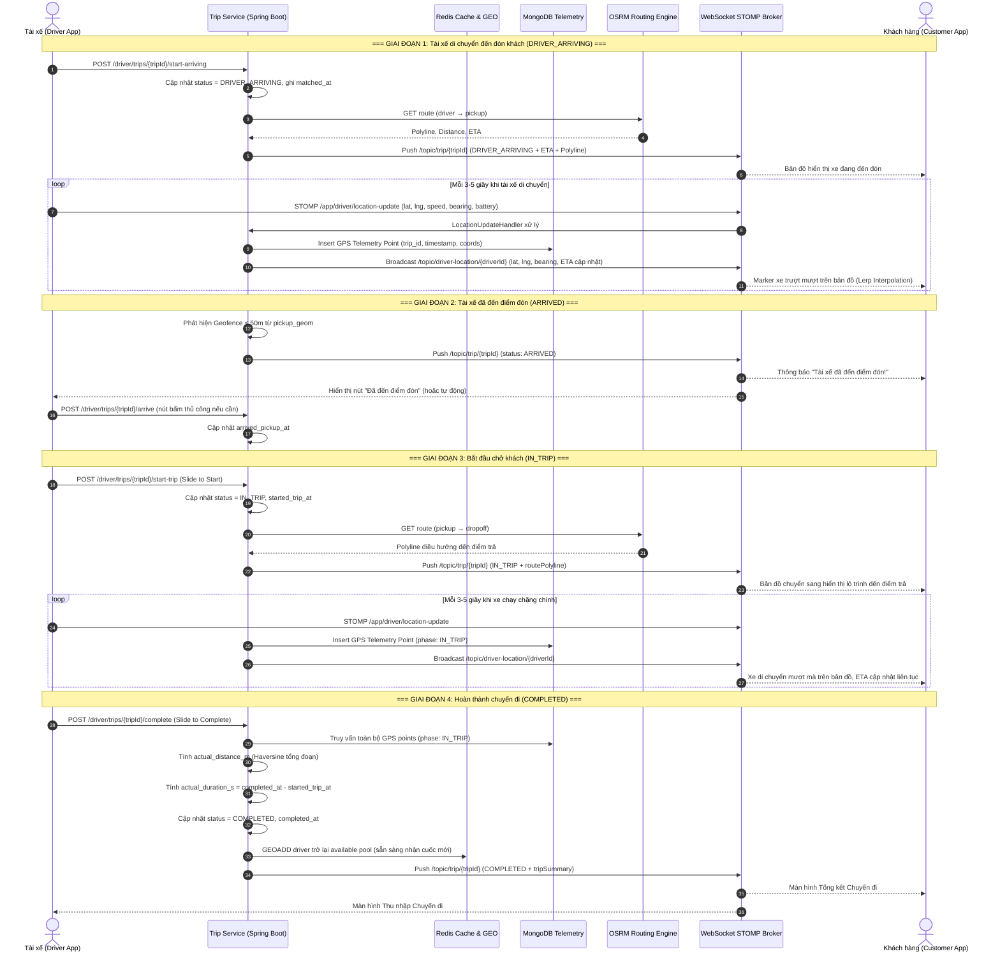
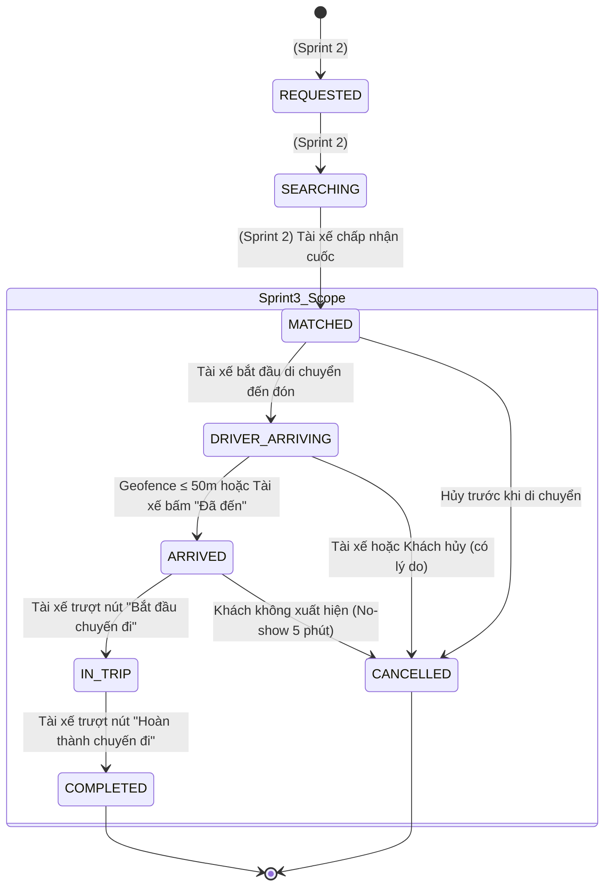
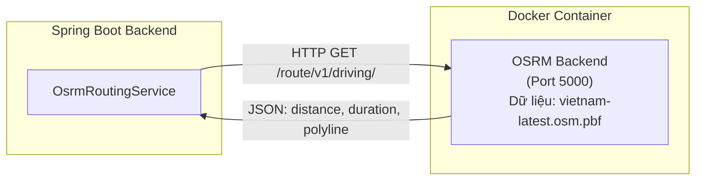
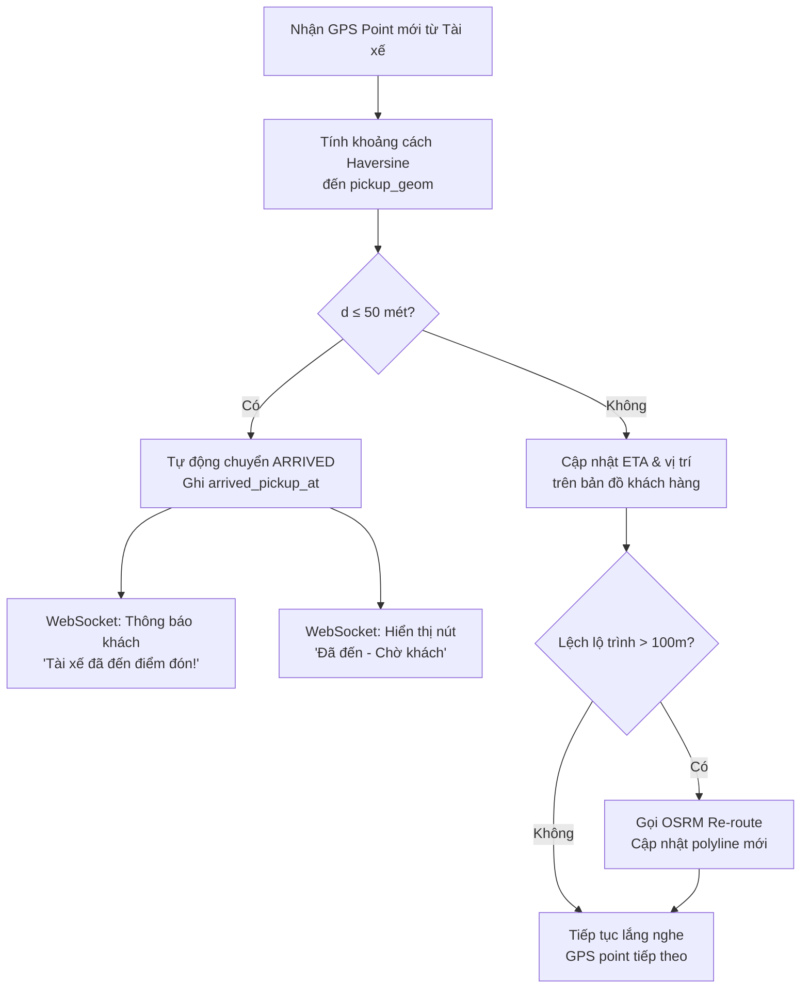
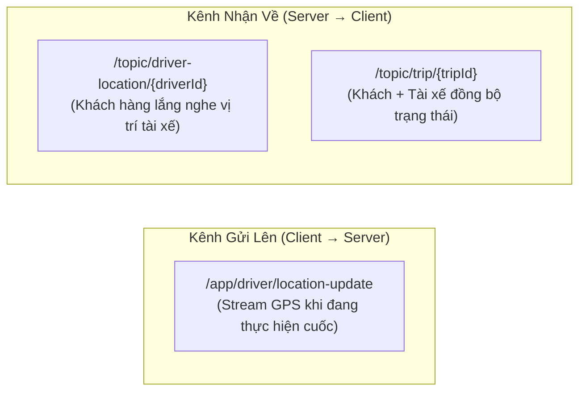
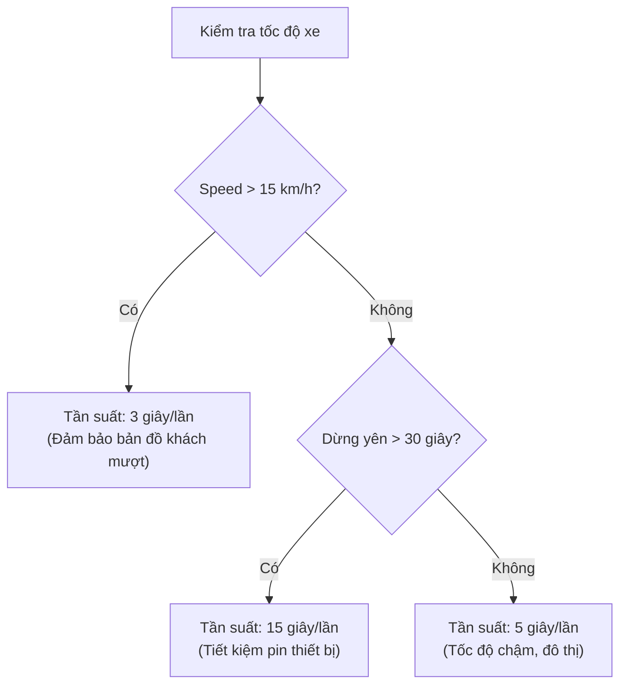

# Sprint 3 Specification: Real-time GPS Tracking, Trip Execution & Turn-by-Turn Navigation

> **Tài liệu**: Đặc tả Kỹ thuật Chi tiết Sprint 3 (Sprint 3 Specification)  
> **Dự án**: Nền tảng gọi xe điện tích hợp hệ thống đo lường, báo cáo và khuyến khích giảm phát thải carbon (Green Mobility)  
> **Thời gian thực hiện theo Đề cương KLTN**: 19/10/2026 – 25/10/2026  
> **Mục tiêu**: Hoàn thiện toàn diện luồng Thực hiện Cuốc xe (Trip Execution) từ lúc ghép cặp thành công đến khi hoàn thành chuyến đi: Theo dõi GPS thời gian thực vị trí tài xế xe điện trên bản đồ khách hàng, Điều hướng dẫn đường Turn-by-Turn cho tài xế qua OSRM, Phát hiện Geofence tự động khi tài xế đến điểm đón ($\le 50$m), Lưu trữ vệt tọa độ GPS Telemetry vào MongoDB time-series, và Tính toán quãng đường thực tế cuối chuyến (`actual_distance_m`) để chuẩn bị cho Sprint 4 (Carbon Engine).  
> **Phiên bản**: 1.0.0 (Production Blueprint)

---

## 1. Mục tiêu & Phạm vi Nghiệp vụ (Sprint Scope & System Overview)

Sprint 3 kế thừa toàn bộ nền tảng Sprint 1 (Xác thực, KYC, Sinh trắc học) và Sprint 2 (Đặt xe & Ghép cặp Tài xế), kích hoạt giai đoạn tiếp theo trong vòng đời chuyến đi: **Tài xế di chuyển đến đón khách → Khách lên xe → Theo dõi hành trình thời gian thực → Hoàn thành chuyến đi**.



---

## 2. Vòng đời Chuyến xe Sprint 3 – Máy Trạng thái Mở rộng (Extended State Machine)

### 2.1. Sơ đồ Chuyển đổi Trạng thái Sprint 3 (State Diagram)

Sprint 3 kích hoạt luồng chuyển trạng thái từ `MATCHED` (kết quả Sprint 2) cho đến `COMPLETED`, bao gồm cả trường hợp hủy giữa chừng:



### 2.2. Bảng Chuyển trạng thái & Quy tắc Ràng buộc (Transition Matrix)

| Trạng thái Hiện tại | Hành động Kích hoạt | Trạng thái Mới | Tác nhân (Actor) | Ràng buộc Nghiệp vụ |
| :--- | :--- | :--- | :--- | :--- |
| `MATCHED` | Tài xế bắt đầu di chuyển đến đón | `DRIVER_ARRIVING` | Tài xế | Gọi OSRM tính route đến pickup, ghi `matched_at`. Bắt đầu stream GPS. |
| `DRIVER_ARRIVING` | Xe vào Geofence ≤ 50m hoặc bấm nút | `ARRIVED` | Hệ thống / Tài xế | Khoảng cách Haversine giữa tọa độ hiện tại và `pickup_geom` ≤ 50m. Ghi `arrived_pickup_at`. |
| `DRIVER_ARRIVING` | Khách hoặc Tài xế hủy | `CANCELLED` | Khách / Tài xế | Ghi `cancel_reason`, `cancelled_by`. Giải phóng tài xế, trả lại Redis GEO available. |
| `ARRIVED` | Tài xế trượt nút "Bắt đầu chuyến đi" | `IN_TRIP` | Tài xế | Gọi OSRM tính route đến dropoff. Ghi `started_trip_at`. Bắt đầu tính quãng đường thực tế. |
| `ARRIVED` | Khách không xuất hiện sau 5 phút | `CANCELLED` | Hệ thống / Tài xế | `cancel_reason = 'CUSTOMER_NO_SHOW'`, `cancelled_by = 'DRIVER'`. Cho phép tài xế hủy không bị phạt. |
| `IN_TRIP` | Tài xế trượt nút "Hoàn thành" | `COMPLETED` | Tài xế | Truy vấn MongoDB tính `actual_distance_m` và `actual_duration_s`. Ghi `completed_at`. Trả tài xế về pool available. |

---

## 3. Thiết kế Lưu trữ GPS Telemetry (MongoDB Time-Series Collection)

### 3.1. Lý do Sử dụng MongoDB thay vì PostgreSQL cho GPS

Trong quá trình thực hiện cuốc xe, tài xế gửi tọa độ GPS mỗi 3–5 giây. Với 1.000 tài xế hoạt động đồng thời, hệ thống phải ghi nhận 200–333 điểm tọa độ mỗi giây. Đây là dạng **write-heavy, time-series workload** mà MongoDB xử lý hiệu quả hơn nhiều so với PostgreSQL:

- **Ghi nhanh không khóa**: MongoDB sử dụng WiredTiger engine với document-level locking, phù hợp workload ghi liên tục.
- **Time-Series Collection**: Tối ưu tự động nén dữ liệu chuỗi thời gian, giảm dung lượng lưu trữ tới 90%.
- **TTL Index**: Tự động xóa dữ liệu telemetry cũ hơn 30 ngày, giảm chi phí vận hành.
- **Aggregate Pipeline**: Truy vấn tổng hợp tính toán quãng đường thực tế cuối chuyến rất hiệu quả.

### 3.2. Schema Document GPS Telemetry

**Database**: `greenmobility_telemetry`  
**Collection**: `trip_gps_points` (Time-Series Collection)

```javascript
// Tạo Time-Series Collection
db.createCollection("trip_gps_points", {
    timeseries: {
        timeField: "timestamp",
        metaField: "metadata",
        granularity: "seconds"
    },
    expireAfterSeconds: 2592000  // TTL 30 ngày tự động xóa
});

// Mẫu Document
{
    "_id": ObjectId("..."),
    "timestamp": ISODate("2026-10-19T08:35:12.450Z"),
    "metadata": {
        "trip_id": "7bb192a0-4318-4a92-b68e-5b1287c80521",
        "driver_id": "9c12b7a8-1234-5678-9abc-def012345678",
        "vehicle_type": "ELECTRIC_MOTORBIKE",
        "phase": "DRIVER_ARRIVING"  // Giá trị: DRIVER_ARRIVING | IN_TRIP
    },
    "location": {
        "type": "Point",
        "coordinates": [106.701540, 10.777120]  // [lng, lat] theo chuẩn GeoJSON
    },
    "speed_kmh": 24.5,
    "bearing": 182.0,
    "altitude_m": 12.3,
    "accuracy_m": 4.2,
    "battery_percent": 82,
    "is_mock_location": false       // Cờ phát hiện Fake GPS từ thiết bị
}
```

### 3.3. Chỉ mục MongoDB

```javascript
// Chỉ mục 2dsphere cho truy vấn không gian (gần vị trí)
db.trip_gps_points.createIndex({ "location": "2dsphere" });

// Chỉ mục phức hợp cho truy vấn theo trip_id và thời gian
db.trip_gps_points.createIndex(
    { "metadata.trip_id": 1, "timestamp": 1 },
    { name: "idx_trip_timeline" }
);

// Chỉ mục cho truy vấn phát hiện gian lận GPS
db.trip_gps_points.createIndex(
    { "metadata.driver_id": 1, "timestamp": -1 },
    { name: "idx_driver_latest" }
);
```

### 3.4. Aggregation Pipeline - Tính Quãng đường Thực tế Cuối Chuyến

Khi tài xế bấm "Hoàn thành chuyến đi", Backend truy vấn MongoDB để tính tổng quãng đường thực tế:

```javascript
// Truy vấn tất cả GPS points thuộc phase IN_TRIP của cuốc xe
db.trip_gps_points.aggregate([
    // 1. Lọc theo trip_id và phase IN_TRIP
    {
        $match: {
            "metadata.trip_id": "7bb192a0-4318-4a92-b68e-5b1287c80521",
            "metadata.phase": "IN_TRIP"
        }
    },
    // 2. Sắp xếp theo thời gian tăng dần
    { $sort: { "timestamp": 1 } },
    // 3. Gom tất cả tọa độ thành mảng tuần tự
    {
        $group: {
            _id: "$metadata.trip_id",
            points: {
                $push: {
                    lng: { $arrayElemAt: ["$location.coordinates", 0] },
                    lat: { $arrayElemAt: ["$location.coordinates", 1] },
                    ts: "$timestamp",
                    speed: "$speed_kmh"
                }
            },
            totalPoints: { $sum: 1 },
            startTime: { $first: "$timestamp" },
            endTime: { $last: "$timestamp" }
        }
    }
]);
// => Backend Java nhận mảng points, tính tổng khoảng cách Haversine giữa các cặp điểm liên tiếp
```

---

## 4. Cấu trúc Dữ liệu Redis cho Tracking thời gian thực

Sprint 3 tái sử dụng và mở rộng các key Redis đã thiết lập từ Sprint 2:

| Key Format | Redis Type | TTL | Mô tả & Chức năng |
| :--- | :--- | :--- | :--- |
| `drivers:geo:available:{vehicleType}` | **GEO** | Vĩnh viễn | **(Sprint 2)** Tọa độ tài xế đang rảnh. Sprint 3 xóa khi `DRIVER_ARRIVING`, thêm lại khi `COMPLETED`. |
| `driver:meta:{driverId}` | **Hash** | 24 giờ | **(Sprint 2)** Metadata tài xế. Sprint 3 bổ sung field `currentTripId`, `tripPhase`. |
| `trip:tracking:{tripId}` | **Hash** | 2 giờ | **(Mới)** Trạng thái tracking thời gian thực: `driverId`, `driverLat`, `driverLng`, `bearing`, `speedKmh`, `batteryPercent`, `lastPingEpoch`, `etaSeconds`, `phase`. |
| `trip:route:{tripId}` | **String** | 2 giờ | **(Mới)** Encoded polyline OSRM của lộ trình hiện tại (đến pickup hoặc đến dropoff). |
| `driver:location:latest:{driverId}` | **Hash** | 5 phút | **(Mới)** Tọa độ mới nhất của tài xế đang thực hiện cuốc: `lat`, `lng`, `bearing`, `speed`, `updatedAt`. Dùng cho WebSocket broadcast. |

#### Các thao tác Redis cho Sprint 3:

```redis
# 1. Khi tài xế chuyển sang DRIVER_ARRIVING → Xóa khỏi pool available
ZREM drivers:geo:available:ELECTRIC_MOTORBIKE "9c12b7a8-1234-5678-9abc-def012345678"

# 2. Cập nhật metadata tài xế đang bận cuốc
HSET driver:meta:9c12b7a8-... currentTripId "7bb192a0-..." tripPhase "DRIVER_ARRIVING"

# 3. Tạo hash tracking cho cuốc xe
HSET trip:tracking:7bb192a0-... driverId "9c12b7a8-..." driverLat "10.777120" driverLng "106.701540" bearing "182.0" speedKmh "24.5" batteryPercent "82" lastPingEpoch "1729320912" etaSeconds "180" phase "DRIVER_ARRIVING"
EXPIRE trip:tracking:7bb192a0-... 7200

# 4. Lưu polyline OSRM
SET trip:route:7bb192a0-... "g_t_gA_r|qSs@q..." EX 7200

# 5. Cập nhật vị trí mới nhất tài xế (mỗi 3-5 giây)
HSET driver:location:latest:9c12b7a8-... lat "10.778230" lng "106.702010" bearing "185.0" speed "28.3" updatedAt "1729320915"
EXPIRE driver:location:latest:9c12b7a8-... 300

# 6. Khi COMPLETED → Trả tài xế về pool available
GEOADD drivers:geo:available:ELECTRIC_MOTORBIKE 106.803054 10.870020 "9c12b7a8-..."
HDEL driver:meta:9c12b7a8-... currentTripId tripPhase
DEL trip:tracking:7bb192a0-...
DEL trip:route:7bb192a0-...
DEL driver:location:latest:9c12b7a8-...
```

---

## 5. Tích hợp OSRM Routing Engine (Định tuyến & Dẫn đường)

### 5.1. Kiến trúc OSRM trong Hệ thống

OSRM (Open Source Routing Machine) được triển khai dưới dạng Docker container cục bộ, cung cấp API định tuyến nhanh với dữ liệu OpenStreetMap Việt Nam:



### 5.2. API OSRM sử dụng trong Sprint 3

**Base URL**: `http://osrm:5000` (Docker internal) hoặc `http://localhost:5000` (local dev)

#### API Route - Tính lộ trình giữa 2 điểm:

```
GET /route/v1/driving/{lng1},{lat1};{lng2},{lat2}?overview=full&geometries=polyline6&steps=true&annotations=distance,duration
```

**Ví dụ Request**: Tính route từ vị trí tài xế → Điểm đón khách:
```
GET /route/v1/driving/106.701540,10.777120;106.700981,10.776530?overview=full&geometries=polyline6&steps=true
```

**Response (JSON)**:
```json
{
    "code": "Ok",
    "routes": [
        {
            "distance": 842.3,
            "duration": 112.5,
            "geometry": "g_t_gA_r|qSs@q...",
            "legs": [
                {
                    "distance": 842.3,
                    "duration": 112.5,
                    "steps": [
                        {
                            "distance": 320.1,
                            "duration": 42.3,
                            "name": "Đường Lê Lợi",
                            "maneuver": {
                                "type": "depart",
                                "modifier": "right",
                                "location": [106.701540, 10.777120],
                                "bearing_before": 0,
                                "bearing_after": 182
                            },
                            "driving_side": "right"
                        },
                        {
                            "distance": 522.2,
                            "duration": 70.2,
                            "name": "Đường Nguyễn Huệ",
                            "maneuver": {
                                "type": "turn",
                                "modifier": "left",
                                "location": [106.700800, 10.775200]
                            }
                        }
                    ]
                }
            ]
        }
    ]
}
```

### 5.3. Cập nhật ETA Động (Dynamic ETA Recalculation)

Mỗi khi tài xế gửi vị trí mới (mỗi 3-5 giây), Backend **không** gọi lại OSRM mỗi lần mà áp dụng chiến lược tối ưu:

| Điều kiện | Hành động | Lý do |
| :--- | :--- | :--- |
| Tài xế di chuyển trên lộ trình (deviation $\le 100$m) | Ước tính ETA dựa trên khoảng cách còn lại ÷ tốc độ trung bình | Giảm tải OSRM, ETA chính xác đủ dùng |
| Tài xế lệch lộ trình (deviation $> 100$m) | Gọi lại OSRM tính route mới (Re-route) | Đảm bảo dẫn đường chính xác |
| Mỗi 30 giây (định kỳ) | Gọi lại OSRM cập nhật ETA chính thức | Đồng bộ ETA với tình trạng giao thông mới nhất |

**Công thức ước tính ETA nhanh** (khi không gọi OSRM):
$$\text{ETA}_{\text{fast}} = \frac{D_{\text{remaining}}}{v_{\text{avg}}} \quad \text{(giây)}$$

Trong đó:
- $D_{\text{remaining}}$: Khoảng cách Haversine còn lại từ vị trí hiện tại đến điểm đích (mét).
- $v_{\text{avg}}$: Vận tốc trung bình 30 giây gần nhất ($m/s$), tính từ các GPS point trong Redis/MongoDB.

---

## 6. Thuật toán Phát hiện Geofence Tự động (Geofence Detection Algorithm)

### 6.1. Công thức Khoảng cách Haversine

Khi tài xế đang trong trạng thái `DRIVER_ARRIVING`, mỗi GPS point mới đều được kiểm tra khoảng cách đến điểm đón (`pickup_geom`). Sử dụng công thức Haversine cho độ chính xác cao trên bề mặt Trái đất:

$$d = 2R \cdot \arcsin\left(\sqrt{\sin^2\left(\frac{\Delta\phi}{2}\right) + \cos(\phi_1) \cdot \cos(\phi_2) \cdot \sin^2\left(\frac{\Delta\lambda}{2}\right)}\right)$$

Trong đó:
- $R = 6{,}371{,}000\,\text{m}$ (Bán kính trung bình Trái đất).
- $\phi_1, \phi_2$: Vĩ độ (radian) của 2 điểm.
- $\Delta\phi = \phi_2 - \phi_1$: Hiệu vĩ độ.
- $\Delta\lambda = \lambda_2 - \lambda_1$: Hiệu kinh độ.

### 6.2. Ngưỡng Geofence & Logic Xử lý



**Tham số cấu hình**:

| Tham số | Giá trị | Mô tả |
| :--- | :--- | :--- |
| `GEOFENCE_RADIUS_ARRIVED_M` | **50** mét | Bán kính Geofence tự động chuyển sang ARRIVED |
| `REROUTE_DEVIATION_M` | **100** mét | Ngưỡng lệch lộ trình kích hoạt OSRM re-route |
| `ETA_REFRESH_INTERVAL_S` | **30** giây | Chu kỳ gọi OSRM cập nhật ETA chính thức |
| `GPS_PING_INTERVAL_MOVING_S` | **3** giây | Tần suất gửi GPS khi xe đang di chuyển ($>15\,km/h$) |
| `GPS_PING_INTERVAL_IDLE_S` | **15** giây | Tần suất gửi GPS khi xe dừng ($\le 15\,km/h$ quá 30s) |
| `NO_SHOW_TIMEOUT_S` | **300** giây (5 phút) | Thời gian chờ khách tại điểm đón trước khi cho phép tài xế hủy |

---

## 7. Giao thức WebSocket STOMP Thời gian thực (Real-time Channels - Sprint 3)

* **WebSocket Handshake URL**: `ws://localhost:8080/ws-connect` (hoặc `wss://api.greenmobility.vn/ws-connect`)
* **Headers Xác thực**: `Authorization: Bearer <JWT_TOKEN>`



### 7.1. Kênh Gửi Lên: `/app/driver/location-update` (Tài xế → Server)

Tài xế gửi tọa độ GPS liên tục trong suốt thời gian thực hiện cuốc xe (từ `DRIVER_ARRIVING` đến `COMPLETED`):

```json
{
    "tripId": "7bb192a0-4318-4a92-b68e-5b1287c80521",
    "lat": 10.778230,
    "lng": 106.702010,
    "speedKmh": 28.3,
    "bearing": 185.0,
    "altitude": 12.3,
    "accuracy": 4.2,
    "batteryPercent": 80,
    "isMockLocation": false,
    "timestamp": "2026-10-19T08:35:12.450Z"
}
```

**Xử lý phía Server (`DriverLocationController @MessageMapping`)**:
1. Validate: Kiểm tra `tripId` thuộc về tài xế hiện tại (chống injection).
2. Kiểm tra `isMockLocation == false` (cờ cảnh báo Fake GPS).
3. Lưu vào MongoDB collection `trip_gps_points`.
4. Cập nhật Redis Hash `trip:tracking:{tripId}` và `driver:location:latest:{driverId}`.
5. Nếu `phase == DRIVER_ARRIVING`: Kiểm tra Geofence ≤ 50m.
6. Tính toán ETA nhanh hoặc gọi OSRM re-route nếu lệch đường.
7. Broadcast qua `/topic/driver-location/{driverId}` cho khách hàng.

### 7.2. Kênh Nhận Về: `/topic/driver-location/{driverId}` (Server → Khách hàng)

Khách hàng subscribe kênh này để cập nhật marker xe trên bản đồ mỗi 3-5 giây:

```json
{
    "driverId": "9c12b7a8-1234-5678-9abc-def012345678",
    "lat": 10.778230,
    "lng": 106.702010,
    "bearing": 185.0,
    "speedKmh": 28.3,
    "batteryPercent": 80,
    "etaSeconds": 156,
    "distanceRemainingM": 620,
    "phase": "DRIVER_ARRIVING",
    "timestamp": "2026-10-19T08:35:12Z"
}
```

### 7.3. Kênh Trạng thái Cuốc xe: `/topic/trip/{tripId}` – Các Sự kiện Sprint 3

#### Sự kiện `DRIVER_ARRIVING` (Tài xế bắt đầu di chuyển đến đón):
```json
{
    "tripId": "7bb192a0-4318-4a92-b68e-5b1287c80521",
    "status": "DRIVER_ARRIVING",
    "message": "Tài xế đang trên đường đến đón bạn!",
    "driver": {
        "fullName": "Nguyễn Minh Thiện",
        "phoneNumber": "0987654321",
        "avatarUrl": "https://minio.greenmobility.vn/avatars/driver1.jpg",
        "vehicleModel": "VinFast Feliz S",
        "licensePlate": "59-P1 987.65",
        "currentLat": 10.777120,
        "currentLng": 106.701540
    },
    "routing": {
        "etaSeconds": 180,
        "distanceToPickupM": 842,
        "routePolyline": "g_t_gA_r|qSs@q..."
    },
    "timestamp": "2026-10-19T08:32:00Z"
}
```

#### Sự kiện `ARRIVED` (Tài xế đã đến điểm đón):
```json
{
    "tripId": "7bb192a0-4318-4a92-b68e-5b1287c80521",
    "status": "ARRIVED",
    "message": "Tài xế đã đến điểm đón! Vui lòng ra xe.",
    "arrivedAt": "2026-10-19T08:35:00Z",
    "waitingTimeoutSeconds": 300,
    "timestamp": "2026-10-19T08:35:00Z"
}
```

#### Sự kiện `IN_TRIP` (Bắt đầu chở khách):
```json
{
    "tripId": "7bb192a0-4318-4a92-b68e-5b1287c80521",
    "status": "IN_TRIP",
    "message": "Chuyến đi đã bắt đầu! Cùng di chuyển xanh nào!",
    "routing": {
        "etaSeconds": 1920,
        "distanceToDropoffM": 16200,
        "routePolyline": "abc123encoded..."
    },
    "startedAt": "2026-10-19T08:36:00Z",
    "timestamp": "2026-10-19T08:36:00Z"
}
```

#### Sự kiện `COMPLETED` (Hoàn thành chuyến đi):
```json
{
    "tripId": "7bb192a0-4318-4a92-b68e-5b1287c80521",
    "status": "COMPLETED",
    "message": "Chuyến đi hoàn thành! Cảm ơn bạn đã đi xe điện xanh!",
    "tripSummary": {
        "tripCode": "GM-20261019-9981",
        "pickupAddress": "Nhà hát Thành phố, Quận 1, TP.HCM",
        "dropoffAddress": "Trường ĐH Công nghệ Thông tin, TP. Thủ Đức, TP.HCM",
        "estimatedDistanceM": 16200,
        "actualDistanceM": 16850,
        "estimatedDurationS": 1920,
        "actualDurationS": 2040,
        "fareAmountVnd": 76000,
        "finalAmountVnd": 76000,
        "paymentMethod": "CASH",
        "co2SavedGrams": 850.07,
        "driverEarningsVnd": 60800,
        "customerName": "Phạm Hà Anh Thư",
        "driverName": "Nguyễn Minh Thiện"
    },
    "completedAt": "2026-10-19T09:10:00Z",
    "timestamp": "2026-10-19T09:10:00Z"
}
```

---

## 8. Đặc tả Chi tiết REST API Contracts

Base URL: `http://localhost:8080/api/v1`

### 8.1. `POST /driver/trips/{tripId}/start-arriving` – Tài xế Bắt đầu Di chuyển Đến Đón Khách

* **Headers**: `Authorization: Bearer <DRIVER_JWT>`
* **Logic Xử lý**:
  1. Kiểm tra `trip.status == MATCHED` và `trip.driver_id` thuộc về tài xế hiện tại.
  2. Gọi OSRM `/route/v1/driving/{driverLng},{driverLat};{pickupLng},{pickupLat}` lấy route, distance, ETA.
  3. Cập nhật `trip.status = DRIVER_ARRIVING`.
  4. Xóa tài xế khỏi Redis GEO `drivers:geo:available:{vehicleType}` (nếu chưa xóa ở bước accept Sprint 2).
  5. Tạo Redis Hash `trip:tracking:{tripId}` và `trip:route:{tripId}`.
  6. Cập nhật Redis Hash `driver:meta:{driverId}` thêm `currentTripId`, `tripPhase`.
  7. Phát sự kiện WebSocket STOMP tới `/topic/trip/{tripId}` (trạng thái `DRIVER_ARRIVING` + routing info).
* **Response (200 OK)**:
```json
{
    "success": true,
    "message": "Đang di chuyển đến đón khách. Vui lòng làm theo hướng dẫn điều hướng!",
    "data": {
        "tripId": "7bb192a0-4318-4a92-b68e-5b1287c80521",
        "status": "DRIVER_ARRIVING",
        "routing": {
            "etaSeconds": 180,
            "distanceToPickupM": 842,
            "routePolyline": "g_t_gA_r|qSs@q...",
            "steps": [
                {
                    "instruction": "Đi thẳng trên Đường Lê Lợi",
                    "distanceM": 320,
                    "durationS": 42,
                    "maneuver": "depart"
                },
                {
                    "instruction": "Rẽ trái vào Đường Nguyễn Huệ",
                    "distanceM": 522,
                    "durationS": 70,
                    "maneuver": "turn-left"
                }
            ]
        },
        "pickup": {
            "address": "Nhà hát Thành phố, Quận 1, TP.HCM",
            "lat": 10.776530,
            "lng": 106.700981
        },
        "customer": {
            "fullName": "Phạm Hà Anh Thư",
            "phoneNumber": "0901234567"
        }
    },
    "timestamp": "2026-10-19T08:32:00Z"
}
```
* **Response lỗi (400 Bad Request)** – Cuốc xe không ở trạng thái MATCHED:
```json
{
    "success": false,
    "message": "Cuốc xe không ở trạng thái cho phép bắt đầu di chuyển (status hiện tại: SEARCHING)",
    "timestamp": "2026-10-19T08:32:00Z"
}
```

---

### 8.2. `POST /driver/trips/{tripId}/arrive` – Tài xế Xác nhận Đã Đến Điểm Đón

* **Headers**: `Authorization: Bearer <DRIVER_JWT>`
* **Logic Xử lý**:
  1. Kiểm tra `trip.status == DRIVER_ARRIVING`.
  2. Lấy tọa độ mới nhất của tài xế từ Redis `driver:location:latest:{driverId}`.
  3. Tính khoảng cách Haversine giữa tọa độ hiện tại và `trip.pickup_geom`.
  4. **Nếu khoảng cách $\le 200$m**: Chấp nhận xác nhận (cho phép sai số GPS và trường hợp bên kia đường).
  5. **Nếu khoảng cách $> 200$m**: Từ chối, yêu cầu tài xế di chuyển gần hơn.
  6. Cập nhật `trip.status = ARRIVED`, ghi `arrived_pickup_at = NOW()`.
  7. Cập nhật Redis Hash `trip:tracking:{tripId}` field `phase = ARRIVED`.
  8. Phát sự kiện WebSocket STOMP tới `/topic/trip/{tripId}` (trạng thái `ARRIVED`).
  9. Bắt đầu bộ đếm No-Show 5 phút (lưu vào Redis TTL key hoặc scheduled task).
* **Response (200 OK)**:
```json
{
    "success": true,
    "message": "Bạn đã đến điểm đón! Đang thông báo cho khách hàng ra xe.",
    "data": {
        "tripId": "7bb192a0-4318-4a92-b68e-5b1287c80521",
        "status": "ARRIVED",
        "arrivedAt": "2026-10-19T08:35:00Z",
        "noShowTimeoutSeconds": 300,
        "customerName": "Phạm Hà Anh Thư",
        "customerPhone": "0901234567"
    },
    "timestamp": "2026-10-19T08:35:00Z"
}
```
* **Response lỗi (400 Bad Request)** – Tài xế còn quá xa điểm đón:
```json
{
    "success": false,
    "message": "Bạn còn cách điểm đón 1.2km. Vui lòng di chuyển đến gần hơn để xác nhận đã đến.",
    "data": {
        "currentDistanceM": 1200,
        "maxAllowedDistanceM": 200
    },
    "timestamp": "2026-10-19T08:34:00Z"
}
```

---

### 8.3. `POST /driver/trips/{tripId}/start-trip` – Tài xế Bắt đầu Chuyến đi (Khách đã Lên xe)

* **Headers**: `Authorization: Bearer <DRIVER_JWT>`
* **Logic Xử lý**:
  1. Kiểm tra `trip.status == ARRIVED`.
  2. Gọi OSRM `/route/v1/driving/{pickupLng},{pickupLat};{dropoffLng},{dropoffLat}` lấy route đến điểm trả.
  3. Cập nhật `trip.status = IN_TRIP`, ghi `started_trip_at = NOW()`.
  4. Cập nhật Redis Hash `trip:tracking:{tripId}` field `phase = IN_TRIP`.
  5. Phát sự kiện WebSocket STOMP tới `/topic/trip/{tripId}` (trạng thái `IN_TRIP` + route mới đến dropoff).
  6. Hủy bộ đếm No-Show (nếu đang chạy).
* **Response (200 OK)**:
```json
{
    "success": true,
    "message": "Chuyến đi đã bắt đầu! Cùng di chuyển xanh bảo vệ môi trường!",
    "data": {
        "tripId": "7bb192a0-4318-4a92-b68e-5b1287c80521",
        "status": "IN_TRIP",
        "startedAt": "2026-10-19T08:36:00Z",
        "routing": {
            "etaSeconds": 1920,
            "distanceToDropoffM": 16200,
            "routePolyline": "abc123encoded...",
            "steps": [
                {
                    "instruction": "Đi thẳng trên Đường Nguyễn Huệ",
                    "distanceM": 1200,
                    "durationS": 180,
                    "maneuver": "depart"
                },
                {
                    "instruction": "Lên cầu Sài Gòn theo hướng Thủ Đức",
                    "distanceM": 3500,
                    "durationS": 300,
                    "maneuver": "turn-right"
                }
            ]
        },
        "dropoff": {
            "address": "Trường ĐH Công nghệ Thông tin, TP. Thủ Đức, TP.HCM",
            "lat": 10.870020,
            "lng": 106.803054
        }
    },
    "timestamp": "2026-10-19T08:36:00Z"
}
```

---

### 8.4. `POST /driver/trips/{tripId}/complete` – Tài xế Hoàn thành Chuyến đi

* **Headers**: `Authorization: Bearer <DRIVER_JWT>`
* **Logic Xử lý**:
  1. Kiểm tra `trip.status == IN_TRIP`.
  2. **Tính quãng đường thực tế**:
     a. Truy vấn MongoDB `trip_gps_points` lấy tất cả GPS points thuộc `phase == IN_TRIP` của `trip_id`.
     b. Sắp xếp theo `timestamp` tăng dần.
     c. Tính tổng khoảng cách Haversine giữa các cặp điểm liên tiếp: $D_{\text{actual}} = \sum_{i=1}^{N-1} \text{Haversine}(P_i, P_{i+1})$.
     d. Lọc nhiễu: Bỏ qua các đoạn có vận tốc tức thời $> 120\,km/h$ (nghi ngờ GPS nhảy).
  3. **Tính thời gian thực tế**: $T_{\text{actual}} = \text{completed\_at} - \text{started\_trip\_at}$.
  4. Cập nhật bảng `trips`: `actual_distance_m`, `actual_duration_s`, `status = COMPLETED`, `completed_at = NOW()`.
  5. **Tính lại cước phí cuối cùng** (nếu cần, so sánh `actual_distance` vs `estimated_distance`):
     - Nếu $|\text{actual} - \text{estimated}| \le 15\%$: Giữ nguyên `fare_amount` ước tính (bảo vệ khách hàng).
     - Nếu $\text{actual} > \text{estimated} \times 1.15$: Ghi nhận chênh lệch nhưng vẫn tính theo giá ước tính (Green Mobility chịu rủi ro).
  6. **Tính sơ bộ lượng $CO_2$ giảm** (giá trị ước tính nhanh, Sprint 4 Carbon Engine sẽ tính chính xác hơn):
     $$\text{co2\_saved\_grams} = D_{\text{actual\_km}} \times \text{net\_co2\_saving\_per\_km}$$
  7. Dọn dẹp Redis: Xóa `trip:tracking:{tripId}`, `trip:route:{tripId}`, `driver:location:latest:{driverId}`.
  8. **Trả tài xế về pool available**: `GEOADD drivers:geo:available:{vehicleType}` tại tọa độ điểm trả.
  9. Cập nhật Redis Hash `driver:meta:{driverId}`: Xóa `currentTripId`, `tripPhase`.
  10. Cập nhật `driver_profiles.total_trips_completed += 1`.
  11. Phát sự kiện WebSocket STOMP tới `/topic/trip/{tripId}` (trạng thái `COMPLETED` + tripSummary).
  12. Đẩy sự kiện RabbitMQ `trip.event.completed` (chuẩn bị cho Sprint 4 – Carbon Engine & Sprint 5 – Payment).

* **Response (200 OK)**:
```json
{
    "success": true,
    "message": "Chuyến đi hoàn thành! Cảm ơn bạn đã đóng góp cho môi trường xanh!",
    "data": {
        "tripId": "7bb192a0-4318-4a92-b68e-5b1287c80521",
        "tripCode": "GM-20261019-9981",
        "status": "COMPLETED",
        "completedAt": "2026-10-19T09:10:00Z",
        "tripSummary": {
            "pickupAddress": "Nhà hát Thành phố, Quận 1, TP.HCM",
            "dropoffAddress": "Trường ĐH Công nghệ Thông tin, TP. Thủ Đức, TP.HCM",
            "estimatedDistanceM": 16200,
            "actualDistanceM": 16850,
            "estimatedDurationS": 1920,
            "actualDurationS": 2040,
            "fareAmountVnd": 76000,
            "finalAmountVnd": 76000,
            "paymentMethod": "CASH",
            "paymentStatus": "PENDING",
            "co2SavedGrams": 850.07
        },
        "driverEarnings": {
            "grossAmountVnd": 76000,
            "platformFeeVnd": 15200,
            "netEarningsVnd": 60800
        }
    },
    "timestamp": "2026-10-19T09:10:00Z"
}
```

---

### 8.5. `POST /driver/trips/{tripId}/cancel` – Tài xế Hủy cuốc xe đang Thực hiện

* **Headers**: `Authorization: Bearer <DRIVER_JWT>`
* **Request Body**:
```json
{
    "cancelReason": "Khách hàng không xuất hiện tại điểm đón sau 5 phút chờ"
}
```
* **Logic Xử lý**:
  1. Chỉ được hủy khi `trip.status` thuộc `[DRIVER_ARRIVING, ARRIVED]` (không cho hủy khi `IN_TRIP` – đang chở khách).
  2. Cập nhật `trip.status = CANCELLED`, `cancelled_by = DRIVER`, `cancel_reason = ...`.
  3. Xác định loại hủy:
     - Nếu `ARRIVED` + đã chờ $\ge 5$ phút: `cancel_reason = 'CUSTOMER_NO_SHOW'` → Tài xế không bị phạt.
     - Nếu tài xế tự hủy khi đang `DRIVER_ARRIVING` mà không có lý do chính đáng: Ghi nhận vi phạm.
  4. Dọn dẹp Redis: Xóa tracking keys, trả tài xế về GEO available pool.
  5. Phát WebSocket STOMP `/topic/trip/{tripId}` thông báo hủy cho khách hàng.
* **Response (200 OK)**:
```json
{
    "success": true,
    "message": "Đã hủy cuốc xe. Bạn đã được đưa trở lại trạng thái sẵn sàng nhận cuốc.",
    "data": {
        "tripId": "7bb192a0-4318-4a92-b68e-5b1287c80521",
        "status": "CANCELLED",
        "cancelledBy": "DRIVER",
        "cancelReason": "Khách hàng không xuất hiện tại điểm đón sau 5 phút chờ",
        "isPenalized": false
    },
    "timestamp": "2026-10-19T08:40:30Z"
}
```

---

### 8.6. `GET /trips/{tripId}/tracking` – Khách hàng Xem Trạng thái Tracking Hiện tại

* **Headers**: `Authorization: Bearer <CUSTOMER_JWT>`
* **Mục đích**: Khi khách hàng mở lại app hoặc bị mất kết nối WebSocket, gọi API này để đồng bộ lại trạng thái tracking mới nhất (fallback cho WebSocket).
* **Response (200 OK)**:
```json
{
    "success": true,
    "data": {
        "tripId": "7bb192a0-4318-4a92-b68e-5b1287c80521",
        "tripCode": "GM-20261019-9981",
        "status": "DRIVER_ARRIVING",
        "driver": {
            "driverId": "9c12b7a8-1234-5678-9abc-def012345678",
            "fullName": "Nguyễn Minh Thiện",
            "phoneNumber": "0987654321",
            "avatarUrl": "https://minio.greenmobility.vn/avatars/driver1.jpg",
            "ratingAvg": 4.95,
            "vehicleModel": "VinFast Feliz S",
            "licensePlate": "59-P1 987.65"
        },
        "tracking": {
            "driverLat": 10.778230,
            "driverLng": 106.702010,
            "bearing": 185.0,
            "speedKmh": 28.3,
            "batteryPercent": 80,
            "etaSeconds": 120,
            "distanceRemainingM": 480,
            "routePolyline": "g_t_gA_r|qSs@q...",
            "lastUpdatedAt": "2026-10-19T08:34:55Z"
        },
        "pickup": {
            "address": "Nhà hát Thành phố, Quận 1, TP.HCM",
            "lat": 10.776530,
            "lng": 106.700981
        },
        "dropoff": {
            "address": "Trường ĐH Công nghệ Thông tin, TP. Thủ Đức, TP.HCM",
            "lat": 10.870020,
            "lng": 106.803054
        }
    },
    "timestamp": "2026-10-19T08:34:56Z"
}
```

---

### 8.7. `GET /trips/{tripId}/route` – Lấy Lộ trình OSRM Hiện tại

* **Headers**: `Authorization: Bearer <JWT_TOKEN>`
* **Mục đích**: Trả về polyline và các bước dẫn đường hiện tại (từ Redis cache hoặc gọi OSRM mới nếu cache hết hạn).
* **Response (200 OK)**:
```json
{
    "success": true,
    "data": {
        "tripId": "7bb192a0-4318-4a92-b68e-5b1287c80521",
        "phase": "DRIVER_ARRIVING",
        "origin": {
            "lat": 10.777120,
            "lng": 106.701540,
            "label": "Vị trí tài xế"
        },
        "destination": {
            "lat": 10.776530,
            "lng": 106.700981,
            "label": "Nhà hát Thành phố, Quận 1"
        },
        "routePolyline": "g_t_gA_r|qSs@q...",
        "distanceM": 842,
        "durationS": 112,
        "steps": [
            {
                "instruction": "Đi thẳng trên Đường Lê Lợi",
                "distanceM": 320,
                "durationS": 42,
                "maneuver": "depart",
                "startLocation": [106.701540, 10.777120]
            },
            {
                "instruction": "Rẽ trái vào Đường Nguyễn Huệ",
                "distanceM": 522,
                "durationS": 70,
                "maneuver": "turn-left",
                "startLocation": [106.700800, 10.775200]
            }
        ]
    },
    "timestamp": "2026-10-19T08:32:05Z"
}
```

---

## 9. RabbitMQ Events – Sprint 3

Sprint 3 bổ sung các sự kiện mới trên Exchange `greenmobility.topic.exchange`:

| Routing Key | Queue Name | Chức năng | Payload DTO |
| :--- | :--- | :--- | :--- |
| `trip.event.arriving` | `q.trip.status.arriving` | Thông báo tài xế bắt đầu di chuyển đón khách | `TripArrivingEvent` |
| `trip.event.arrived` | `q.trip.status.arrived` | Thông báo tài xế đã đến điểm đón | `TripArrivedEvent` |
| `trip.event.started` | `q.trip.status.started` | Thông báo bắt đầu chở khách | `TripStartedEvent` |
| `trip.event.completed` | `q.trip.status.completed` | Kích hoạt Carbon Engine (Sprint 4) & Payment (Sprint 5) | `TripCompletedEvent` |
| `trip.event.cancelled` | `q.trip.status.cancelled` | **(Sprint 2)** Mở rộng xử lý hủy giữa chừng | `TripCancelledEvent` |

### DTO `TripCompletedEvent` (sự kiện quan trọng nhất – đón đầu Sprint 4):

```json
{
    "tripId": "7bb192a0-4318-4a92-b68e-5b1287c80521",
    "tripCode": "GM-20261019-9981",
    "customerId": "3fa85f64-5717-4562-b3fc-2c963f66afa6",
    "driverId": "9c12b7a8-1234-5678-9abc-def012345678",
    "vehicleId": "a1b2c3d4-5678-9012-3456-789012345678",
    "vehicleType": "ELECTRIC_MOTORBIKE",
    "estimatedDistanceM": 16200,
    "actualDistanceM": 16850,
    "estimatedDurationS": 1920,
    "actualDurationS": 2040,
    "fareAmountVnd": 76000,
    "finalAmountVnd": 76000,
    "paymentMethod": "CASH",
    "startedAt": "2026-10-19T08:36:00Z",
    "completedAt": "2026-10-19T09:10:00Z"
}
```

---

## 10. Thuật toán Tính Quãng đường Thực tế (Actual Distance Calculation)

### 10.1. Phương pháp Tổng Haversine tuần tự (Sequential Haversine Summation)

Sau khi truy vấn được $N$ điểm GPS thuộc phase `IN_TRIP` từ MongoDB, quãng đường thực tế được tính bằng tổng khoảng cách giữa các cặp điểm liên tiếp:

$$D_{\text{actual}} = \sum_{i=1}^{N-1} \text{Haversine}(P_i, P_{i+1})$$

### 10.2. Lọc Nhiễu GPS (Noise Filtering)

Dữ liệu GPS thô từ thiết bị di động có thể bị nhiễu do mất tín hiệu trong hầm chui, phản xạ tín hiệu giữa các tòa nhà cao tầng (Multipath), hoặc Fake GPS. Áp dụng các bộ lọc sau:

| Bộ lọc | Điều kiện | Hành động |
| :--- | :--- | :--- |
| **Lọc tốc độ bất thường** | Vận tốc tức thời $v_i = \frac{\text{Haversine}(P_i, P_{i+1})}{\Delta t} > 120\,km/h$ | Loại bỏ điểm $P_{i+1}$, không tính vào tổng quãng đường |
| **Lọc nhảy vọt (Teleportation)** | $\text{Haversine}(P_i, P_{i+1}) > 500m$ và $\Delta t \le 3s$ | Loại bỏ điểm $P_{i+1}$ (nghi ngờ GPS nhảy) |
| **Lọc đóng băng (Dead Pin)** | $\text{Haversine}(P_i, P_{i+1}) \le 1m$ liên tiếp $> 5$ điểm trong khi `speed > 0` | Đánh dấu cờ `is_mock_location` để kiểm tra gian lận |
| **Lọc độ chính xác thấp** | `accuracy_m > 50m` | Bỏ qua điểm này trong phép tính (tín hiệu GPS quá yếu) |

### 10.3. Đối chiếu với Khoảng cách OSRM (Sanity Check)

Sau khi tính được $D_{\text{actual}}$, thực hiện đối chiếu kiểm tra tính hợp lý:

$$\text{Ratio} = \frac{D_{\text{actual}}}{D_{\text{osrm\_estimated}}}$$

| Ratio | Đánh giá | Hành động |
| :--- | :--- | :--- |
| $0.85 \le \text{Ratio} \le 1.30$ | Hợp lý (tài xế đi đường vòng nhẹ hoặc tắt đường) | Chấp nhận `actual_distance_m` |
| $\text{Ratio} > 1.30$ | Tài xế đi đường dài bất thường | Ghi cờ cảnh báo gian lận nhẹ, log vào `fraud_alerts` |
| $\text{Ratio} < 0.85$ | Quãng đường thực tế quá ngắn (có thể mất GPS data) | Sử dụng `estimated_distance_m` làm giá trị fallback |

---

## 11. Cơ chế Tiết kiệm Pin & Xử lý Mất mạng (Adaptive GPS & Offline Sync)

### 11.1. Adaptive GPS Frequency



### 11.2. Offline GPS Buffer & Auto-Sync

Khi tài xế đi vào vùng mất sóng (hầm chui, khu vực phủ sóng yếu):

1. **Phát hiện mất mạng**: WebSocket connection bị ngắt hoặc HTTP ping thất bại.
2. **Lưu đệm cục bộ**: Các tọa độ GPS tiếp tục được ghi vào SQLite / Hive DB trên thiết bị, kèm timestamp chính xác.
3. **Tự động đồng bộ**: Khi có lại kết nối mạng, Driver App gửi batch GPS points tích lũy lên Backend qua REST API:

### 8.8. `POST /driver/trips/{tripId}/sync-gps-batch` – Đồng bộ GPS Batch (Offline Sync)

* **Headers**: `Authorization: Bearer <DRIVER_JWT>`
* **Request Body**:
```json
{
    "tripId": "7bb192a0-4318-4a92-b68e-5b1287c80521",
    "points": [
        {
            "lat": 10.780100,
            "lng": 106.705200,
            "speedKmh": 22.1,
            "bearing": 190.0,
            "accuracy": 5.0,
            "batteryPercent": 78,
            "isMockLocation": false,
            "timestamp": "2026-10-19T08:40:03.200Z"
        },
        {
            "lat": 10.780500,
            "lng": 106.705800,
            "speedKmh": 25.3,
            "bearing": 188.0,
            "accuracy": 4.8,
            "batteryPercent": 78,
            "isMockLocation": false,
            "timestamp": "2026-10-19T08:40:06.150Z"
        }
    ]
}
```
* **Logic Xử lý**:
  1. Validate tất cả `timestamp` thuộc khoảng thời gian hợp lệ của cuốc xe ($\ge$ `started_trip_at` và $\le$ `NOW()`).
  2. Lọc trùng lặp: Bỏ qua các điểm có `timestamp` đã tồn tại trong MongoDB.
  3. Chèn batch vào MongoDB `trip_gps_points`.
  4. Cập nhật Redis với tọa độ mới nhất trong batch.
* **Response (200 OK)**:
```json
{
    "success": true,
    "message": "Đã đồng bộ 2 điểm GPS thành công",
    "data": {
        "syncedPoints": 2,
        "skippedDuplicates": 0
    },
    "timestamp": "2026-10-19T08:41:00Z"
}
```

---

## 12. Đặc tả Chi tiết Giao diện Người dùng (UI/UX Specifications)

### 12.1. Customer Mobile App – Theo dõi Hành trình Thời gian thực

#### 1. Màn hình Tài xế Đang Đến Đón (DRIVER_ARRIVING Screen)

* **Bản đồ Chính**:
  - Hiển thị 2 marker: **Ghim xanh phát sáng** tại điểm đón khách + **Icon xe máy/ô tô điện** tại vị trí tài xế.
  - Polyline màu Emerald (`#10B981`) nét đứt nối từ vị trí tài xế đến điểm đón.
  - Xe tài xế di chuyển mượt mà trên bản đồ bằng **Marker Lerp Interpolation** (không giật cục khi GPS cập nhật).
  - Camera bản đồ tự động zoom fit cả 2 marker.

* **Bottom Sheet (Kéo lên từ đáy)**:
  - Ảnh đại diện tài xế hình tròn + Tên tài xế + Sao đánh giá (4.95 ⭐).
  - Dòng xe & Biển số: *VinFast Feliz S - 59-P1 987.65*.
  - Thanh tiến trình ETA: **"Tài xế đang đến · Còn 3 phút"** (cập nhật liên tục).
  - 2 nút liên lạc: **📞 Gọi điện** và **💬 Nhắn tin**.
  - Nút **"Hủy cuốc xe"** (màu đỏ nhạt, nhỏ hơn ở góc dưới).
  - Nút **"Chia sẻ Hành trình"** (tạo link web cho người thân theo dõi vị trí xe).

#### 2. Màn hình Tài xế Đã Đến (ARRIVED Notification)

* Pop-up overlay hoặc Toast thông báo:
  - Rung nhẹ haptic + Âm thanh "Ding" ngắn.
  - Nội dung: *"Tài xế Nguyễn Minh Thiện đã đến điểm đón! Vui lòng ra xe."*
  - Nút **"Tôi đã thấy tài xế"** (xanh Emerald, đóng pop-up).

#### 3. Màn hình Đang Trong Hành trình (IN_TRIP Screen)

* **Bản đồ Chính**:
  - Marker xe tài xế di chuyển liên tục trên polyline lộ trình.
  - Polyline đổi sang đường từ vị trí hiện tại → Điểm trả (dùng polyline OSRM mới).
  - Thanh ETA: **"Còn 28 phút đến điểm trả"** (cập nhật mỗi khi nhận GPS mới).
  - Hiển thị badge nhỏ: **"🌿 Đang giảm ~817g CO2"** góc trên phải bản đồ.

* **Bottom Sheet thu gọn**:
  - Dòng trạng thái: *"Đang trên đường đến Trường ĐH CNTT"*.
  - Hiển thị quãng đường đã đi / tổng quãng đường: *"4.2 / 16.2 km"*.
  - Nút SOS khẩn cấp (ẩn trong menu "..." ba chấm).

#### 4. Màn hình Hoàn thành Chuyến đi (COMPLETED Summary – Customer)

* Thẻ tổng kết hiện lên dưới dạng Full-Screen Modal:
  - Hiệu ứng confetti xanh lá nhẹ nhàng rơi từ trên.
  - **Thông tin chuyến đi**:
    - Mã cuốc: `GM-20261019-9981`
    - Lộ trình: Nhà hát Thành phố → ĐH CNTT
    - Quãng đường: `16.9 km` | Thời gian: `34 phút`
  - **Cước phí**: `76.000đ` (CASH)
  - **Tác động Xanh** (Miniature Impact Receipt):
    - 🌿 Giảm CO2: **`850g`** (chữ lớn xanh Emerald)
    - 🌳 Tương đương: `14.2 ngày cây xanh hấp thụ`
  - **Đánh giá Tài xế**: 5 ngôi sao bấm chọn + Ô nhập nhận xét.
  - Nút **"Đánh giá & Về Trang chủ"** (xanh Emerald).

---

### 12.2. Driver Mobile App – Điều hướng & Thực hiện Cuốc xe

#### 1. Màn hình Dẫn đường Đến Đón Khách (Navigation to Pickup)

* **Bản đồ Toàn màn hình (Full-Screen Map)**:
  - Chế độ điều hướng: Camera follow vị trí tài xế, tự động xoay theo `bearing`.
  - Polyline xanh Emerald nét liền: Đường đi ngắn nhất đến điểm đón (từ OSRM).
  - Marker ghim đỏ tại điểm đón khách, kèm nhãn: *"Nhà hát Thành phố"*.
  - Thanh hướng dẫn Turn-by-Turn phía trên:
    - Icon hướng rẽ (thẳng/trái/phải/vòng xoay) + Khoảng cách: *"↰ Rẽ trái sau 200m · Đường Nguyễn Huệ"*.
  - Nút **"Mở Google Maps"** (góc phải dưới) cho phép mở app Google Maps bên ngoài với tọa độ đích.

* **Bottom Bar Thông tin**:
  - Thời gian đến đón dự kiến: **"ETA: 3 phút · 842m"** (cập nhật liên tục).
  - Tên khách hàng + SĐT: *"Phạm Hà Anh Thư · 0901234567"*.
  - Nút **📞 Gọi khách** nhanh.

* **Nút Hành động chính (khi đến gần)**:
  - Khi Geofence $\le 50$m hoặc tài xế đến nơi: Nút **"ĐÃ ĐẾN ĐIỂM ĐÓN"** (Full-width, màu xanh Emerald, bo tròn) hiện lên từ đáy màn hình.

#### 2. Màn hình Chờ Khách (ARRIVED - Waiting Screen)

* Giao diện đơn giản, nền tối:
  - Bộ đếm thời gian chờ: **"Đang chờ khách · 2:35 / 5:00"** (đếm ngược 5 phút).
  - Thông tin khách: Tên + SĐT + Nút gọi.
  - Nút trượt (Slide Button): **"↝ Trượt để Bắt đầu Chuyến đi"** (khi khách đã lên xe).
    - Slide button với gradient Emerald → Cyan, đòi hỏi trượt ngang hết thanh (chống bấm nhầm).
  - Nút **"Hủy cuốc (Khách không đến)"** hiện lên sau khi bộ đếm 5 phút hết.

#### 3. Màn hình Đang Chạy Cuốc (IN_TRIP - Active Trip Navigation)

* **Bản đồ Điều hướng**:
  - Camera follow vị trí xe, lộ trình đến điểm trả khách.
  - Thanh Turn-by-Turn phía trên: Hướng dẫn rẽ tiếp theo.
  - Thanh ETA: **"Còn 25 phút · 12.0 km đến điểm trả"**.
  - Badge thu nhập dự kiến: **"+60.800đ"** (góc trên phải, màu vàng kim).
  - Badge CO2: **"🌿 -850g CO2"** (góc trên trái).

* **Bottom Bar**:
  - Quãng đường đã đi: *"4.2 km đã đi"*.
  - Thời gian đã chạy: *"12 phút"*.
  - Nút SOS khẩn cấp (ẩn trong menu "...").

* **Nút Hoàn thành** (hiện lên khi gần điểm trả $\le 200$m):
  - Nút trượt: **"↝ Trượt để Hoàn thành Chuyến đi"** (Slide to Complete Trip).
  - Đòi hỏi trượt ngang hết thanh (chống bấm nhầm giữa hành trình).

#### 4. Màn hình Tổng kết Thu nhập Chuyến đi (Trip Earnings Summary – Driver)

* Hiện lên sau khi hoàn thành:
  - **Thu nhập**:
    - Cước tổng: `76.000đ`
    - Phí nền tảng (20%): `-15.200đ`
    - **Thu nhập thực nhận: `60.800đ`** (chữ lớn, màu vàng kim `#F59E0B`)
  - **Đóng góp Xanh**:
    - CO2 đã giúp giảm: **`850g`** 🌿
    - Tổng CO2 tích lũy cá nhân: `12.5 kg`
  - **Thông số Chuyến đi**:
    - Quãng đường: `16.9 km` | Thời gian: `34 phút`
    - Phương thức thanh toán: Tiền mặt
  - Nút **"Tiếp tục nhận cuốc"** (xanh Emerald) hoặc **"Tắt ca"** (xám Slate).

---

### 12.3. Web Admin Portal – Giám sát Hành trình Thời gian thực

#### Trang Giám sát Chuyến đi Trực tiếp (`/trips/live-tracking`)

* **Bản đồ Giám sát Toàn cảnh**:
  - Hiển thị tất cả các cuốc xe đang ở trạng thái `DRIVER_ARRIVING`, `ARRIVED`, `IN_TRIP` dưới dạng marker di chuyển trên bản đồ.
  - Mã màu marker:
    - 🟡 Vàng: `DRIVER_ARRIVING` (đang đến đón)
    - 🟠 Cam: `ARRIVED` (đang chờ khách)
    - 🟢 Xanh: `IN_TRIP` (đang chạy cuốc)
  - Click vào marker: Pop-up hiển thị chi tiết cuốc xe (mã cuốc, tài xế, khách, ETA, quãng đường).

* **Bảng Danh sách Cuốc Xe Đang Hoạt Động (Active Trips Table)**:
  - Cột: Mã cuốc, Tài xế, Khách hàng, Loại xe, Trạng thái (Badge màu), ETA, Quãng đường, Thời gian đã chạy.
  - Bộ lọc: Trạng thái, Loại xe, Khoảng thời gian.
  - Tự động cập nhật dữ liệu mỗi 10 giây (polling hoặc WebSocket subscription).

* **Thẻ KPI Thời gian thực**:
  - Tổng số cuốc xe đang hoạt động.
  - Thời gian đón khách trung bình (Average Pickup Time).
  - Tổng km xe điện đang chạy hiện tại.
  - Lượng CO2 đang được tiết kiệm theo thời gian thực.

---

## 13. Kế hoạch Kiểm thử Chấp nhận (Acceptance Criteria & Test Matrix)

| Mã AC | Nghiệp vụ Kiểm thử | Đầu vào & Thao tác | Kết quả Kỳ vọng (Expected Result) | Trạng thái |
| :--- | :--- | :--- | :--- | :--- |
| **AC-01** | Tài xế bắt đầu di chuyển đến đón | `POST /driver/trips/{tripId}/start-arriving` khi `status == MATCHED` | HTTP 200 OK, status → `DRIVER_ARRIVING`, trả về route OSRM + steps. WebSocket `/topic/trip/{tripId}` phát sự kiện. | Chờ kiểm thử |
| **AC-02** | Stream GPS qua WebSocket | Tài xế gửi STOMP `/app/driver/location-update` mỗi 3-5 giây | GPS point lưu vào MongoDB `trip_gps_points`. Redis `trip:tracking` cập nhật. Khách hàng nhận broadcast `/topic/driver-location/{driverId}`. | Chờ kiểm thử |
| **AC-03** | Geofence tự động chuyển ARRIVED | Tài xế di chuyển đến vị trí cách `pickup_geom` ≤ 50m | Hệ thống tự động chuyển status → `ARRIVED`, phát WebSocket thông báo cho khách "Tài xế đã đến điểm đón!". | Chờ kiểm thử |
| **AC-04** | Tài xế bấm "Đã đến" khi gần điểm đón | `POST /driver/trips/{tripId}/arrive` khi cách pickup ≤ 200m | HTTP 200 OK, status → `ARRIVED`, ghi `arrived_pickup_at`. | Chờ kiểm thử |
| **AC-05** | Tài xế bấm "Đã đến" khi còn xa | `POST /driver/trips/{tripId}/arrive` khi cách pickup > 200m | HTTP 400 Bad Request, thông báo "Vui lòng di chuyển đến gần hơn". | Chờ kiểm thử |
| **AC-06** | Tài xế bắt đầu chuyến đi | `POST /driver/trips/{tripId}/start-trip` khi `status == ARRIVED` | HTTP 200 OK, status → `IN_TRIP`, ghi `started_trip_at`. Trả route OSRM đến điểm trả. WebSocket phát sự kiện `IN_TRIP`. | Chờ kiểm thử |
| **AC-07** | Hoàn thành chuyến đi & tính quãng đường | `POST /driver/trips/{tripId}/complete` khi `status == IN_TRIP` | HTTP 200 OK, status → `COMPLETED`. `actual_distance_m` tính từ MongoDB GPS data. `actual_duration_s` tính từ `completed_at - started_trip_at`. Tài xế trả về Redis GEO available. | Chờ kiểm thử |
| **AC-08** | Lọc nhiễu GPS (tốc độ bất thường) | Chuỗi GPS points có 1 điểm nhảy vọt $v > 120\,km/h$ | Điểm bất thường bị loại khỏi phép tính `actual_distance_m`. Quãng đường tính ra hợp lý. | Chờ kiểm thử |
| **AC-09** | Đối chiếu actual vs estimated distance | Chuyến đi có `actual_distance_m` $> 1.3 \times$ `estimated_distance_m` | Ghi cờ cảnh báo vào `fraud_alerts`. Cước phí vẫn tính theo giá ước tính (bảo vệ khách). | Chờ kiểm thử |
| **AC-10** | Dynamic ETA update | Tài xế lệch lộ trình OSRM > 100m | Hệ thống gọi OSRM re-route, cập nhật polyline và ETA mới, broadcast cho khách hàng. | Chờ kiểm thử |
| **AC-11** | Tài xế hủy cuốc khi đang đến đón | `POST /driver/trips/{tripId}/cancel` khi `DRIVER_ARRIVING` | HTTP 200 OK, status → `CANCELLED`. Tài xế trả về Redis GEO. WebSocket thông báo khách. | Chờ kiểm thử |
| **AC-12** | Khách không xuất hiện (No-Show) | Tài xế ở trạng thái `ARRIVED` quá 5 phút | Hệ thống cho phép tài xế hủy không bị phạt. `cancel_reason = CUSTOMER_NO_SHOW`. | Chờ kiểm thử |
| **AC-13** | Offline GPS Sync | Tài xế mất mạng 30 giây, sau đó có lại kết nối | `POST /driver/trips/{tripId}/sync-gps-batch` đồng bộ các điểm GPS đệm thành công. MongoDB nhận đủ dữ liệu liên tục. | Chờ kiểm thử |
| **AC-14** | Khách mở lại app (fallback REST) | `GET /trips/{tripId}/tracking` khi WebSocket bị ngắt | HTTP 200 OK, trả về trạng thái tracking mới nhất từ Redis (vị trí tài xế, ETA, phase). | Chờ kiểm thử |
| **AC-15** | Adaptive GPS frequency | Xe di chuyển $> 15\,km/h$ sau đó dừng đèn đỏ $> 30$s | Tần suất GPS chuyển từ 3s/lần sang 15s/lần tự động. | Chờ kiểm thử |
| **AC-16** | RabbitMQ event COMPLETED | Tài xế hoàn thành chuyến đi | Sự kiện `trip.event.completed` được đẩy lên queue `q.trip.status.completed` với payload đầy đủ (chuẩn bị Sprint 4). | Chờ kiểm thử |

---

## 14. Định hướng Triển khai Kỹ thuật (Developer Implementation Checklist)

1. **Backend Layer**:
   - [ ] Tạo `OsrmRoutingService.java` – HTTP client gọi OSRM `/route/v1/driving/` trả về polyline, distance, duration, steps.
   - [ ] Tạo `GpsTelemetryService.java` – Lưu GPS points vào MongoDB `trip_gps_points`, truy vấn aggregate tính quãng đường.
   - [ ] Tạo `GeofenceService.java` – Kiểm tra khoảng cách Haversine cho Geofence (50m đón, 200m xác nhận thủ công).
   - [ ] Tạo `TripTrackingRedisService.java` – Quản lý Redis Hash `trip:tracking:{tripId}`, `driver:location:latest:{driverId}`, `trip:route:{tripId}`.
   - [ ] Tạo `ActualDistanceCalculator.java` – Tính quãng đường thực tế bằng Haversine tổng + bộ lọc nhiễu.
   - [ ] Tạo `DriverLocationController.java` – `@MessageMapping("/driver/location-update")` xử lý GPS stream từ STOMP.
   - [ ] Mở rộng `TripService.java` – Thêm các phương thức: `startArriving()`, `arrive()`, `startTrip()`, `completeTrip()`, `cancelByDriver()`.
   - [ ] Mở rộng `TripController.java` – Thêm endpoints REST cho Sprint 3 (8 API mới).
   - [ ] Cấu hình MongoDB `MongoTemplate` / `MongoRepository` cho `TripGpsPoint` document.
   - [ ] Cấu hình RabbitMQ: Queue `q.trip.status.completed` binding với routing key `trip.event.completed`.
   - [ ] Cấu hình Docker Compose: Thêm service OSRM backend với dữ liệu `vietnam-latest.osm.pbf`.

2. **Customer Mobile App (`mobile/apps/customer_app`)**:
   - [ ] Dựng `ActiveTripScreen` – Bản đồ theo dõi tài xế với Marker Lerp Interpolation.
   - [ ] Subscribe WebSocket `/topic/driver-location/{driverId}` – Cập nhật marker xe mượt mà.
   - [ ] Subscribe WebSocket `/topic/trip/{tripId}` – Lắng nghe sự kiện chuyển trạng thái.
   - [ ] Dựng Bottom Sheet thông tin tài xế + ETA + nút gọi/nhắn.
   - [ ] Dựng màn hình Tổng kết Chuyến đi (COMPLETED Summary) với đánh giá sao.
   - [ ] Implement fallback REST `GET /trips/{tripId}/tracking` khi WebSocket reconnect.

3. **Driver Mobile App (`mobile/apps/driver_app`)**:
   - [ ] Dựng `NavigationScreen` – Bản đồ điều hướng Turn-by-Turn với OSRM steps.
   - [ ] Implement Foreground Service GPS tracking 3-5 giây, gửi qua STOMP `/app/driver/location-update`.
   - [ ] Implement Adaptive GPS Frequency (3s khi chạy, 15s khi dừng).
   - [ ] Implement Offline GPS Buffer – Lưu SQLite khi mất mạng, sync batch khi có lại.
   - [ ] Dựng `WaitingCustomerScreen` – Bộ đếm 5 phút chờ khách + nút hủy No-Show.
   - [ ] Dựng Slide Button "Bắt đầu Chuyến đi" và "Hoàn thành Chuyến đi" (chống bấm nhầm).
   - [ ] Dựng `TripEarningsScreen` – Tổng kết thu nhập + CO2 đã giảm.

4. **Infrastructure**:
   - [ ] Tạo `docker-compose` service cho OSRM backend (port 5000) với dữ liệu OSM Việt Nam.
   - [ ] Đảm bảo MongoDB `greenmobility_telemetry` đã tạo Time-Series Collection `trip_gps_points`.
   - [ ] Tạo MongoDB indexes (2dsphere, trip_timeline, driver_latest).

5. **Testing & Verification**:
   - [ ] Viết Unit test cho `ActualDistanceCalculator` – Kiểm tra công thức Haversine và bộ lọc nhiễu.
   - [ ] Viết Unit test cho `GeofenceService` – Kiểm tra ngưỡng 50m và 200m.
   - [ ] Viết Integration test luồng `MATCHED → DRIVER_ARRIVING → ARRIVED → IN_TRIP → COMPLETED`.
   - [ ] Viết Integration test WebSocket STOMP: Gửi location update, verify broadcast tới khách hàng.
   - [ ] Viết Integration test Offline GPS Sync: Gửi batch, verify MongoDB nhận đủ.
