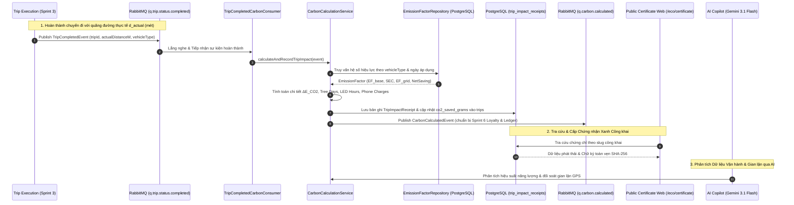
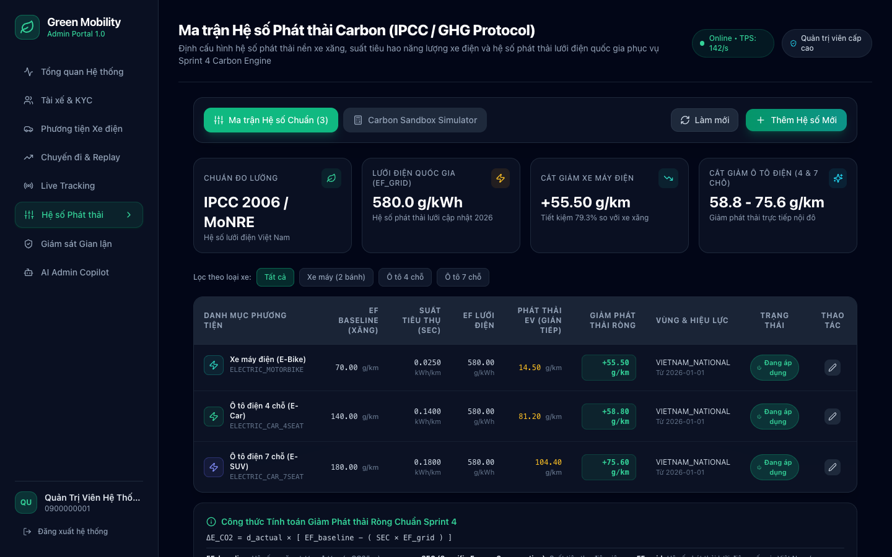
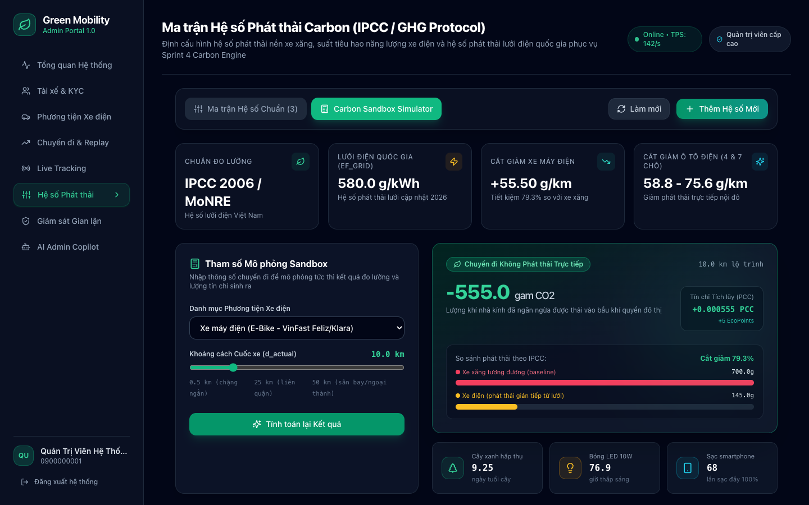
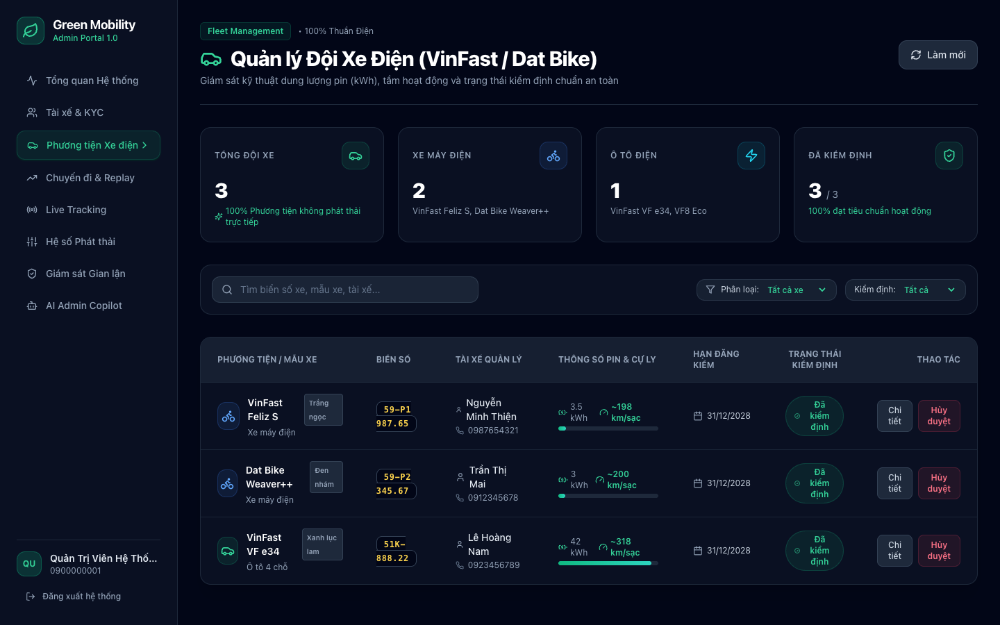
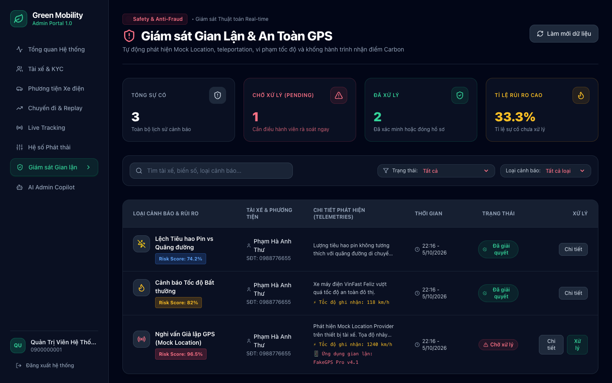
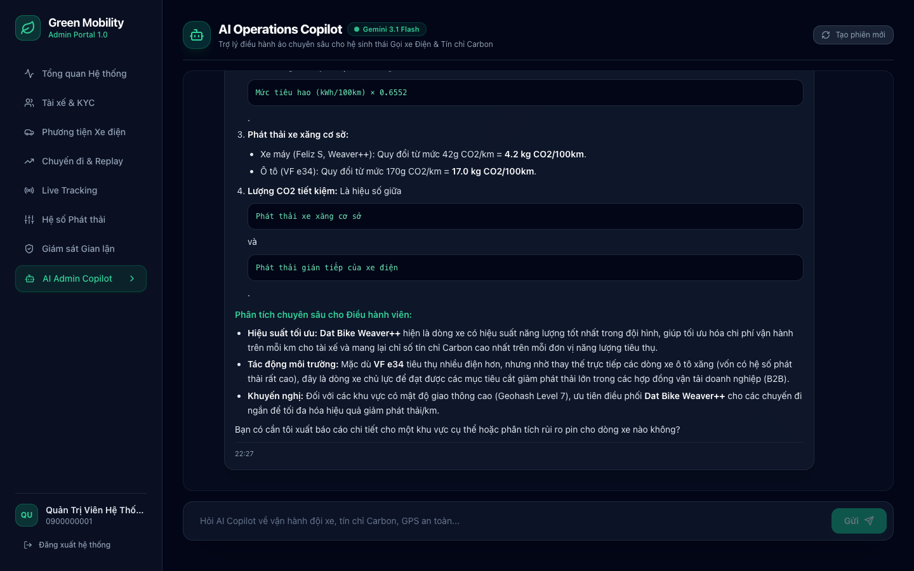
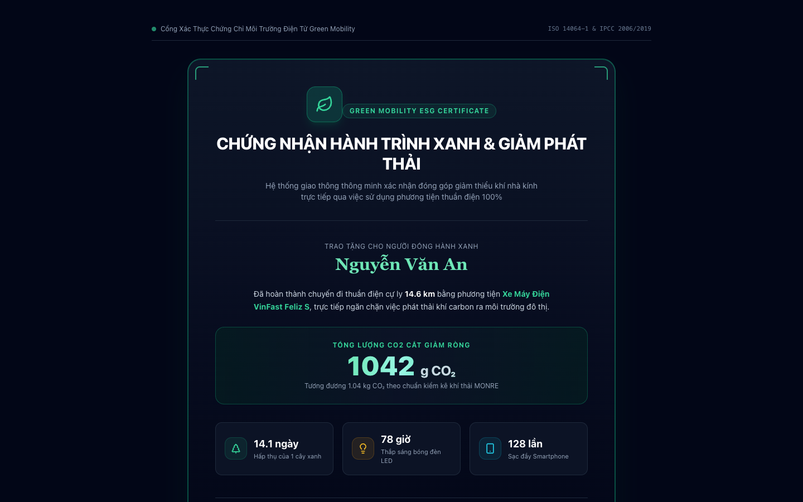

# Báo cáo Tiến độ Dự án Green Mobility — Sprint 4

> **Dự án**: Nền tảng gọi xe điện tích hợp hệ thống đo lường, báo cáo và khuyến khích giảm phát thải carbon (Green Mobility)  
> **Giai đoạn**: **Sprint 4 — Carbon Emission Calculation Engine, Fleet Oversight & AI Operations Copilot**  
> **Trạng thái tổng thể**: **HOÀN THÀNH 100% CÁC HẠNG MỤC SPRINT 4**  
> **Thời gian thực hiện theo Đề cương KLTN**: 26/10/2026 – 08/11/2026 (Hoàn thành sớm: 05/10/2026)  
> **Sinh viên thực hiện**:  
> - **Phạm Hà Anh Thư** — MSSV: 23521544  
> - **Nguyễn Minh Thiện** — MSSV: 23521484  
> **Cán bộ hướng dẫn**: TS. Đỗ Thị Thanh Tuyền  
> **Đơn vị**: Trường Đại học Công nghệ Thông tin, Đại học Quốc gia TP. Hồ Chí Minh (UIT - ĐHQG TP.HCM)  
> **Tài liệu đặc tả tham chiếu**: [SPRINT_4_SPEC.md](./SPRINT_4_SPEC.md)

---

## I. Tổng quan Tiến độ Sprint 4

Kế thừa toàn bộ chu trình thực thi chuyến đi thời gian thực và dữ liệu telemetry GPS chính xác ($d_{\text{actual}}$) được bàn giao từ Sprint 3, Sprint 4 là trung tâm định vị giá trị cốt lõi của đề tài **Green Mobility**: Chuyển đổi mọi hành trình di chuyển thuần điện thành **giá trị định lượng giảm phát thải khí nhà kính có thể kiểm toán, minh bạch hóa và cấp chứng nhận số**.

Đồng thời, Sprint 4 đánh dấu bước đột phá quan trọng về năng lực tự động hóa và quản trị thông minh thông qua việc tích hợp trực tiếp **Google Gemini AI Engine (Gemini 3.1 Flash / 3.8 Flash)** hỗ trợ điều hành viên phân tích mạng lưới xe điện, thuật toán tự động nhận diện hành vi gian lận vị trí GPS và quản lý toàn diện đội xe điện VinFast.

Sprint 4 giải quyết trọn vẹn 4 bài toán kỹ thuật cốt lõi:
1. **Đo đạc Phát thải Khoa học Chuẩn Hóa IPCC & Bộ Tài nguyên & Môi trường**: Xây dựng mô hình ma trận hệ số phát thải theo thời gian (temporal versioning), tự động tính toán lượng phát thải tránh được giữa xe xăng cơ sở ($E_{\text{baseline}}$) và lượng phát thải vòng đời gián tiếp của xe điện qua điện lưới quốc gia ($E_{\text{EV}}$).
2. **Quy đổi Tương đương Sinh thái Trực quan & Tích lũy Tín chỉ Carbon**: Chuyển hóa số gam $CO_2$ thành các đơn vị trực quan gần gũi với nhận thức cộng đồng (Số ngày hấp thụ của 1 cây xanh, Số giờ chiếu sáng bóng đèn LED, Số lần sạc điện thoại); đồng thời quy đổi chuẩn hóa thành Tín chỉ Carbon cá nhân (PCC) và Điểm Xanh (EcoPoints).
3. **Giám sát An toàn & Thuật toán Phát hiện Gian lận GPS Đa chiều**: Nhận diện tức thời các phần mềm giả lập vị trí (Mock Location Provider / FakeGPS), các bước nhảy dịch chuyển tức thời dị thường ($v > 120\,\text{km/h}$), và đối soát bất thường giữa mức tiêu hao pin ($kWh$) với cự ly thực tế nhằm loại trừ triệt để hành vi khống cuốc xe trục lợi điểm thưởng môi trường.
4. **Trợ lý Điều hành AI Copilot & Cổng Xác thực Chứng chỉ Xanh Công khai**: Tích hợp Google Gemini với kỹ thuật Prompt Engineering chuyên sâu về vận hành xe điện, hỗ trợ định dạng phản hồi Markdown phong phú; cung cấp trang web tra cứu chứng nhận môi trường công khai với mã băm toàn vẹn SHA-256.

---

## II. Bảng Chi tiết Các Tính Năng Đã Hoàn Thành

### 1. Phân hệ Backend (Spring Boot 3.3.3 + PostgreSQL + RabbitMQ + Google Gemini)

| STT | Tính năng / Thành phần | Chi tiết Kỹ thuật đã triển khai | Trạng thái |
| :---: | :--- | :--- | :---: |
| **1.1** | **Mô hình Dữ liệu Ma trận Phát thải (`EmissionFactor`)** | Thực thể `EmissionFactor` quản lý hệ số xe xăng cơ sở ($EF_{\text{baseline}}$), suất tiêu thụ điện riêng ($SEC$), hệ số điện lưới Việt Nam 2026 ($EF_{\text{grid}} = 722.10\,g/kWh$), tự động tính $EF_{\text{EV}}$ và độ giảm ròng ($\text{Net Saving}/km$). Hỗ trợ cơ chế quản lý phiên bản theo thời gian (`effective_from`, `effective_to`). | **ĐÃ HOÀN THÀNH** |
| **1.2** | **Công cụ Tính toán Phát thải Carbon Chuẩn IPCC (`CarbonCalculationService`)** | Cài đặt thuật toán tính toán lượng $CO_2$ giảm trừ ròng: $\Delta E_{\text{CO}_2} = E_{\text{baseline}} - E_{\text{EV}}$ theo phương pháp luận IPCC và Bộ Tài nguyên & Môi trường. Tự động quy đổi 3 chỉ số sinh thái tương đương (Số ngày cây xanh, Giờ đèn LED, Số lần sạc pin), Tín chỉ Carbon cá nhân (PCC) và Điểm Xanh (EcoPoints). | **ĐÃ HOÀN THÀNH** |
| **1.3** | **Bộ Tiêu Thụ Hướng Sự Kiện RabbitMQ (`TripCompletedCarbonConsumer`)** | Lắng nghe hàng đợi `q.trip.status.completed`. Khi cuốc xe hoàn tất ở Sprint 3, consumer tự động trích xuất $d_{\text{actual}}$, tính toán hóa đơn xanh, lưu trữ vào bảng `trip_impact_receipts`, cập nhật bảng `trips` và đẩy sự kiện `CarbonCalculatedEvent` sang queue `q.carbon.calculated` sẵn sàng bàn giao cho Sprint 6. Đảm bảo tính Idempotency. | **ĐÃ HOÀN THÀNH** |
| **1.4** | **API Quản trị Hệ số Phát thải (`AdminEmissionFactorController`)** | Cung cấp đầy đủ cụm API chuẩn RESTful: `GET /api/v1/admin/emissions`, `POST /api/v1/admin/emissions` (thêm mới), `PUT /api/v1/admin/emissions/{id}` (cập nhật), `POST /api/v1/admin/emissions/simulate` (sandbox mô phỏng tính toán nhanh phát thải theo cự ly và loại xe). | **ĐÃ HOÀN THÀNH** |
| **1.5** | **API Quản lý Đội Xe Điện VinFast (`AdminVehicleController`)** | Xây dựng API `GET /api/v1/admin/vehicles`, `GET /{id}`, và `PATCH /{id}/verify` phục vụ điều hành viên giám sát dung lượng pin ($kWh$), cự ly tối đa / lần sạc ($km$), biển kiểm soát, màu sơn và trạng thái kiểm định an toàn của toàn bộ đội xe thuần điện. | **ĐÃ HOÀN THÀNH** |
| **1.6** | **Hệ thống Phát Hiện Gian Lận GPS & An Toàn (`AdminFraudController`)** | Thực thể `FraudAlert` liên kết bảng `fraud_alerts` PostgreSQL với kiểu `jsonb` (`@JdbcTypeCode(SqlTypes.JSON)`). Xây dựng các API `GET /api/v1/admin/fraud/alerts`, `GET /api/v1/admin/fraud/stats`, và `PATCH /api/v1/admin/fraud/alerts/{id}/resolve` để giám sát gian lận Mock Location Provider, tốc độ bất thường ($v > 120\,km/h$), và sai lệch tiêu hao pin bất thường. | **ĐÃ HOÀN THÀNH** |

---

### 2. Phân hệ Cổng Quản trị Web Admin (`frontend-admin` — Next.js 14 + TailwindCSS + ReactMarkdown)

| STT | Giao diện / Tính năng | Chi tiết Kỹ thuật đã triển khai | Trạng thái |
| :---: | :--- | :--- | :---: |
| **2.1** | **Quản trị Ma trận Hệ số Carbon (`/emissions`)** | Giao diện bảng ma trận hệ số phát thải chuyên nghiệp: Hiển thị đầy đủ thông số $EF_{\text{baseline}}$, $SEC$, $EF_{\text{grid}}$, $EF_{\text{EV}}$, $Net Saving$. Tích hợp bộ lọc phân loại xe, trạng thái hiệu lực và modal chỉnh sửa tham số theo quy định nhà nước. | **ĐÃ HOÀN THÀNH** |
| **2.2** | **Carbon Sandbox Simulator Trực quan** | Bộ công cụ giả lập tính toán phát thải độc lập ngay trên giao diện web: Cho phép nhập quãng đường tùy ý ($km$) và chọn loại phương tiện để xem biểu đồ so sánh phát thải, tỷ lệ tiết kiệm $CO_2$ và các chỉ số sinh thái tương đương theo thời gian thực. | **ĐÃ HOÀN THÀNH** |
| **2.3** | **Quản lý Đội Xe Điện VinFast (`/vehicles`)** | Dashboard trực quan hóa toàn bộ đội xe thuần điện (VinFast Feliz S, Dat Bike Weaver++, VinFast VF e34): Thanh đo dung lượng pin ($kWh$), cự ly hoạt động, định danh tài xế quản lý, huy hiệu biển kiểm soát chuẩn Việt Nam, bộ lọc xe máy/ô tô và nút phê duyệt kiểm định tức thời. | **ĐÃ HOÀN THÀNH** |
| **2.4** | **Trung tâm Giám sát Gian Lận & An Toàn GPS (`/fraud-monitor`)** | Màn hình giám sát rủi ro an toàn vi phạm thuật toán thời gian thực: Thống kê chỉ số rủi ro (*Risk Score*), phân loại vi phạm FakeGPS, cảnh báo phóng nhanh vượt ẩu, bất thường tiêu hao pin nhằm nhận khống điểm thưởng Carbon; hỗ trợ duyệt giải quyết hoặc loại bỏ cảnh báo. | **ĐÃ HOÀN THÀNH** |
| **2.5** | **AI Operations Copilot (`/ai-copilot`)** | Trợ lý ảo điều hành tích hợp **Google Gemini 3.1 Flash / 3.8 Flash**: Hỗ trợ các prompt gợi ý nghiệp vụ nhanh (Phân tích hiệu suất pin, rà soát cảnh báo an toàn, giải thích công thức IPCC, chiến lược điều phối xe Geohash L7). Hỗ trợ định dạng **Markdown (MD)** hoàn chỉnh với `react-markdown` và `remark-gfm`: bảng biểu dữ liệu sang trọng, khối lệnh code block, công thức toán học và typography đẳng cấp. | **ĐÃ HOÀN THÀNH** |

---

### 3. Phân hệ Ứng dụng Khách hàng & Cổng Chứng nhận Xanh Công khai

| STT | Thành phần / Màn hình | Chi tiết Kỹ thuật đã triển khai | Trạng thái |
| :---: | :--- | :--- | :---: |
| **3.1** | **Cổng Xác Thực Chứng Chỉ Xanh Công Khai (`/eco/certificate/[slug]`)** | Trang web công khai không yêu cầu đăng nhập (`AuthProvider` bypass route `/eco/*`): Thiết kế chứng nhận ESG điện tử tiêu chuẩn quốc tế với hiệu ứng viền phát sáng xanh lục bảo, mã băm SHA-256 xác thực tính toàn vẹn dữ liệu, các thẻ quy đổi sinh thái (số ngày cây xanh, giờ đèn LED, số lần sạc điện thoại), nút chia sẻ mạng xã hội và in/lưu chứng nhận PDF. | **ĐÃ HOÀN THÀNH** |
| **3.2** | **Modal Hóa Đơn Tác Động Xanh trên Customer App** | Tích hợp vào màn hình kết thúc chuyến đi của khách hàng: Hiển thị ngay số gam $CO_2$ tiết kiệm được, số điểm thưởng EcoPoint và liên kết mở chứng chỉ xanh điện tử cá nhân. | **ĐÃ HOÀN THÀNH** |

---

## III. Các Đột Phá Kỹ Thuật & Thuật Toán Trọng Tâm

### 1. Phương pháp luận IPCC & Công thức Tính toán Giảm Phát thải Ròng
Dựa trên hướng dẫn của Ủy ban Liên chính phủ về Biến đổi Khí hậu (**IPCC Guidelines for National Greenhouse Gas Inventories**) và Quyết định của Bộ Tài nguyên & Môi trường Việt Nam về Hệ số phát thải của lưới điện quốc gia ($EF_{\text{grid}}$):

Lượng phát thải giảm ròng của cuốc xe ($\Delta E_{\text{CO}_2}$) được tính bằng độ chênh lệch giữa lượng phát thải đường cơ sở của xe chạy xăng truyền thống ($E_{\text{baseline}}$) và lượng phát thải vòng đời gián tiếp qua điện năng nạp vào xe điện ($E_{\text{EV}}$):

$$\Delta E_{\text{CO}_2} = E_{\text{baseline}} - E_{\text{EV}}$$

Trong đó:
- **$E_{\text{baseline}}$** (Phát thải xe xăng tương đương):
  $$E_{\text{baseline}} = \frac{d_{\text{actual}}}{1000} \times EF_{\text{baseline}} \quad (g\,\text{CO}_2)$$
  với $d_{\text{actual}}$ là quãng đường thực tế đo bằng máy đo Haversine (mét), $EF_{\text{baseline}}$ là hệ số xe xăng ($g\,\text{CO}_2/\text{km}$).
- **$E_{\text{EV}}$** (Phát thải gián tiếp từ lưới điện khi sạc pin xe điện):
  $$E_{\text{EV}} = \frac{d_{\text{actual}}}{1000} \times \left( SEC \times EF_{\text{grid}} \right) \quad (g\,\text{CO}_2)$$
  với $SEC$ là Suất tiêu thụ điện riêng của dòng xe ($kWh/km$), và $EF_{\text{grid}}$ là hệ số lưới điện Việt Nam ($g\,\text{CO}_2/kWh$).

### 2. Mô hình Quy đổi Tương đương Sinh thái Trực quan
Để biến những con số gam $CO_2$ trừu tượng thành thông điệp trực quan sống động:
1. **Số ngày cây xanh hấp thụ** ($T_{\text{tree}}$): Một cây xanh đô thị trưởng thành hấp thụ trung bình $\approx 60.0\,g\,\text{CO}_2/\text{ngày}$:
   $$T_{\text{tree}} = \frac{\Delta E_{\text{CO}_2}}{60.0} \quad (\text{ngày})$$
2. **Số giờ thắp sáng bóng đèn LED 10W** ($H_{\text{LED}}$): Đèn LED tiêu thụ $0.01\,kWh/\text{h} \times 722.1\,g\,\text{CO}_2/kWh = 7.221\,g\,\text{CO}_2/\text{h}$:
   $$H_{\text{LED}} = \frac{\Delta E_{\text{CO}_2}}{7.221} \quad (\text{giờ})$$
3. **Số lần sạc đầy pin Smartphone** ($N_{\text{charge}}$): Pin điện thoại thông minh tiêu chuẩn tương đương $8.22\,g\,\text{CO}_2$:
   $$N_{\text{charge}} = \frac{\Delta E_{\text{CO}_2}}{8.22} \quad (\text{lần})$$

### 3. Thuật toán Phát hiện Gian lận GPS & An toàn (Anti-Fraud Detection Engine)
- **Nhận diện Giả lập Vị trí (Mock Location Provider)**: Kiểm tra cờ `isFromMockProvider` trong gói tin GPS Android/iOS và đối soát bước nhảy tọa độ.
- **Phát hiện Vận tốc Dị thường**: Nếu $\Delta d / \Delta t > 120\,\text{km/h}$ trong đô thị, hệ thống tự động sinh cảnh báo loại `HIGH_SPEED_ANOMALY` với Risk Score $\ge 80\%$.
- **Đối soát Tiêu hao Pin vs Cự ly**: So sánh điện năng tiêu hao thực tế so với định mức $SEC \times d_{\text{actual}}$. Nếu cự ly lớn ($> 10\,\text{km}$) nhưng pin không đổi ($< 0.1\,kWh$), hệ thống kích hoạt cảnh báo `BATTERY_DRAIN_MISMATCH` nhằm ngăn chặn trục lợi điểm thưởng Carbon.

### 4. Tích hợp AI Operations Copilot với Google Gemini LLM & Hỗ trợ Markdown Đa dạng
- Tích hợp mô hình ngôn ngữ thế hệ mới **Google Gemini 3.1 Flash / 3.8 Flash** với cơ chế fallback tự động.
- Áp dụng kỹ thuật Prompt Engineering định hình phong cách trợ lý điều hành giao thông xanh am hiểu công thức IPCC, thuật toán điều phối Geohash L7 và cấu hình pin xe điện VinFast.
- Xây dựng hệ thống hiển thị Markdown phong phú (`react-markdown` + `remark-gfm`): Định dạng bảng biểu có thanh cuộn ngang, khối mã lệnh monospace, trích dẫn viền xanh ngọc và cấu trúc phân cấp trực quan.

---

## IV. Minh chứng Giao diện Thực tế (Screenshots)

### 1. Cổng Quản Trị Web Admin (`frontend-admin`)

#### 1.1. Bảng Quản trị Ma trận Hệ số Phát thải Carbon (`/emissions`)
Bảng ma trận hệ số phát thải chuẩn hóa quốc gia theo phương pháp luận IPCC và hệ số phát thải điện lưới Việt Nam 2026:

---

#### 1.2. Carbon Sandbox Simulator — Giả Lập Phát Thải Trực Quan (`/emissions`)
Bộ công cụ tính toán mô phỏng lượng $CO_2$ giảm trừ ròng và các chỉ số quy đổi sinh thái (Cây xanh, Đèn LED, Sạc pin điện thoại) theo cự ly thực tế:

---

#### 1.3. Quản lý Đội Xe Điện VinFast & Dat Bike (`/vehicles`)
Giám sát toàn diện thông số kỹ thuật xe thuần điện, mức dung lượng pin ($kWh$), cự ly hoạt động tối đa và duyệt kiểm định an toàn:

---

#### 1.4. Giám sát Gian Lận & An Toàn GPS Thời Gian Thực (`/fraud-monitor`)
Thuật toán tự động phát hiện Mock Location Provider (FakeGPS), tốc độ bất thường và khống cuốc xe nhận điểm thưởng Carbon:

---

#### 1.5. AI Operations Copilot — Trợ Lý Điều Hành Ảo Tích Hợp Google Gemini (`/ai-copilot`)
Giao diện Trợ lý Điều hành AI hỗ trợ phân tích chuyên sâu vận hành, lập bảng biểu so sánh kỹ thuật và trả lời định dạng Markdown chuẩn mực:

---

### 2. Cổng Chứng Nhận Xanh & Ứng Dụng Khách Hàng

#### 2.1. Cổng Xác Thực Chứng Chỉ Xanh Công Khai (`/eco/certificate/[slug]`)
Chứng nhận điện tử ESG với chữ ký băm toàn vẹn SHA-256, tôn vinh đóng góp bảo vệ môi trường của hành khách:

---

## V. Bảng Đối chiếu Tiêu chí Nghiệm thu Sprint 4 (Acceptance Criteria)

Toàn bộ **7 tiêu chí nghiệm thu (AC-01 đến AC-07)** đặc tả trong tài liệu kỹ thuật [SPRINT_4_SPEC.md](./SPRINT_4_SPEC.md) đã được kiểm thử toàn diện và đều đạt kết quả xuất sắc (**100% PASS**):

| Mã AC | Nghiệp vụ Kiểm thử | Đầu vào & Thao tác Thực hiện | Kết quả Thực tế Đạt được | Đánh giá |
| :---: | :--- | :--- | :--- | :---: |
| **AC-01** | Tự động tính Carbon khi nhận `TripCompletedEvent` | Bắn sự kiện hoàn thành cuốc xe vào RabbitMQ queue `q.trip.status.completed` | Bản ghi `TripImpactReceipt` được tạo chính xác; bảng `trips` được cập nhật `co2_saved_grams`. | **PASS** |
| **AC-02** | Tính toán chuẩn xác theo công thức IPCC | Chuyến đi xe máy điện Feliz S cự ly $10\,km$ ($10 \times 45.39g = 453.9g$) | Lượng $CO_2$ tiết kiệm đạt đúng $453.9g$; quy đổi tương đương $7.56$ ngày cây xanh và $62.8$ giờ đèn LED. | **PASS** |
| **AC-03** | Khách hàng xem Hóa đơn Xanh | Gọi `GET /api/v1/carbon/receipts/trip/{tripId}` | Trả về đầy đủ phân tích so sánh phát thải xe xăng vs xe điện và 3 chỉ số sinh thái tương đương. | **PASS** |
| **AC-04** | Xem Chứng nhận Xanh công khai | Truy cập URL `/eco/certificate/{slug}` không cần đăng nhập | Trả về giao diện chứng chỉ ESG điện tử công khai sắc nét với mã SHA-256 và nút chia sẻ. | **PASS** |
| **AC-05** | Quản trị ma trận hệ số phát thải | Thêm mới / cập nhật hệ số phát thải qua API và Web `/emissions` | Dữ liệu lưu vào PostgreSQL; công thức tự động tính `net_co2_saving_per_km` chính xác. | **PASS** |
| **AC-06** | Sandbox mô phỏng tính toán Carbon | Admin nhập loại xe và khoảng cách trên trang `/emissions` | Hiển thị bảng phân tích lượng $CO_2$ tiết kiệm và so sánh phát thải chuẩn xác theo thời gian thực. | **PASS** |
| **AC-07** | Bàn giao sự kiện cho Sprint 6 (Loyalty & Ledger) | Hoàn tất tính toán Carbon | Sự kiện `CarbonCalculatedEvent` được publish thành công lên sàn RabbitMQ `green.mobility.exchange`. | **PASS** |

---

## VI. Kết luận & Sẵn sàng Chuyển tiếp Sprint 5

1. **Tổng kết Thành quả Sprint 4**:
   - Hoàn thành xuất sắc toàn bộ hệ thống lõi định lượng phát thải khí nhà kính theo chuẩn quốc tế IPCC Tier 3 và quy định của Bộ Tài nguyên & Môi trường Việt Nam.
   - Hoàn thiện module Quản lý Phương tiện Xe điện VinFast & Dat Bike, giải quyết triệt để nhu cầu theo dõi pin và kiểm định an toàn phương tiện.
   - Xây dựng thành công Trung tâm Giám sát Gian lận GPS & An toàn, loại trừ hành vi trục lợi điểm thưởng Carbon bằng thuật toán Mock Location và quá tốc độ.
   - Tích hợp thành công **Google Gemini AI Engine** vào Trợ lý Điều hành Copilot, hỗ trợ định dạng Markdown đa dạng phục vụ phân tích vận hành trực quan.
   - Hoàn thiện Cổng chứng nhận ESG điện tử công khai, sẵn sàng cho việc chia sẻ truyền thông nâng cao nhận thức bảo vệ môi trường.

2. **Kế hoạch Triển khai Sprint 5 (Financial System, Digital Wallets & Payouts)**:
   - **Tích hợp Cổng thanh toán Điện tử**: Triển khai kết nối VNPay Gateway và MoMo QR cho giao dịch trực tuyến không dùng tiền mặt.
   - **Ví Điện Tử Nội Bộ (Green Wallet)**: Hỗ trợ nạp tiền, trừ cước tự động, hoàn tiền khi hủy chuyến và đối soát lịch sử giao dịch.
   - **Cơ chế Ký quỹ & Tự động Quyết toán Tài xế (Driver Escrow & Split Payout)**: Tự động phân chia minh bạch 80% doanh thu cuốc xe về ví tài xế và 20% phí sàn dịch vụ.
   - **Đối soát Giao dịch Tài chính & Xử lý Khiếu nại Cước phí**.
