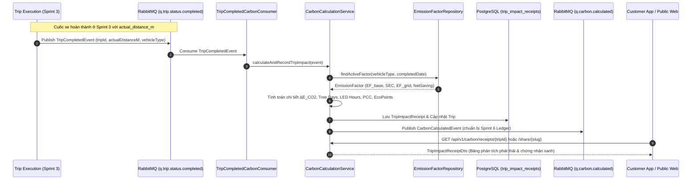

# Sprint 4 Specification: Carbon Emission Calculation Engine & Impact Certificate

> **Tài liệu**: Đặc tả Kỹ thuật Chi tiết Sprint 4 (Sprint 4 Specification)  
> **Dự án**: Nền tảng gọi xe điện tích hợp hệ thống đo lường, báo cáo và khuyến khích giảm phát thải carbon (Green Mobility)  
> **Thời gian thực hiện theo Đề cương KLTN**: 26/10/2026 – 08/11/2026  
> **Mục tiêu**: Xây dựng công cụ tính toán phát thải Carbon chuẩn hóa (Carbon Calculation Engine) theo phương pháp luận IPCC và hệ số phát thải lưới điện Việt Nam (Bộ TN&MT); Tự động tiêu thụ sự kiện hoàn thành cuốc xe từ RabbitMQ để sinh Hóa đơn Tác động Xanh (Trip Impact Receipt); Cung cấp API và giao diện quản trị Ma trận Hệ số Phát thải (Emission Factor Matrix) với cơ chế phiên bản hiệu lực; Cung cấp màn hình Hóa đơn Tác động Xanh trên ứng dụng Khách hàng với các chỉ số sinh thái tương đương và Chứng nhận Xanh có thể chia sẻ công khai.  
> **Phiên bản**: 1.0.0 (Production Blueprint)

---

## 1. Mục tiêu & Phạm vi Nghiệp vụ (Sprint Scope & System Overview)

Sprint 4 là trung tâm định vị giá trị cốt lõi của nền tảng **Green Mobility**: chuyển đổi mọi chuyến đi bằng phương tiện thuần điện thành **giá trị giảm phát thải có thể định lượng, kiểm toán và cấp chứng nhận**.

---

## 2. Cơ sở Khoa học & Công thức Tính toán Carbon (Scientific Methodology)

### 2.1. Phương pháp luận IPCC & Tiêu chuẩn Bộ Tài nguyên & Môi trường

Theo hướng dẫn của Ủy ban Liên chính phủ về Biến đổi Khí hậu (**IPCC Guidelines for National Greenhouse Gas Inventories**) và Quyết định của Bộ Tài nguyên & Môi trường Việt Nam về Hệ số phát thải của lưới điện Việt Nam:

Lượng phát thải giảm ròng của cuốc xe ($\Delta E_{\text{CO}_2}$) được tính bằng độ chênh lệch giữa lượng phát thải đường cơ sở của xe chạy xăng truyền thống ($E_{\text{baseline}}$) và lượng phát thải vòng đời gián tiếp qua điện năng nạp vào xe điện ($E_{\text{EV}}$):

$$\Delta E_{\text{CO}_2} = E_{\text{baseline}} - E_{\text{EV}}$$

Trong đó:
- **$E_{\text{baseline}}$** (Phát thải xe xăng tương đương):
  $$E_{\text{baseline}} = \frac{d_{\text{actual}}}{1000} \times EF_{\text{baseline}}$$
  *(Đơn vị: gam $CO_2$, với $d_{\text{actual}}$ tính bằng mét, $EF_{\text{baseline}}$ tính bằng $gCO_2/km$)*.

- **$E_{\text{EV}}$** (Phát thải gián tiếp từ lưới điện khi sạc xe điện):
  $$E_{\text{EV}} = \frac{d_{\text{actual}}}{1000} \times \left( SEC \times EF_{\text{grid}} \right)$$
  *(Trong đó $SEC$ là Suất tiêu thụ điện năng riêng $kWh/km$, và $EF_{\text{grid}}$ là Hệ số phát thải lưới điện quốc gia $gCO_2/kWh$)*.

- **Lượng giảm phát thải ròng trên mỗi km**:
  $$\text{Net Saving per km} = EF_{\text{baseline}} - \left( SEC \times EF_{\text{grid}} \right)$$

### 2.2. Ma trận Hệ số Mặc định Áp dụng cho Việt Nam (Baseline Factors)

| Danh mục Phương tiện (`vehicle_category`) | Phương tiện Tiêu chuẩn | $EF_{\text{baseline}}$ (Xăng) | Suất Tiêu thụ Điện $SEC$ | $EF_{\text{grid}}$ (Lưới điện VN) | Phát thải $EF_{\text{EV}}$ | Giảm phát thải Ròng $\Delta EF$ |
| :--- | :--- | :--- | :--- | :--- | :--- | :--- |
| **MOTORBIKE** (Xe máy 2 bánh) | VinFast Feliz S / Klara S vs Xe xăng 110-125cc | $68.50\,g/km$ | $0.0320\,kWh/km$ | $722.10\,g/kWh$ | $23.11\,g/km$ | **$45.39\,g/km$** |
| **CAR_4SEATS** (Ô tô điện 4 chỗ) | VinFast VF e34 / VF 5 vs Xe xăng hạng A/B | $152.00\,g/km$ | $0.1350\,kWh/km$ | $722.10\,g/kWh$ | $97.48\,g/km$ | **$54.52\,g/km$** |
| **CAR_7SEATS** (Ô tô điện 7 chỗ) | VinFast VF 8 / VF 9 vs Xe xăng MPV/SUV | $210.00\,g/km$ | $0.1800\,kWh/km$ | $722.10\,g/kWh$ | $129.98\,g/km$ | **$80.02\,g/km$** |

### 2.3. Quy đổi Tương đương Sinh thái Trực quan (Ecological Equivalents)

Để người dùng dễ dàng hình dung và cảm nhận giá trị đóng góp bảo vệ môi trường, hệ thống chuyển đổi lượng gam $CO_2$ tiết kiệm thành 3 thước đo thực tế:

1. **Số ngày cây xanh hấp thụ** ($T_{\text{tree}}$):
   Một cây xanh đô thị trưởng thành hấp thụ trung bình khoảng $21.77\,kg\,CO_2/\text{năm} \approx 59.64\,g\,CO_2/\text{ngày}$ (lấy xấp xỉ chuẩn $60.0\,g\,CO_2/\text{ngày}$):
   $$T_{\text{tree}} = \frac{\Delta E_{\text{CO}_2} \text{ (grams)}}{60.0}$$
2. **Số giờ thắp sáng bóng đèn LED 10W** ($H_{\text{LED}}$):
   Bóng đèn LED 10W tiêu thụ $0.01\,kWh/\text{giờ}$. Với hệ số lưới điện $722.10\,gCO_2/kWh$, phát thải tương đương là $7.221\,g\,CO_2/\text{giờ}$:
   $$H_{\text{LED}} = \frac{\Delta E_{\text{CO}_2} \text{ (grams)}}{7.221}$$
3. **Số lần sạc đầy điện thoại thông minh** ($N_{\text{charge}}$):
   Một lần sạc đầy pin smartphone tiêu chuẩn (~15Wh) tương đương $8.22\,g\,CO_2$:
   $$N_{\text{charge}} = \frac{\Delta E_{\text{CO}_2} \text{ (grams)}}{8.22}$$

### 2.4. Quy đổi Tín chỉ Carbon Cá nhân (PCC) & Điểm thưởng Xanh (EcoPoints)
- **Tín chỉ Carbon Cá nhân (Personal Carbon Credit - PCC)**: $1\,\text{PCC} = 1\,\text{tấn } CO_2 = 1,000,000\,g\,CO_2$.
  $$\text{PCC Earned} = \frac{\Delta E_{\text{CO}_2}}{1,000,000.0}$$
- **Điểm thưởng tích lũy (EcoPoints)**: Mỗi $100\,g\,CO_2$ giảm được quy đổi thành 1 điểm thưởng EcoPoint để sử dụng đổi quà ở Sprint 6:
  $$\text{EcoPoints} = \left\lfloor \frac{\Delta E_{\text{CO}_2}}{100.0} \right\rfloor$$

---

## 3. Kiến trúc Dữ liệu & Database Schema

### 3.1. Entity `EmissionFactor` (`emission_factors`)
Bảng lưu trữ danh mục hệ số phát thải theo thời gian (temporal versioning):
- `id`: UUID (Primary Key)
- `vehicle_category`: VARCHAR(50) — `MOTORBIKE`, `CAR_4SEATS`, `CAR_7SEATS`
- `baseline_gasoline_factor_gco2_km`: NUMERIC(8,2) — Hệ số xe xăng ($g/km$)
- `ev_energy_consumption_kwh_km`: NUMERIC(6,4) — Suất tiêu thụ điện ($kWh/km$)
- `grid_emission_factor_gco2_kwh`: NUMERIC(8,2) — Hệ số lưới điện ($g/kWh$)
- `calculated_ev_factor_gco2_km`: NUMERIC(8,2) — Phát thải EV ($g/km$)
- `net_co2_saving_per_km`: NUMERIC(8,2) — Giảm phát thải ròng ($g/km$)
- `region`: VARCHAR(50) — Mặc định `VIETNAM_NATIONAL`
- `effective_from`: DATE — Ngày bắt đầu hiệu lực
- `effective_to`: DATE (nullable) — Ngày kết thúc hiệu lực (NULL = vô thời hạn)
- `is_active`: BOOLEAN — Đang kích hoạt hay không
- `created_by`: UUID (references `users.id`)
- `created_at`: TIMESTAMP WITH TIME ZONE

### 3.2. Entity `TripImpactReceipt` (`trip_impact_receipts`)
Bảng lưu trữ chi tiết Hóa đơn Tác động Xanh được sinh tự động sau khi kết thúc chuyến đi:
- `id`: UUID (Primary Key)
- `trip_id`: UUID (Unique, references `trips.id`)
- `co2_saved_grams`: NUMERIC(10,2) — Lượng $CO_2$ tiết kiệm ròng
- `baseline_gasoline_co2_grams`: NUMERIC(10,2) — Phát thải xe xăng
- `ev_emitted_co2_grams`: NUMERIC(10,2) — Phát thải điện gián tiếp
- `tree_absorption_days_equiv`: NUMERIC(6,2) — Số ngày cây xanh tương đương
- `led_bulb_hours_equiv`: NUMERIC(8,2) — Số giờ thắp đèn LED tương đương
- `shareable_slug`: VARCHAR(64) (Unique) — Slug định danh chứng nhận xanh công khai
- `created_at`: TIMESTAMP WITH TIME ZONE

---

## 4. Đặc tả API Backend (RESTful Endpoints)

### 4.1. Nhóm API Khách hàng (Customer Endpoints)
- **`GET /api/v1/carbon/receipts/trip/{tripId}`** (Authenticated: Customer):
  - Lấy thông tin Hóa đơn Tác động Xanh của chuyến đi.
  - Phản hồi: Chi tiết $CO_2$, so sánh xăng vs điện, số ngày cây xanh, số giờ đèn LED, số lần sạc pin, slug chia sẻ.
- **`GET /api/v1/carbon/receipts/share/{slug}`** (Public - No Auth required):
  - Lấy thông tin chứng nhận xanh công khai để hiển thị trên web chia sẻ mạng xã hội.
- **`GET /api/v1/carbon/user/summary`** (Authenticated: Customer):
  - Lấy thống kê tổng hợp phát thải của người dùng hiện tại: Tổng $CO_2$ đã giảm, Tổng số ngày cây xanh, Tổng số cuốc xe xanh, Tổng PCC và EcoPoints.

### 4.2. Nhóm API Quản trị Hệ số Phát thải (Admin Endpoints)
- **`GET /api/v1/admin/emissions`** (Authenticated: ADMIN / ESG_MANAGER):
  - Lấy danh sách tất cả các hệ số phát thải, hỗ trợ lọc theo `vehicleCategory`, `isActive`.
- **`POST /api/v1/admin/emissions`** (Authenticated: ADMIN):
  - Tạo mới hệ số phát thải (tự động tính `calculated_ev_factor` và `net_co2_saving_per_km`).
- **`PUT /api/v1/admin/emissions/{id}`** (Authenticated: ADMIN):
  - Cập nhật hệ số phát thải hoặc vô hiệu hóa (`is_active = false`).
- **`POST /api/v1/admin/emissions/simulate`** (Authenticated: ADMIN / ESG_MANAGER):
  - Sandbox mô phỏng tính toán nhanh lượng phát thải và các chỉ số sinh thái theo quãng đường và danh mục phương tiện.

---

## 5. Tích hợp Hàng đợi RabbitMQ (Event-Driven Integration)

### 5.1. Tiêu thụ sự kiện `TripCompletedEvent` từ Sprint 3
- **Queue**: `q.trip.status.completed`
- **Consumer**: `TripCompletedCarbonConsumer`
- **Luồng xử lý**:
  1. Kiểm tra nếu cuốc xe đã có `TripImpactReceipt` thì bỏ qua (Idempotent processing).
  2. Lấy quãng đường hợp lệ: `actualDistanceM` (nếu null thì dùng `estimatedDistanceM`).
  3. Lấy hệ số phát thải đang hiệu lực tương ứng với `vehicleType`.
  4. Thực thi công thức tính toán và lưu `TripImpactReceipt`.
  5. Cập nhật các cột `co2_saved_grams`, `carbon_credits_earned`, `loyalty_points_earned` vào bảng `trips`.
  6. Phát sự kiện `CarbonCalculatedEvent` lên RabbitMQ topic exchange `green.mobility.exchange` với routing key `carbon.event.calculated`.

### 5.2. Sự kiện Phát sinh `CarbonCalculatedEvent` (Bàn giao Sprint 6)
- **Routing Key**: `carbon.event.calculated`
- **Queue tiếp nhận**: `q.carbon.calculated`
- **Payload**: `tripId`, `customerId`, `co2SavedGrams`, `carbonCreditsEarned`, `loyaltyPointsEarned`, `timestamp`.

---

## 6. Giao diện Người dùng & Trải nghiệm (UI/UX)

### 6.1. Ứng dụng Khách hàng (Customer Mobile App)
- **Màn hình Hóa đơn Tác động Xanh (Impact Receipt View)**:
  - Tự động bật modal hoặc điều hướng tới sau khi chuyến đi hoàn thành.
  - Thiết kế thẻ chứng nhận xanh (Emerald Gradient Card) với hiệu ứng chúc mừng sống xanh.
  - Thanh so sánh lượng phát thải Xe xăng vs Xe điện.
  - 3 widget sinh thái: Cây xanh (ngày), Đèn LED (giờ), Sạc điện thoại (lần).
  - Tín chỉ Carbon cá nhân (PCC) và Điểm thưởng EcoPoint tích lũy được từ chuyến đi.
  - Nút "Chia sẻ Chứng nhận Xanh": Tạo liên kết chia sẻ hoặc sao chép slug.

### 6.2. Cổng Quản trị Web (Admin Portal)
- **Trang Quản trị Hệ số Carbon (`/emissions`)**:
  - Bảng ma trận hệ số phát thải với đầy đủ thông số $EF_{\text{baseline}}$, $SEC$, $EF_{\text{grid}}$, $EF_{\text{EV}}$, $Net Saving$.
  - Tag trạng thái Đang áp dụng / Hết hiệu lực, Vùng miền áp dụng.
  - Form thêm / sửa hệ số phát thải với tính toán tự động ngay trên UI.
  - **Carbon Sandbox Calculator**: Bộ công cụ tính toán thử nghiệm trực quan cho phép nhập số km và chọn loại xe để xem kết quả tính toán chi tiết tức thì.

---

## 7. Tiêu chí Chấp thuận (Acceptance Criteria - AC)

| Mã AC | Tiêu chí | Điều kiện kiểm thử | Kết quả mong đợi |
| :--- | :--- | :--- | :--- |
| **AC-01** | Tự động tính Carbon khi nhận `TripCompletedEvent` | Bắn sự kiện hoàn thành cuốc xe vào RabbitMQ | Bản ghi `TripImpactReceipt` được tạo chính xác, `trips` được cập nhật `co2_saved_grams`. |
| **AC-02** | Tính toán chuẩn xác theo công thức IPCC | Chuyến đi xe máy 10km ($10 \times 45.39g = 453.9g$) | `co2_saved_grams` đạt đúng $453.9g$, ngày cây xanh $\approx 7.56$ ngày. |
| **AC-03** | Khách hàng xem Hóa đơn Xanh | Gọi `GET /api/v1/carbon/receipts/trip/{tripId}` | Trả về đầy đủ thông số phát thải và 3 chỉ số sinh thái tương đương. |
| **AC-04** | Xem Chứng nhận Xanh công khai | Gọi `GET /api/v1/carbon/receipts/share/{slug}` không cần đăng nhập | Trả về dữ liệu công khai của chứng nhận tác động xanh. |
| **AC-05** | Admin quản lý ma trận hệ số | Thêm mới / cập nhật hệ số phát thải qua API và Web | Dữ liệu lưu vào database, công thức tự động tính `net_co2_saving_per_km`. |
| **AC-06** | Sandbox mô phỏng tính toán Carbon | Admin nhập loại xe và khoảng cách trên trang `/emissions` | Hiển thị bảng phân tích lượng $CO_2$ tiết kiệm và so sánh phát thải chuẩn xác. |
| **AC-07** | Bàn giao sự kiện cho Sprint 6 | Hoàn tất tính toán Carbon | Sự kiện `CarbonCalculatedEvent` được publish thành công lên RabbitMQ. |
